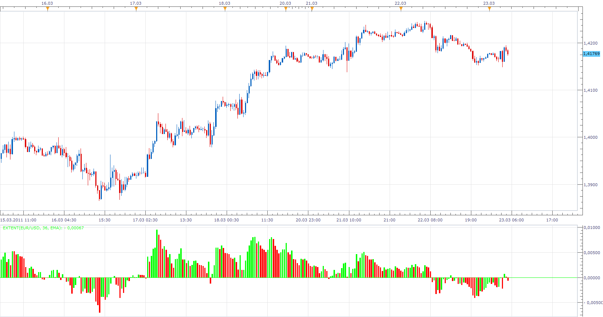

# Extent Indicator

> Source: https://fxcodebase.com/code/viewtopic.php?f=17&t=3707  
> Forum: 17 · Topic 3707 · 2 post(s)

---

## Extent Indicator

**Apprentice** · Wed Mar 23, 2011 4:21 am

The indicator shows the difference between, moving average and price.

 [Extent.lua](files/8982/Extent.lua)

To this indicator to work, you need to install Averages Indicator.
You can find it here.
[viewtopic.php?f=17&t=2430&p=5268&hilit=averages#p5268](https://fxcodebase.com/code/viewtopic.php?f=17&t=2430&p=5268&hilit=averages#p5268)

MT4 / MQ4 version.
[viewtopic.php?f=38&t=64495](https://fxcodebase.com/code/viewtopic.php?f=38&t=64495)

The indicator was revised and updated

---

## Re: Extent Indicator

**Apprentice** · Sat Feb 18, 2017 5:30 am

Indicator was revised and updated.
