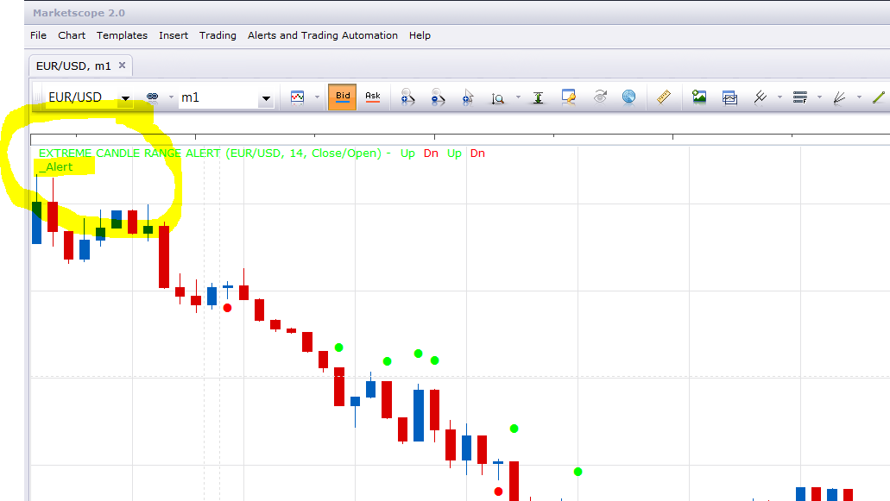

# Extreme Candle Range Alert

> Source: https://fxcodebase.com/code/viewtopic.php?f=17&t=59547  
> Forum: 17 · Topic 59547 · 21 post(s)

---

## Extreme Candle Range Alert

**Apprentice** · Sat Sep 21, 2013 10:18 am

This indicator provides Audio / Email Alerts,
High /Low line Crossover
Ratio > High Line
Ratio < Low Line

 [Extreme Candle Range Alert .lua](files/89602/Extreme%20Candle%20Range%20Alert%20.lua)

 [ATR Candle Range Ratio.lua](files/89602/ATR%20Candle%20Range%20Ratio.lua)

The indicator was revised and updated

---

## Re: Extreme Candle Range Alert

**HappyFox8** · Wed Nov 25, 2015 7:46 pm

Hi Apprentice,
Thanks for this indicator, it is very useful. I am getting the dot on the charts, however, I can't get the alert to sound. I have installed it & it is showing on the strategy dashboard. It is set to play a sound. But no alert is sounding when the conditions are met.

---

## Re: Extreme Candle Range Alert

**Apprentice** · Thu Nov 26, 2015 4:16 am

Do you have an active _Alert helper on selected currency chart?

---

## Re: Extreme Candle Range Alert

**HappyFox8** · Sun Nov 29, 2015 12:17 am

I'm sorry, I don't understand your questions. Please explain what you mean by an "active alert helper". What should I look for?

---

## Re: Extreme Candle Range Alert

**HappyFox8** · Tue Dec 01, 2015 5:24 am

Just wondering if you have had time to answer. Do you mean in the Legend? When I open _Alert properties from the Legend there is nothing in Parameters.

---

## Re: Extreme Candle Range Alert

**Apprentice** · Tue Dec 01, 2015 6:14 am

Do you have _Alert in your chart corner.

---

## Re: Extreme Candle Range Alert

**HappyFox8** · Tue Dec 01, 2015 7:55 am

Yes, I have _Alert in my chart corner. When I open it, there is nothing in the parameters field.

---

## Re: Extreme Candle Range Alert

**Apprentice** · Wed Dec 02, 2015 5:21 am

Fixed, It is a compatibility issue.
_Alert helper is not longer needed.

---

## Re: Extreme Candle Range Alert

**HappyFox8** · Wed Dec 02, 2015 10:35 am

Great! Thanks so much. Working perfectly now.

I have another small request. The placement of the marker dot is sometimes a very long way from the bar (when the range is a very high extreme). Is it possible to set so that it is always just slightly away from the bar?

---

## Re: Extreme Candle Range Alert

**HappyFox8** · Wed Dec 02, 2015 10:43 am

Hi again Apprentice,
Actually I have a further request. I would like to be able to combine this Extreme Candle Range Alert with your Price MA Cross Alert. I.e. I'd like to be able to set it so that the Extreme Range Alert only sounds when price also crosses the MA. This would be an optional filter. Would this be possible?

---

## Re: Extreme Candle Range Alert

**Apprentice** · Thu Dec 10, 2015 5:14 am

Try it now.

---

## Re: Extreme Candle Range Alert

**HappyFox8** · Tue May 16, 2017 5:17 am

Something has gone wrong with this indicator in my system. I have it set to play a sound but the sound only plays some of the time. Very frustration as I have developed a trading system around the indicator sounding.

---

## Re: Extreme Candle Range Alert

**Apprentice** · Wed May 17, 2017 1:13 pm

Try it now.

---

## Re: Extreme Candle Range Alert

**HappyFox8** · Thu Jun 08, 2017 7:35 pm

Thank you. Working now.

---

## Re: Extreme Candle Range Alert

**HappyFox8** · Fri Jun 09, 2017 12:36 am

I posted my reply too soon. The indicator is still playing up. It does not play a sound when a candle with an extreme range is formed. But waits until the next bar has formed.

---

## Re: Extreme Candle Range Alert

**HappyFox8** · Tue Jun 13, 2017 3:30 am

Unfortunately this indicator is no longer working correctly. It was originally possible to set it to sound an alert whenever an extreme range candle occurred (whether extremely tall or extremely short). This is no longer possible.

---

## Re: Extreme Candle Range Alert

**HappyFox8** · Thu Jun 22, 2017 12:36 am

I am still hoping for a reply. This indicator is inconsistent, sometimes the alert sounds and other times not.

---

## Re: Extreme Candle Range Alert

**HappyFox8** · Thu Jun 22, 2017 1:10 am

Hi again, actually, can we change this indicator into something really simple. (or perhaps create a new one). At the moment it is quite complex and perhaps this is causing the issues.

All that I need is an indicator that will sound an alert when a bar (from open to close) is greater than a certain percentage of the past x bars. I would even be happy with an indicator that will sound when a bar (open to close) is greater than an assigned number of pips. (I.e. the number of pips would be an input that the user can vary according to need).

I would also prefer two separate indicators, one for up closes, and a second for down closes.

---

## Re: Extreme Candle Range Alert

**HappyFox8** · Mon Aug 19, 2019 5:51 am

This indicator has stopped working again. It doesn't play a sound.

---

## Re: Extreme Candle Range Alert

**HappyFox8** · Wed Jun 24, 2020 9:24 pm

Hi Apprentice, I have been revisiting this indicator and unfortunately I am unable to get the alert to sound with this one either. Maybe I have something wrong in my settings. I have attached a snip.

---

## Re: Extreme Candle Range Alert

**Apprentice** · Wed Jul 01, 2020 11:04 am

[Extreme Candle Range Alert .lua](files/135520/Extreme%20Candle%20Range%20Alert%20.lua)

Works as expected in simulation mode.
