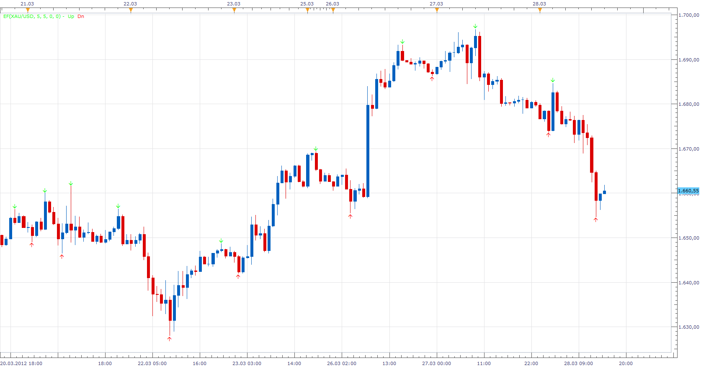

# Extreme Finder

> Source: https://fxcodebase.com/code/viewtopic.php?f=17&t=15322  
> Forum: 17 · Topic 15322 · 43 post(s)

---

## Extreme Finder

**Apprentice** · Wed Mar 28, 2012 2:30 pm



You can define asymmetrically within which period of time you want to find extreme. Also, it is possible to define the minimum body size of the candle for current and period that follows immediately after.

This is a simplified algorithm.

```lua
if BMax <= high and   FMax  <=  high  then
We have Up Signal
end
if BMin >=  low and   FMin  >=  low then
We have Down Signal
end
```

Bmax, Bmin as the previous period N Max, Min.
Fmax, Fmin as following N period Max, Min.
Forward component causes repaint.

 [EF.lua](files/28902/EF.lua)

 [EF Oscillator.lua](files/28902/EF%20Oscillator.lua)

EF based strategy.
[viewtopic.php?f=31&t=69349](https://fxcodebase.com/code/viewtopic.php?f=31&t=69349)

---

## Re: Extreme Finder

**Hailkayy** · Thu Mar 29, 2012 4:42 am

Looks like its always working what's that code lol !

---

## Re: Extreme Finder

**chriswant** · Fri Mar 30, 2012 1:16 pm

Great Indicator.. Is there a strategie or alert for this? if notcan it be made?
Thanks

Does any one know how to get an alert to text you?

---

## Re: Extreme Finder

**rdz6115** · Sun Apr 01, 2012 7:54 am

Please make an alert and strategy for this very good incator apperentice. Very good job. Please make as soon as possible.

Thank you very much on helping us.

Thanks again..

---

## Re: Extreme Finder

**Apprentice** · Mon Apr 02, 2012 4:55 am

Your request is added to the development list.

---

## Re: Extreme Finder

**MERNISSI** · Mon Apr 02, 2012 4:02 pm

Please add strategy for this indicator & thank you very much for your good job really you are the boss apperentice

---

## Re: Extreme Finder

**Apprentice** · Tue Apr 03, 2012 2:37 am

Your request is added to the development list.

---

## Re: Extreme Finder

**Apprentice** · Tue Apr 03, 2012 3:41 am

Audio Alert & Unconfirmed indications distinction added.

---

## Re: Extreme Finder

**cc.matt** · Wed Apr 25, 2012 7:10 am

Thank you for the hard work apprentice! Could you add price labels to this please?

---

## Re: Extreme Finder

**jaynlola** · Wed Apr 25, 2012 12:36 pm

This looks very nice! Seems to be 'spot on' with actual price changes.

Works better on longer timeframes; small price changes affects its calculating. But, could work really well for Scalpers or Range traders.

---

## Re: Extreme Finder

**Apprentice** · Thu Apr 26, 2012 2:15 am

Your request is added to the development list.

---

## Re: Extreme Finder

**Hug Coder** · Fri Apr 27, 2012 4:44 am

Changing the minimum pips for current and next candle seems to produce no signals, even if choosing something like 0,1 pips.

Also the bull and bear colors are inverted. I think this is a bug in the platform though, when using the extreme colors like 255,0,0 (suppose to be red but can give blue or green), changing to 200,0,0 as default in the code or something usually makes the color assigned properly again.

---

## Re: Extreme Finder

**iverlord** · Sat Nov 08, 2014 6:42 pm

please id like know how this indicator works

---

## Re: Extreme Finder

**Apprentice** · Sun Nov 09, 2014 7:45 am

Indicator will highlight candles that have achieved the minimum or maximum value within the observed period, N periods before / after the current candle.
The candle must be larger than the trigger level.
Subsequent candle must be larger than the trigger level.
By default this is set to Zero.

---

## Re: Extreme Finder

**mulligan** · Thu Dec 04, 2014 11:10 am

Thank you for this extremely helpful indicator. For those of us with multiple charts on screen and multiple computers, a "show alert" in addition to the sound alert would be greatly appreciated.

---

## Re: Extreme Finder

**Apprentice** · Sun Dec 07, 2014 8:08 am

"show alert" PopUp Added.
Have not test it.
As the market is closed.

---

## Re: Extreme Finder

**mulligan** · Sun Dec 07, 2014 8:30 pm

Thanks for adding the show alert to the indicator. It will be very helpful. Right now it is showing the following error message - an error occurred during the calculation of the indicator 'EF', the error details: The Async Operation Finished method is not defined. Thanks again for your assistance.

---

## Re: Extreme Finder

**Apprentice** · Tue Dec 09, 2014 5:21 am

Please Re-Download.

---

## Re: Extreme Finder

**nikpapado** · Wed Dec 10, 2014 4:02 pm

A strange ? message appears with the words...CROSS UNDER....it took me some efforts to get rid of it ...together with the indicator !!!

---

## Re: Extreme Finder

**spinemaligna** · Mon Dec 15, 2014 2:56 am

Could I respectfully ask for a brief description of what the parameters do and the theory behind this indicator. When does unconfirmed become confirmed etc. Seems to repaint like mad.

Ross

---

## Re: Extreme Finder

**Apprentice** · Mon Dec 15, 2014 5:37 am

This is a simplified algorithm.

```lua
if BMax <= high and   FMax  <=  high  then
We have Up Signal
end
if BMin >=  low and   FMin  >=  low then
We have Down Signal
end
```

Bmax, Bmin as the previous period N Max, Min.
Fmax, Fmin as following N period Max, Min.
Forward component causes repaint.

---

## Re: Extreme Finder

**easytrading** · Mon Feb 09, 2015 4:40 pm

Hello Apprentice,

is it possible to devolope a strategy for this indicator please?

thank u for the hard work u r doing for us.

---

## Re: Extreme Finder

**Apprentice** · Wed Feb 11, 2015 3:57 am

Can you define the strategy rules.

---

## Re: Extreme Finder

**easytrading** · Wed Feb 11, 2015 12:42 pm

open long position when UP arrow show on chart.
open short position when DOWN arrow show on chart.
Exit on opesit direction.
with the ability to choose (buy,sell or both) direction to go with.
many thanks in advance as always.

---

## Re: Extreme Finder

**Apprentice** · Thu Feb 12, 2015 4:57 am

Your request is added to the development list.

---

## Re: Extreme Finder

**easytrading** · Sat Mar 21, 2015 10:31 pm

> **easytrading wrote:**
> open long position when UP arrow show on chart.
> open short position when DOWN arrow show on chart.
> Exit on opesit direction.
> with the ability to choose (buy,sell or both) direction to go with.
> many thanks in advance as always.

just a friendly reminder of my last request Apprentice, if u please i need it very much because now i am trading manually the London session which in my local time starts 1 AM and i wanted to keep the trading open all the night until the end of London session.with my appreciation.

---

## Re: Extreme Finder

**amazon1a** · Sun Jun 21, 2015 7:36 am

Hi Apprentice,

Is it possible to make a MT4 version of this indicator?

Thanks, AG

---

## Re: Extreme Finder

**Apprentice** · Mon Jun 22, 2015 2:38 am

Your request is added to the development list.

---

## Re: Extreme Finder

**Stance** · Wed Jun 24, 2015 9:57 pm

Do you need to have marketscope charts open for the alert to work?

Can you have an alert running without needing the chart open?

---

## Re: Extreme Finder

**Apprentice** · Thu Jun 25, 2015 3:34 am

If we are talking about Alert capable indicators Marketscope should be active.
If we are talking about the Signals / Strategies, Trading Station should be active.

---

## Re: Extreme Finder

**rrrix1** · Mon Jul 06, 2015 2:28 pm

I am also VERY interested in a strategy as described above for this indicator.

Thanks Apprentice for sharing this - this is another great one from you

---

## Re: Extreme Finder

**Apprentice** · Fri Oct 12, 2018 5:16 am

The indicator was revised and updated.

---

## Re: Extreme Finder

**ANTONIO** · Wed Jan 22, 2020 6:24 am

Hi apprentice,
Can you make a strategy with this indicator?
BUY: confirmed up
SELL: confirmed down
Entry and exit: Live/ end of turn
Use breakeven

Thank you

---

## Re: Extreme Finder

**MC. Trend Trader** · Wed Jan 22, 2020 9:30 am

Error

Bei der Erstellung des Indikators ist ein Fehler aufgetreten 'EF(GER30, 5, 5, 0, 0)'. Fehlereinzelheiten: C:/Program Files (x86)/Candleworks/FXTS2/Indicators/Custom/EF.lua:206: The fourth parameter must be a number.

---

## Re: Extreme Finder

**Apprentice** · Wed Jan 22, 2020 4:50 pm

Your requests are added to the development list.
Development reference 570.

---

## Re: Extreme Finder

**Apprentice** · Mon Jan 27, 2020 7:43 am

[EF.lua](files/130931/EF.lua)

Typo fixed.

---

## Re: Extreme Finder

**Apprentice** · Mon Jan 27, 2020 7:48 am

EF based strategy.
[viewtopic.php?f=31&t=69349](https://fxcodebase.com/code/viewtopic.php?f=31&t=69349)

---

## Re: Extreme Finder

**MadMan** · Tue Jun 02, 2020 1:35 am

Hello Apprentice, thanks for the great work

I have an issue with the alert, only the sound is working but the dialog box never shows .. i made sure that it is turned to "yes" but still not working

Can you please check

---

## Re: Extreme Finder

**Apprentice** · Tue Jun 02, 2020 5:34 am

Your request is added to the development list.
Development reference 1405.

---

## Re: Extreme Finder

**Apprentice** · Tue Jun 02, 2020 5:58 am

I have no issues.
Can you share your parameters, time frame, and the instrument used?

---

## Re: Extreme Finder

**MadMan** · Tue Jun 02, 2020 6:19 am

I applied the default settings on 15 different instruments on different time frames .. did not work .. some are EUR/USD , GBP/USD, USD/JPY

I tried other signals and/or alerts and they're working fine

---

## Re: Extreme Finder

**Tronix** · Tue Jun 09, 2020 12:13 pm

Please can you assist is this compartible on MT4 and 5 . And where do i install this file please assist

---

## Re: Extreme Finder

**Apprentice** · Wed Jun 10, 2020 5:02 am

Can you specify the exact version to be converted to MT4/MT5?
We have a few file versions on the topic.
