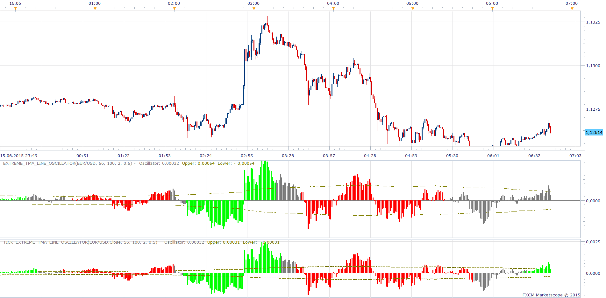

# Extreme TMA Line Oscillator

> Source: https://fxcodebase.com/code/viewtopic.php?f=17&t=62321  
> Forum: 17 · Topic 62321 · 7 post(s)

---

## Extreme TMA Line Oscillator

**Apprentice** · Tue Jun 16, 2015 6:23 am

Based on Extreme TMA Line indicator.
[viewtopic.php?f=17&t=59406](https://fxcodebase.com/code/viewtopic.php?f=17&t=59406)
Is calculated as difference between the closing price and Extreme TMA Line Indicator Central line.

 [Extreme_TMA_Line_Oscillator.lua](files/100974/Extreme_TMA_Line_Oscillator.lua)

 [Tick_Extreme_TMA_Line_Oscillator.lua](files/100974/Tick_Extreme_TMA_Line_Oscillator.lua)

For Tick Versions Tick ATR should be installed.
[viewtopic.php?f=17&t=34094&p=57962&hilit=tick+atr#p57962](https://fxcodebase.com/code/viewtopic.php?f=17&t=34094&p=57962&hilit=tick+atr#p57962)

MT4/MQ4 version.
[viewtopic.php?f=38&t=61392](https://fxcodebase.com/code/viewtopic.php?f=38&t=61392)

---

## Re: Extreme TMA Line Oscillator

**newton** · Tue Jun 16, 2015 3:04 pm

can you create divergence indicator based on this ossilator

---

## Re: Extreme TMA Line Oscillator

**Apprentice** · Wed Jun 17, 2015 2:31 am

Your request is added to the development list.

---

## Re: Extreme TMA Line Oscillator

**Apprentice** · Mon Oct 29, 2018 7:15 am

The indicator was revised and updated.

---

## Re: Extreme TMA Line Oscillator

**Alexander.Gettinger** · Wed Jan 09, 2019 4:49 pm

Please try this divergence indicator:

 [Extreme_TMA_Line_Divergence.lua](files/123287/Extreme_TMA_Line_Divergence.lua)

---

## Re: Extreme TMA Line Oscillator

**MemphisRokudo** · Thu Jan 10, 2019 10:02 pm

Is there a mt4 version?

---

## Re: Extreme TMA Line Oscillator

**Apprentice** · Fri Jan 11, 2019 9:50 am

MT4/MQ4 version.
[viewtopic.php?f=38&t=61392](https://fxcodebase.com/code/viewtopic.php?f=38&t=61392)
