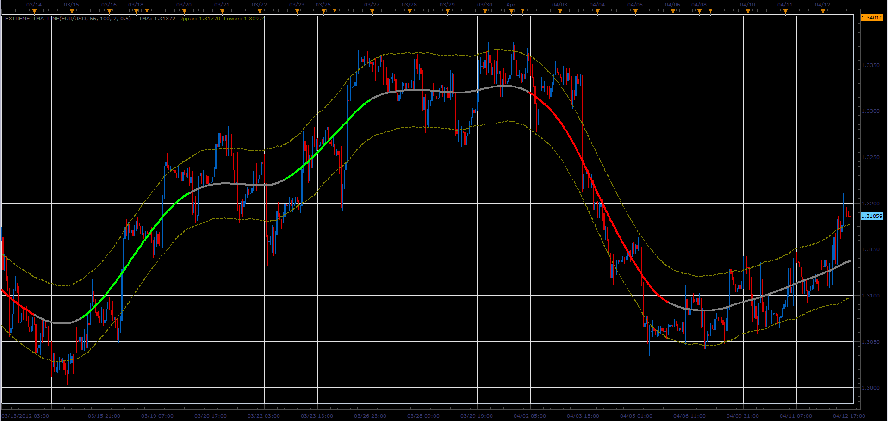
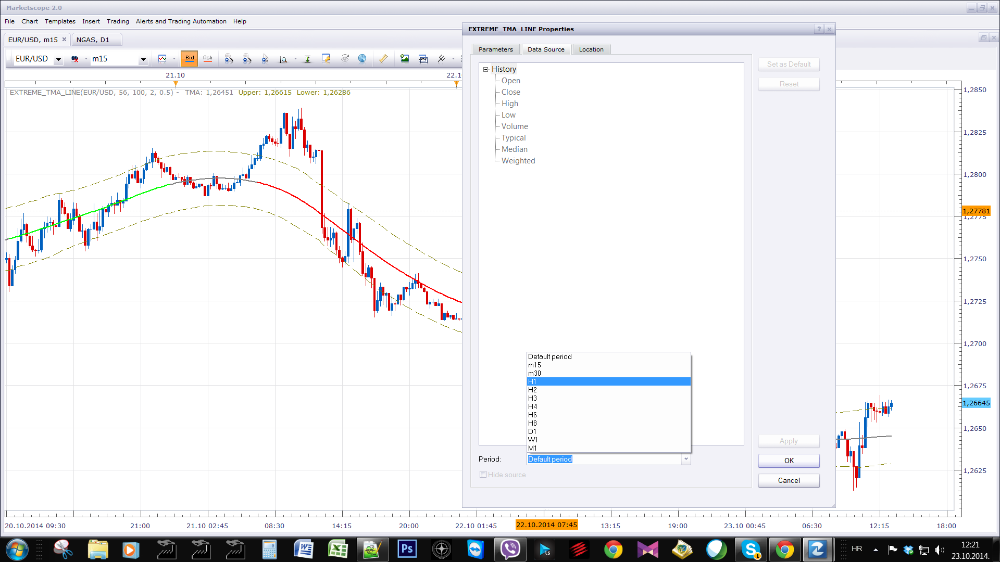
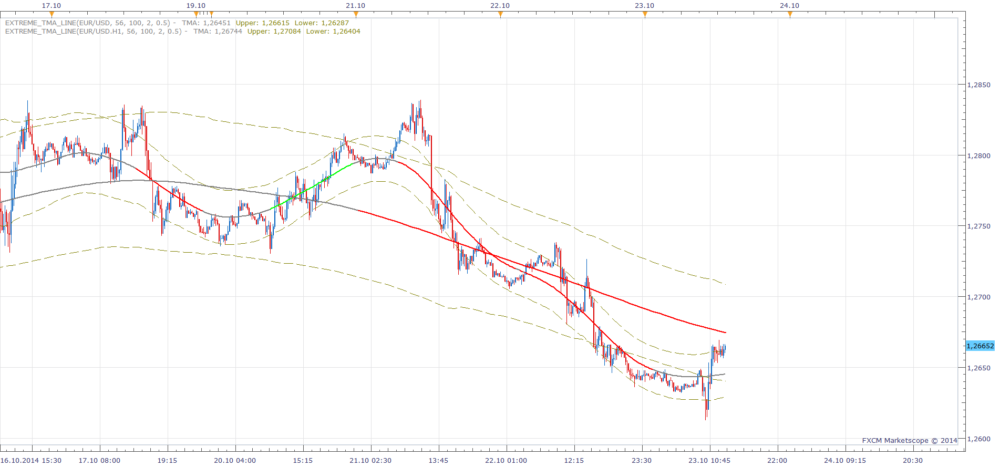
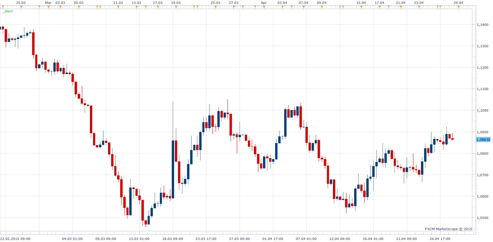
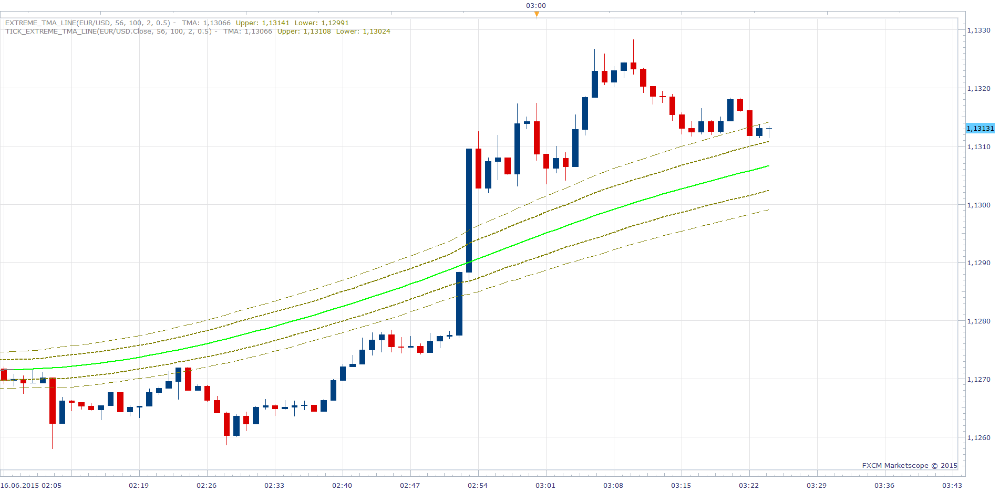
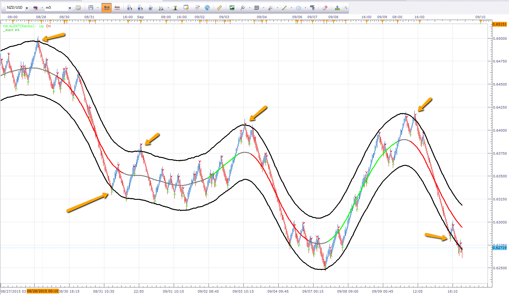
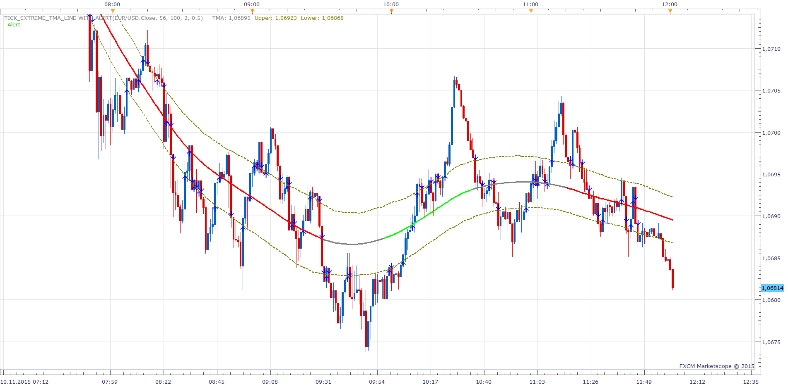
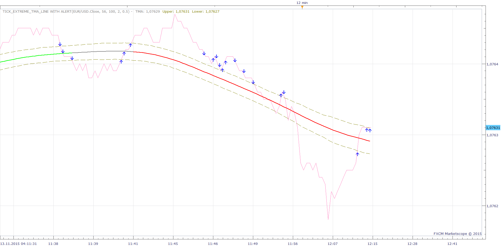

# Extreme_TMA_Line

> Source: https://fxcodebase.com/code/viewtopic.php?f=17&t=59406  
> Forum: 17 · Topic 59406 · 95 post(s)

---

## Extreme_TMA_Line

**Alexander.Gettinger** · Thu Apr 12, 2012 4:19 pm

See this indicator.

 

Download:

 [Extreme_TMA_Line.lua](files/29829/Extreme_TMA_Line.lua)

 [Extreme_TMA_Line with Alert.lua](files/29829/Extreme_TMA_Line%20with%20Alert.lua)

 [Extreme_TMA_Slope.lua](files/29829/Extreme_TMA_Slope.lua)

 [MTF MCP Extreme TMA line Slope List.lua](files/29829/MTF%20MCP%20Extreme%20TMA%20line%20Slope%20List.lua)

Unfortunately indicator redraws the last [TMA period] candles.

 [Tick_Extreme_TMA_Line.lua](files/29829/Tick_Extreme_TMA_Line.lua)

 [Tick_Extreme_TMA_Line with Alert.lua](files/29829/Tick_Extreme_TMA_Line%20with%20Alert.lua)

 [Tick_Extreme_TMA_Slope.lua](files/29829/Tick_Extreme_TMA_Slope.lua)

For Tick Versions Tick ATR should be installed.
[viewtopic.php?f=17&t=34094&p=57962&hilit=tick+atr#p57962](https://fxcodebase.com/code/viewtopic.php?f=17&t=34094&p=57962&hilit=tick+atr#p57962)

MQ4 version of Extreme TMA line indicator can be found here.
[viewtopic.php?f=38&t=61392&p=96801&hilit=TMA#p96801](https://fxcodebase.com/code/viewtopic.php?f=38&t=61392&p=96801&hilit=TMA#p96801)

 [Triple Extreme_TMA_Line.lua](files/29829/Triple%20Extreme_TMA_Line.lua)

Triple Extreme_TMA_Line strategy is available here.
[viewtopic.php?f=31&t=65062&p=114745#p114745](https://fxcodebase.com/code/viewtopic.php?f=31&t=65062&p=114745#p114745)

Tick_Extreme_TMA_Line MT4 version.
[https://fxcodebase.com/code/viewtopic.p ... 84#p146984](https://fxcodebase.com/code/viewtopic.php?f=38&t=72592&p=146984#p146984)

---

## Extreme_TMA_Line

**jaynlola** · Fri Apr 20, 2012 1:27 pm

Could this simple indicator be transformed to a usable Strategy?

---

## Extreme_TMA_Line

**tma4ever** · Sun Apr 22, 2012 9:10 pm

I have been using TMA successfully for a while now. Sorry I don't have the code to share. I just wish someone work on the non-repainting version of this indicator. Thanks in advance.

---

## Extreme_TMA_Line

**jaynlola** · Wed Apr 25, 2012 11:05 am

I've only been using it a short while and it seems to be pretty good. And yeah, a more permanent, concrete version would be cool. Maybe if this Extreme TMA was a configured strategy, combined with 'Stagestop,' it could prove very valuable.

To me, price action is one of the very few indicators/oscillators that do not lag. Losses will occur with any strategy, however, price action trading with some sort of automatic changing stop, and trading with the daily trend, all seems to really cut down the risk (which can facilitate comfort when trading bigger lots)

---

## Extreme_TMA_Line

**Apprentice** · Thu Apr 26, 2012 2:11 am

Noted.

---

## Extreme_TMA_Line

**mulligan** · Mon Oct 29, 2012 2:37 pm

A strategy for this indicator would be great. Buy or sell based on green or red color. Ignore grey neutral until next color reversal and reverse position. Thanks for your consideration.

---

## Extreme_TMA_Line

**Apprentice** · Tue Oct 30, 2012 3:02 am

You're asking for strategy for Extreme_TMA_Line?

---

## Extreme_TMA_Line

**mulligan** · Tue Oct 30, 2012 7:37 am

Yes, Extreme TMA line. Sorry for the wrong headline.

Thanks

---

## Extreme_TMA_Line

**filoo7** · Mon Sep 02, 2013 11:09 am

> **Apprentice wrote:**
> You're asking for strategy for Extreme_TMA_Line?

Hi Apprentice

Did you create Extreme Tma Line?

Thank's

---

## Extreme_TMA_Line

**Apprentice** · Tue Sep 03, 2013 3:36 am

Try This version.
[viewtopic.php?f=31&t=59383](https://fxcodebase.com/code/viewtopic.php?f=31&t=59383)

---

## Re: Extreme_TMA_Line

**sedraude** · Tue Oct 22, 2013 2:51 am

Hi Alexander

Can you make level on Exreme TMA Slope.lua like RLW.lua (%R Larry William) such as -20 & -80. But on Exreme TMA Slope.lua we need level -0.5, 0 & 0.5 only or customable.

Thanks in advanved.

---

## Re: Extreme_TMA_Line

**Apprentice** · Tue Oct 22, 2013 4:59 pm

Your request is added to the development list.

---

## Re: Extreme_TMA_Line

**Apprentice** · Wed Oct 23, 2013 3:47 am

OB/OS Lines added.
Also i have drastically improved the performance.

---

## Re: Extreme_TMA_Line

**sedraude** · Wed Oct 23, 2013 7:44 am

Hello Apprentice,

Thank you for your improvement on this indicator.
Two thumbs up...

> **Apprentice wrote:**
> OB/OS Lines added.
> Also i have drastically improved the performance.

---

## Re: Extreme_TMA_Line

**trdheat** · Wed Nov 06, 2013 5:09 pm

Hello,

I can not use other indicator as source.Is it possible to fix this problem?

---

## Re: Extreme_TMA_Line

**Apprentice** · Thu Nov 07, 2013 4:01 am

The problem is with ATR.
It use a full bar (open, close, high, low).

Try tick versions.(Topmost post)
Obviously, the values ​​will differ from the original.

---

## Re: Extreme_TMA_Line

**DAVIDR** · Tue Feb 18, 2014 3:34 pm

Hi looking at your post on April 12th 2012 and the Price Resistance Bands.

As I use marketscope 2.0 I assume I add the TMA indicator to my charts, but what settings do I need to use to show both bands (above and below the price).

All help gratefully received.

---

## Re: Extreme_TMA_Line

**Apprentice** · Wed Feb 19, 2014 4:20 am

Add Extreme_TMA_Line.lua to your Chart.
If u use default settings, u should have both bands.

---

## Re: Extreme_TMA_Line

**DAVIDR** · Wed Feb 19, 2014 10:53 am

Hi Apprentice, thanks. I had a problem with it, but it is ok now.

My default settings are -

TMA period - 56

ATR period - 100

ATR multiplier - 2.0

Trend Threshold - 0.5

Are these settings good, or have you found any better settings?

---

## Re: Extreme_TMA_Line

**DAVIDR** · Wed Feb 19, 2014 3:34 pm

Hi Apprentice, just to let you know I have answered my own question! I have been using this indicator on MT$ charts but could not access the parameters.

Anyway, I use the default settings above, but with one difference, I use the ATR Multiplier set to 3.0 which seems to work for me ok.

All the best

---

## Re: Extreme_TMA_Line

**DAVIDR** · Thu Oct 23, 2014 4:06 am

I am getting to love this indicator!

As I use 15 min charts, is it possible to display the outer bands from the 1 hour chart, so that both the 15 min bands and the 1 hour bands show on the same 15 min chart?

All the best.

DavidR

---

## Re: Extreme_TMA_Line

**Apprentice** · Thu Oct 23, 2014 5:18 am

 

---

## Re: Extreme_TMA_Line

**DAVIDR** · Fri Oct 24, 2014 6:50 am

Hi Apprentice, thank you so much.

All the best.

---

## Re: Extreme_TMA_Line

**DAVIDR** · Tue Oct 28, 2014 6:08 am

Hi Apprentice, is there an MT4 version of this indicator available?

All the best.

DavidR

---

## Re: Extreme_TMA_Line

**Apprentice** · Wed Oct 29, 2014 4:25 am

NOT at this Time.
Your request is added to the development list.

---

## Re: Extreme_TMA_Line

**Apprentice** · Wed Oct 29, 2014 6:54 am

Mq4 version can be found here.
[viewtopic.php?f=38&t=61392](https://fxcodebase.com/code/viewtopic.php?f=38&t=61392)

---

## Re: Extreme_TMA_Line

**jenniferFX888** · Sat Nov 15, 2014 4:59 am

these bands looks like PB channel and VBbands600 on MT4. I personally like both of them and would like to test this Extreme TMA Line on marketscope. Would you please post the indicator here again... thanks, jen

---

## Re: Extreme_TMA_Line

**Apprentice** · Sat Nov 15, 2014 5:41 am

Can you provide Code / Description / web references for this two.

---

## Re: Extreme_TMA_Line

**jenniferFX888** · Sat Nov 15, 2014 7:49 pm

hi Aprentice, I dont know how to attached MT4 ind. into here
These are called PB Channel.ex4 and VBbands600.ex4.

I can drag those indicators into your skype if you have one. My skypeid: bingchi6

---

## Re: Extreme_TMA_Line

**Apprentice** · Sun Nov 16, 2014 9:44 am

U cam use my privat email mario(.)jemic(@)gmail(.)com
My Skype ID is mario.jemic

---

## Re: Extreme_TMA_Line

**Segwin** · Wed Apr 22, 2015 8:27 pm

Hello Mario,

Is it possible to add an alert/alarm so that if a candle/wick breaks either of the outer bands you can get an email/popup/alert?

Thank you,

Terry

---

## Re: Extreme_TMA_Line

**Apprentice** · Thu Apr 23, 2015 9:41 am

Extreme_TMA_Line with Alert.lua added.

---

## Re: Extreme_TMA_Line

**Segwin** · Fri Apr 24, 2015 3:40 pm

Hello Mario,

I thought I posted a reply but may have not hit the submit.

I have Trading Station and MarketScope configured to send me emails via the test feature but I'm not getting email alerts or popups from the indicator. I'm new to TS & MS so it could be something on my end - any suggestions?

Thank you,

Terry

---

## Re: Extreme_TMA_Line

**Apprentice** · Mon Apr 27, 2015 2:30 am

Unfortunately TS does not provide support for alerts from within indicators.
Therefore _Alert helper is introduced.

U have to have active _Alert helper.
U have to have an instance of _Alert Helper for each currency pair of your interest.
U can add _Alert helper same as any signal or Strategy.

In the following Ts, update, TS will support even Alert Trade functionality.
Until then _Alert will be required.

---

## Re: Extreme_TMA_Line

**Segwin** · Mon Apr 27, 2015 1:10 pm

Sorry for the noob question Mario but and trying to figure out how to activate the alarm.

So in Marketscope 2.0 I start Extreme TMA. And then, I assume, I have to go to Alerts and Trading automation and then go to New Strategy or Alert and start _Alert so that it can port the alarm settings from Extreme TMA?

Is there a post that gives step by step instructions?

Thanks again my friend,

Terry

---

## Re: Extreme_TMA_Line

**Apprentice** · Tue Apr 28, 2015 2:41 am

1. Install _Alert Helper.
2. Add it as any Signal/Strategy.

Once you do that.
_Alert Helper will appear in the upper left corner.

 

Alerts will now work for respective currency.

How To Install Custom Strategies in Marketscope
[http://fxcodebase.com/wiki/index.php/Cu ... arketscope](https://fxcodebase.com/wiki/index.php/Custom_Strategies:_How_To_Install_in_Marketscope)

---

## Re: Extreme_TMA_Line

**Segwin** · Tue Apr 28, 2015 3:38 pm

Hello Mario,

I installed Alert as a Signal/Strategy and then added it to the pairs I'm looking at however I'm not getting any emails or alarms. Email is configured and a test message works.

I'm on a 15 minute chart if that matters.

Any thoughts?

Thanks,

Terry

---

## Re: Extreme_TMA_Line

**Apprentice** · Wed Apr 29, 2015 2:42 am

I assumed it was a problem with _Alert helper.
Sorry about that.
The problem was with indicator itself.
Please re-download.

---

## Re: Extreme_TMA_Line

**Segwin** · Wed Apr 29, 2015 7:59 am

Hi Mario,

The alerts are now working - thanks!

However the top, middle & bottom alarms seems to be out of whack. Best as I can figure if I get a top line alert it is really the middle line being crossed over. Id I get a bottom line alert it is really the top line being crossed over. I have yet to receive a middle line alert.

I appreciate all your help with this.

Terry

---

## Re: Extreme_TMA_Line

**Apprentice** · Thu Apr 30, 2015 3:06 am

Fixed.

---

## Re: Extreme_TMA_Line

**4x4partners** · Thu Apr 30, 2015 10:43 am

Hi Apprentice,

Can you explain what is the difference between the Tick version and original?

And is it possible to have an Alert on the Tick version?

Thanks a lot

---

## Re: Extreme_TMA_Line

**Segwin** · Thu Apr 30, 2015 1:06 pm

I hesitate to post this - you must be getting tired of me lol...

The last issue is fixed but now the email is broken as well as playing a sound on event. I'm sorry to keep bugging you as it is works well now. If you get the time.

Thanks,

Terry

---

## Re: Extreme_TMA_Line

**Apprentice** · Fri May 01, 2015 2:44 am

While Extreme_TMA_Line and Tick_Extreme_TMA_Line have the same Cental line.
Bands may vary.
While Extreme_TMA_Line can not be applied to particular component of the candle.
You have to have, candle source, to use it.
U can apply Tick version to any component of the candle,
or other indicator output line.

---

## Re: Extreme_TMA_Line

**Apprentice** · Fri May 01, 2015 6:29 am

Tick_Extreme_TMA_Line with Alert.lua Added.

---

## Re: Extreme_TMA_Line

**4x4partners** · Mon May 04, 2015 7:44 am

Hi Apprentice,

I'm getting the following error on the Tick Extreme with Alert.

An error occurred during the calculation of the indicator 'TICK_EXTREME_TMA_LINE WITH ALERT'. The error details: Tick_Extreme_TMA_Line with Alert.lua:297: Index is out of range.

---

## Re: Extreme_TMA_Line

**Apprentice** · Mon May 04, 2015 9:24 am

Try it now.

---

## Re: Extreme_TMA_Line

**4x4partners** · Tue May 05, 2015 4:59 am

Thanks Apprentice, it works now.

Although I'm not getting any emails with the Tick Extreme with Alerts.

I have my email settings all setup and get emails from other alerts, so must be something with this one - would you mind to check?

Thanks again
4x4

---

## Re: Extreme_TMA_Line

**Apprentice** · Wed May 06, 2015 6:54 am

If u have active _Alert helper for currency pair in subject .
You should have email alerts.

---

## Re: Extreme_TMA_Line

**easytrading** · Sun Jun 14, 2015 6:50 pm

Apprentice, kindly is it possible to code the BAR OSCILLTOR VERSION of:

1) Extreme_TMA_Slope.lue
2) Tick_Extreme_TMA_Slope.lue

your help is much appreciated.

---

## Re: Extreme_TMA_Line

**Apprentice** · Mon Jun 15, 2015 6:05 am

How do we calculate such indicator.
What presentation will be used.

---

## Re: Extreme_TMA_Line

**gozzox** · Mon Jun 15, 2015 1:23 pm

Hello,
can someone tell me if this indicator is repainting and if yes how many candles before.
Thank you.

---

## Re: Extreme_TMA_Line

**easytrading** · Mon Jun 15, 2015 2:25 pm

it is guna be like MACD histogram, i.e. instead of plotting a line Oscillator for both of them it will plot a histogram, as when the oscilattor line is above the zero level it will be Green bars and when the oscillator line is below the zero level it will be a Red bars, if it is posible please.

---

## Re: Extreme_TMA_Line

**Apprentice** · Tue Jun 16, 2015 2:56 am

to gozzox : Indicator redraws the last TMA period candles.

---

## Re: Extreme_TMA_Line

**Apprentice** · Tue Jun 16, 2015 3:03 am

As you can see the center line is the same for both indicator.
Can you provide the formula
MACD Analog.
MACD = Short EMA - Long EMA
Signal = EMA of MACD
Histogram: MACD - Signal

---

## Re: Extreme_TMA_Line

**easytrading** · Tue Jun 16, 2015 3:51 am

i am very sorry Apprentice cause i could not make my request clear in a right way .all i want is to convert the line style to bar in both oscillators
1) Extreme_TMA_Slope.lue
2) Tick_Extreme_TMA_Slope.lue
 green bars above zero level and red bars below zero level
with my appreciation in advance.

---

## Re: Extreme_TMA_Line

**Apprentice** · Tue Jun 16, 2015 6:24 am

Oscillator can be found here.
[viewtopic.php?f=17&t=62321](https://fxcodebase.com/code/viewtopic.php?f=17&t=62321)

---

## Re: Extreme_TMA_Line With Alert

**jenniferFX888** · Mon Sep 07, 2015 6:28 am

Hi Apprentice,

Can you tell the different of setting between Live and End of Turn mean? When i set for both Live and End of turn the arrows for up trend and down trend appear the same for cross over and cross under. Please see attached: [http://screencast.com/t/G5bEe5utfgd](http://screencast.com/t/G5bEe5utfgd) (Live);
 [http://screencast.com/t/yEL5o4W2ZZ](http://screencast.com/t/yEL5o4W2ZZ) (End of turn)
Thank you very much;

Jenn

---

## Re: Extreme_TMA_Line

**zl068565** · Wed Sep 09, 2015 9:54 pm

Hi Apprentice,

Can you add candle change alert to this indicator for areas outside of the band?

something like the HA Alert that you did here: [link](http://www.fxcodebase.com/code/viewtopic.php?f=17&t=18230&hilit=ha+alert)

so it would first test if the candle is outside of the band,
then gives and alert (sound + box alert option) when the first candle changes and ends (this is important)

 

*Here is an example of where the alert would go off*

Thanks Apprentice. I look forward to your answer.

---

## Re: Extreme_TMA_Line

**jenniferFX888** · Fri Sep 11, 2015 1:45 pm

Hi Aprrentice,

Would you take the HA ALERT (2) change the option to have the same as EXTREME_TMA_WITH ALERT when price cross above or below the upper and lower line that will be very helpful.

Thank you very much;

Jenni

---

## Re: Extreme_TMA_Line

**zl068565** · Wed Sep 16, 2015 3:34 pm

> **zl068565 wrote:**
> Hi Apprentice,
>
> Can you add candle change alert to this indicator for areas outside of the band?
>
> something like the HA Alert that you did here: [link](http://www.fxcodebase.com/code/viewtopic.php?f=17&t=18230&hilit=ha+alert)
>
> so it would first test if the candle is outside of the band,
> then gives and alert (sound + box alert option) when the first candle changes and ends (this is important)
>
>
>
> TMA_+_HA.png
>
>
>
> Thanks Apprentice. I look forward to your answer.

Hey Apprentice,

Any news on this topic? Thanks!

---

## Re: Extreme_TMA_Line

**Apprentice** · Fri Sep 18, 2015 2:28 am

Your request is added to the development list.

---

## Re: Extreme_TMA_Line

**Apprentice** · Fri Sep 25, 2015 4:37 am

Requested can be found here.
[viewtopic.php?f=17&t=62724](https://fxcodebase.com/code/viewtopic.php?f=17&t=62724)

---

## Re: Extreme_TMA_Line

**BigFOX** · Tue Nov 10, 2015 4:11 am

Hello Apprentice,
the version with the "Tick_Extreme_TMA_Line with Alert.lua" does not work.
Error:
- The parameter with the specified id alredy exists.
- attempt to index global 'indicator' (a nil value)

Thanks Adrien

---

## Re: Extreme_TMA_Line

**Apprentice** · Tue Nov 10, 2015 12:38 pm

Will investigate.
For me, it works perfectly.
After the next update alert functionality will get native support from within indicator.
This will eliminate need for helpers.

---

## Re: Extreme_TMA_Line

**BigFOX** · Wed Nov 11, 2015 1:52 am

Thanks for the quick reply,

"Tick_Extreme_TMA_Line.lua" is good.
But "Tick_Extreme_TMA_Line with Alert.lua" does not work.

Thanks Adrien

---

## Re: Extreme_TMA_Line

**Apprentice** · Fri Nov 13, 2015 4:49 am

For me work as expected.
A possible problem is Alert helper
After following TS update alert helper will no longer be required.

---

## Re: Extreme_TMA_Line

**JOKER83** · Mon Apr 25, 2016 9:57 am

PLEASE MAKE EXTREME TMA SLOPE STRATEGY
EXIT OPTIONAL

---

## Re: Extreme_TMA_Line

**Apprentice** · Sun May 01, 2016 6:23 am

Something like this one?
[viewtopic.php?f=31&t=59383](https://fxcodebase.com/code/viewtopic.php?f=31&t=59383)

---

## Re: Extreme_TMA_Line

**Apprentice** · Fri May 06, 2016 5:20 am

Cental line slope alert added.

---

## Re: Extreme_TMA_Line

**rdthomas** · Sat May 07, 2016 3:51 pm

Is it possible on the one file that combines the Extreme TMA Line and Extreme TMA Slope to give us the option of turning off or on the various alerts?

---

## Re: Extreme_TMA_Line

**Apprentice** · Mon May 09, 2016 4:31 am

Try Extreme_TMA_Line with Alert.lua

---

## Re: Extreme_TMA_Line

**Subsurface** · Fri Jul 22, 2016 3:50 am

Hello, First of all thank you very much for the fantastic job done here. I'm a great fan.

Anyway, I was wondering if it will be possible to make this indicator like the Double Bollinger band or Triple Bollinger band. In fact have a XtremeTMA Band instead of a simple line ? Thank you.

---

## Re: Extreme_TMA_Line

**Apprentice** · Sun Jul 24, 2016 7:46 am

Triple Extreme_TMA_Line added.

---

## Re: Extreme_TMA_Line

**Subsurface** · Sun Jul 24, 2016 11:25 am

Just perfect. Thank you very much

---

## Re: Extreme_TMA_Line

**Apprentice** · Wed Sep 19, 2018 9:01 am

The indicator was revised and updated.

---

## Re: Extreme_TMA_Line

**xpertize** · Fri Jan 10, 2020 5:46 am

Hi Apprentice,

Does the "Tick_Extreme_TMA_Line.lua" also redraws the indicator to defined TMA Period?

Regards,
Xpertize

---

## Re: Extreme_TMA_Line

**Apprentice** · Sat Jan 11, 2020 7:04 am

Both versions use the same logic.

---

## Re: Extreme_TMA_Line

**xpertize** · Sun Jan 12, 2020 8:43 am

Thanks

---

## Re: Extreme_TMA_Line

**esperanzaca** · Thu Nov 26, 2020 2:41 pm

Hi. I've a question about the middle line. If I just want to use the middle line, which moving average should I use and what is the setting? Thank you in advance.

---

## MinMax_Extreme_TMA_Line

**Gilles** · Tue Apr 05, 2022 3:37 pm

Hi Apprentice,

I'have an idea,

Could you create a stream to draw MinMax_MA apply to Extrem TMA Line ?
Like this : MinMax_MA(Extreme_TMA_Line, 15).TMA, 5)

It seems to be more effective in reducing noise with 5 periods.

Thank you very much.

---

## Re: c

**Apprentice** · Wed Apr 06, 2022 9:47 am

As an Extreme_TMA_Line-based indicator that will draw a channel.
The central line will be MA of Extreme_TMA_Line
Top Line max of last X candles.
Bottom as min of last X candles.

---

## Re: Extreme_TMA_Line

**Gilles** · Wed Apr 06, 2022 11:23 am

Hi Apprentice,
That's right.
Applying the MINMAX_MA to the source allows EXTREME_TMA_LINE to filter out false signals related to Redraw.
Redraw is an indispensable feature to ensure the perfect smoothing of the TMA with each new price change.
Indeed, MINMAX_MA will represent a centered line between the minimum/maximum variations of the EXTREME_TMA_LINE line over N periods.

Thank you very much :)

---

## Re: Extreme_TMA_Line

**Apprentice** · Sat Apr 09, 2022 11:55 am

Your request is added to the development list.
Development reference 211.

---

## Re: Extreme_TMA_Line

**Apprentice** · Fri May 06, 2022 7:33 am

Try this version.
[https://fxcodebase.com/code/viewtopic.php?f=17&t=72154](https://fxcodebase.com/code/viewtopic.php?f=17&t=72154)

---

## Re: Extreme_TMA_Line

**Gilles** · Mon Jul 25, 2022 1:08 pm

Hi Apprentice,

Please, is it possible to convert Tick_Extreme_TMA_Line.lua for MT4 ?

Thank you very much :) !

---

## Re: Extreme_TMA_Line

**Apprentice** · Wed Jul 27, 2022 2:02 am

We have added your request to the development list.
Development reference 445.

---

## Re: Extreme_TMA_Line

**Apprentice** · Thu Aug 04, 2022 4:18 am

Tick_Extreme_TMA_Line MT4 version.
[https://fxcodebase.com/code/viewtopic.p ... 84#p146984](https://fxcodebase.com/code/viewtopic.php?f=38&t=72592&p=146984#p146984)

---

## Re: Extreme_TMA_Line

**Gilles** · Thu Jun 29, 2023 1:55 pm

Hi Apprentice,
Would it be possible to get a numerical example to better understand how to obtain an Extreme_TMA_Line?
I would like to replicate this calculation in Excel.
Appreciating an indicator is a first step, but understanding it is essential to me.
Thank you in advance for your response.
Thank you very much.

---

## Re: Extreme_TMA_Line

**Apprentice** · Sat Jul 01, 2023 5:59 am

We have added your request to the development list.
Development reference 568.

---

## Re: Extreme_TMA_Line

**AlexanderS** · Sat Jun 14, 2025 11:03 am

HI
Can you make a strategy
same with
Highly adaptable Alligator Strategy
and a indikator with alert same

---

## Re: Extreme_TMA_Line

**Apprentice** · Wed Jun 18, 2025 11:27 am

We have added your request to the development list.
Development reference 393

---

## Re: Extreme_TMA_Line

**Apprentice** · Fri Jun 20, 2025 2:59 am

Try this version.
[https://fxcodebase.com/code/viewtopic.p ... 48#p159648](https://fxcodebase.com/code/viewtopic.php?f=31&t=76047&p=159648#p159648)

---

## Re: Extreme_TMA_Line

**AlexanderS** · Fri Jun 20, 2025 2:40 pm

THANKS
can yu make a indicator with same Settings
with arow

THANKS

---

## Re: Extreme_TMA_Line

**Apprentice** · Sat Jun 21, 2025 1:00 pm

We have added your request to the development list.
Development reference 400

---

## Re: Extreme_TMA_Line

**Apprentice** · Tue Jun 24, 2025 6:08 am

 [Highly_Adaptable_Extreme_TMA_Line.lua](files/159705/Highly_Adaptable_Extreme_TMA_Line.lua)
