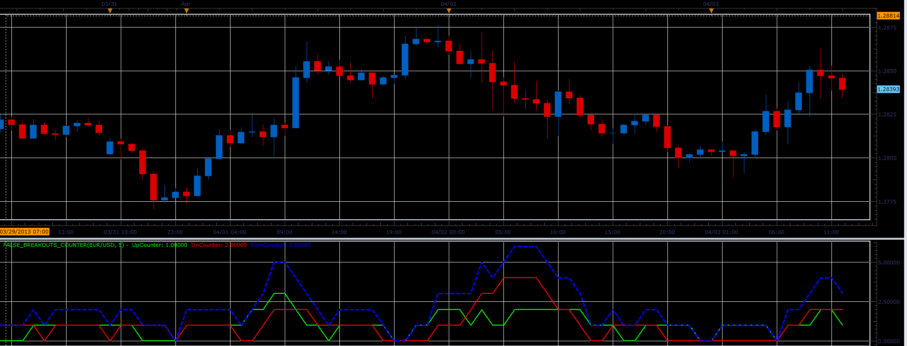

# False Breakouts Counter

> Source: https://fxcodebase.com/code/viewtopic.php?f=17&t=34057  
> Forum: 17 · Topic 34057 · 3 post(s)

---

## False Breakouts Counter

**Alexander.Gettinger** · Wed Apr 03, 2013 2:21 pm

This indicator is a ported MQL5 indicators from [http://www.mql5.com/en/code/1562](http://www.mql5.com/en/code/1562)

 

Download:

 [False_Breakouts_Counter.lua](files/57896/False_Breakouts_Counter.lua)

The indicator was revised and updated

---

## Re: False Breakouts Counter

**Alexander.Gettinger** · Wed Apr 10, 2013 4:11 pm

MQL4 version of this indicator: [viewtopic.php?f=38&t=34360](https://fxcodebase.com/code/viewtopic.php?f=38&t=34360)

---

## Re: False Breakouts Counter

**Apprentice** · Tue May 09, 2017 6:13 am

Indicator was revised and updated.
