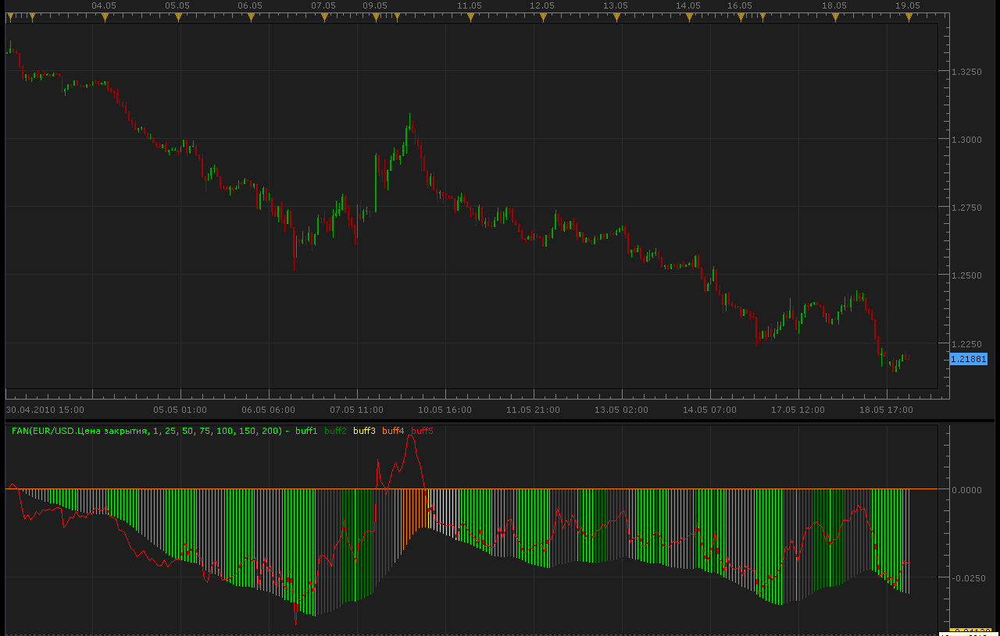
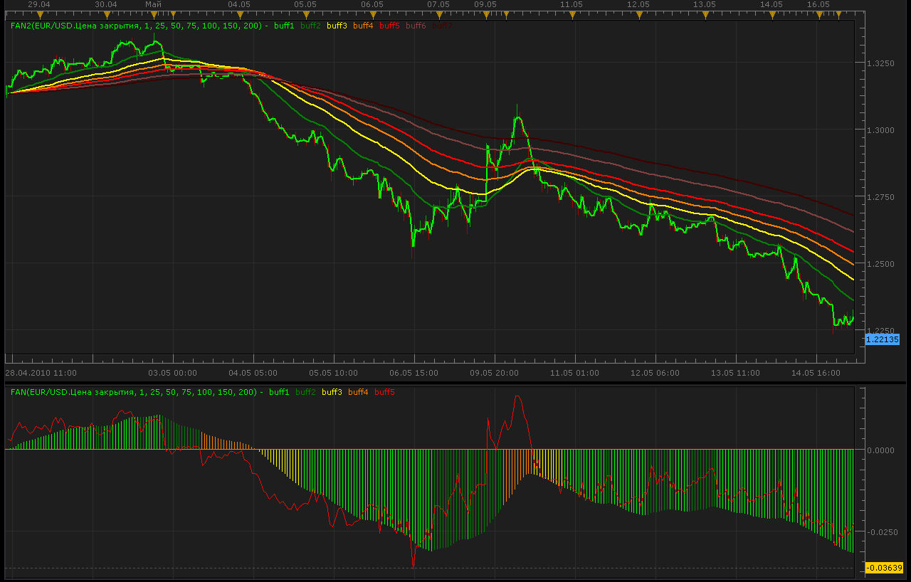

# Fan of MA

> Source: https://fxcodebase.com/code/viewtopic.php?f=17&t=1056  
> Forum: 17 · Topic 1056 · 11 post(s)

---

## Fan of MA

**Alexander.Gettinger** · Wed May 19, 2010 12:27 am

Fan of 7 MA.

 

Code: [Select all](https://fxcodebase.com/code/)
`function Init()
    indicator:name("FAN");
    indicator:description("");
    indicator:requiredSource(core.Tick);
    indicator:type(core.Oscillator);

    indicator.parameters:addInteger("Period_1", "Period 1", "No description", 1);
    indicator.parameters:addInteger("Period_2", "Period 2", "No description", 25);
    indicator.parameters:addInteger("Period_3", "Period 3", "No description", 50);
    indicator.parameters:addInteger("Period_4", "Period 4", "No description", 75);
    indicator.parameters:addInteger("Period_5", "Period 5", "No description", 100);
    indicator.parameters:addInteger("Period_6", "Period 6", "No description", 150);
    indicator.parameters:addInteger("Period_7", "Period 7", "No description", 200);

    indicator.parameters:addColor("color_1", "Color 1", "Color 1", core.rgb(0, 255, 0));
    indicator.parameters:addColor("color_2", "Color 2", "Color 2", core.rgb(0, 128, 0));
    indicator.parameters:addColor("color_3", "Color 3", "Color 3", core.rgb(255, 255, 0));
    indicator.parameters:addColor("color_4", "Color 4", "Color 4", core.rgb(255, 128, 0));
    indicator.parameters:addColor("color_5", "Color 5", "Color 5", core.rgb(255, 0, 0));
end

local Period1;
local Period2;
local Period3;
local Period4;
local Period5;
local Period6;
local Period7;

local first;
local source = nil;
local buff1=nil;
local buff2=nil;
local buff3=nil;
local buff4=nil;
local buff5=nil;

local MA1;
local MA2;
local MA3;
local MA4;
local MA5;
local MA6;
local MA7;

function Prepare()
    Period1 = instance.parameters.Period_1;
    Period2 = instance.parameters.Period_2;
    Period3 = instance.parameters.Period_3;
    Period4 = instance.parameters.Period_4;
    Period5 = instance.parameters.Period_5;
    Period6 = instance.parameters.Period_6;
    Period7 = instance.parameters.Period_7;
    source = instance.source;
    MA1 = core.indicators:create("EMA", source, Period1);
    MA2 = core.indicators:create("EMA", source, Period2);
    MA3 = core.indicators:create("EMA", source, Period3);
    MA4 = core.indicators:create("EMA", source, Period4);
    MA5 = core.indicators:create("EMA", source, Period5);
    MA6 = core.indicators:create("EMA", source, Period6);
    MA7 = core.indicators:create("EMA", source, Period7);
   
    first = math.max(MA1.DATA:first(),MA2.DATA:first(),MA3.DATA:first(),MA4.DATA:first(),MA5.DATA:first(),MA6.DATA:first(),MA7.DATA:first());
    local name = profile:id() .. "(" .. source:name() .. ", " .. Period1 .. ", " .. Period2 .. ", " .. Period3 .. ", " .. Period4 .. ", " .. Period5 .. ", " .. Period6 .. ", " .. Period7 .. ")";
    instance:name(name);
    buff1 = instance:addStream("buff1", core.Bar, name .. ".buff1", "buff1", instance.parameters.color_1, first);
    buff2 = instance:addStream("buff2", core.Bar, name .. ".buff2", "buff2", instance.parameters.color_2, first);
    buff3 = instance:addStream("buff3", core.Bar, name .. ".buff3", "buff3", instance.parameters.color_3, first);
    buff4 = instance:addStream("buff4", core.Bar, name .. ".buff4", "buff4", instance.parameters.color_4, first);
    buff5 = instance:addStream("buff5", core.Line, name .. ".buff5", "buff5", instance.parameters.color_5, first);
end

function Update(period, mode)
 if (period>first) then
  MA1:update(mode);
  MA2:update(mode);
  MA3:update(mode);
  MA4:update(mode);
  MA5:update(mode);
  MA6:update(mode);
  MA7:update(mode);
  local DeltaMA1=MA1.DATA[period]-MA2.DATA[period];
  local DeltaMA2=MA1.DATA[period]-MA3.DATA[period];
  local DeltaMA3=MA1.DATA[period]-MA4.DATA[period];
  local DeltaMA4=MA1.DATA[period]-MA5.DATA[period];
  local DeltaMA5=MA1.DATA[period]-MA6.DATA[period];
  local DeltaMA6=MA1.DATA[period]-MA7.DATA[period];
 
  local DL=buff1[period-1]+buff2[period-1]+buff3[period-1]+buff4[period-1];
  local DeltaFan=DeltaMA6-DeltaMA1;
  buff1[period]=0;
  buff2[period]=0;
  buff3[period]=0;
  buff4[period]=0;
 
  if DeltaFan==DL then
   buff1[period]=buff1[period-1];
   buff2[period]=buff2[period-1];
   buff3[period]=buff3[period-1];
   buff4[period]=buff4[period-1];
  else
   if ((MA2.DATA[period]>MA3.DATA[period] and MA3.DATA[period]>MA4.DATA[period] and MA4.DATA[period]>MA5.DATA[period] and MA5.DATA[period]>MA6.DATA[period] and MA6.DATA[period]>MA7.DATA[period]) or (MA2.DATA[period]<MA3.DATA[period] and MA3.DATA[period]<MA4.DATA[period] and MA4.DATA[period]<MA5.DATA[period] and MA5.DATA[period]<MA6.DATA[period] and MA6.DATA[period]<MA7.DATA[period])) then
    if (DeltaFan>DL and DeltaFan>0) or (DeltaFan<DL and DeltaFan<0) then
     buff1[period]=DeltaFan;
    else
     buff2[period]=DeltaFan;
    end
   else
    if (DeltaFan>DL and DeltaFan>0) or (DeltaFan<DL and DeltaFan<0) then
     buff3[period]=DeltaFan;
    else
     buff4[period]=DeltaFan;
    end
   end
  end
  buff5[period]=(DeltaMA1+DeltaMA2+DeltaMA3+DeltaMA4+DeltaMA5+DeltaMA6)/6.;
 end
end`

---

## Re: Fan of MA

**Alexander.Gettinger** · Wed May 19, 2010 12:41 am

Code: [Select all](https://fxcodebase.com/code/)
`function Init()
    indicator:name("FAN");
    indicator:description("");
    indicator:requiredSource(core.Tick);
    indicator:type(core.Indicator);

    indicator.parameters:addInteger("Period_1", "Period 1", "No description", 1);
    indicator.parameters:addInteger("Period_2", "Period 2", "No description", 25);
    indicator.parameters:addInteger("Period_3", "Period 3", "No description", 50);
    indicator.parameters:addInteger("Period_4", "Period 4", "No description", 75);
    indicator.parameters:addInteger("Period_5", "Period 5", "No description", 100);
    indicator.parameters:addInteger("Period_6", "Period 6", "No description", 150);
    indicator.parameters:addInteger("Period_7", "Period 7", "No description", 200);

    indicator.parameters:addColor("color_1", "Color 1", "Color 1", core.rgb(0, 255, 0));
    indicator.parameters:addColor("color_2", "Color 2", "Color 2", core.rgb(0, 128, 0));
    indicator.parameters:addColor("color_3", "Color 3", "Color 3", core.rgb(255, 255, 0));
    indicator.parameters:addColor("color_4", "Color 4", "Color 4", core.rgb(255, 128, 0));
    indicator.parameters:addColor("color_5", "Color 5", "Color 5", core.rgb(255, 0, 0));
    indicator.parameters:addColor("color_6", "Color 6", "Color 6", core.rgb(128, 64, 64));
    indicator.parameters:addColor("color_7", "Color 7", "Color 7", core.rgb(64, 0, 0));
end

local Period1;
local Period2;
local Period3;
local Period4;
local Period5;
local Period6;
local Period7;

local first;
local source = nil;
local buff1=nil;
local buff2=nil;
local buff3=nil;
local buff4=nil;
local buff5=nil;
local buff6=nil;
local buff7=nil;

local MA1;
local MA2;
local MA3;
local MA4;
local MA5;
local MA6;
local MA7;

function Prepare()
    Period1 = instance.parameters.Period_1;
    Period2 = instance.parameters.Period_2;
    Period3 = instance.parameters.Period_3;
    Period4 = instance.parameters.Period_4;
    Period5 = instance.parameters.Period_5;
    Period6 = instance.parameters.Period_6;
    Period7 = instance.parameters.Period_7;
    source = instance.source;
    MA1 = core.indicators:create("EMA", source, Period1);
    MA2 = core.indicators:create("EMA", source, Period2);
    MA3 = core.indicators:create("EMA", source, Period3);
    MA4 = core.indicators:create("EMA", source, Period4);
    MA5 = core.indicators:create("EMA", source, Period5);
    MA6 = core.indicators:create("EMA", source, Period6);
    MA7 = core.indicators:create("EMA", source, Period7);
   
    first = math.max(MA1.DATA:first(),MA2.DATA:first(),MA3.DATA:first(),MA4.DATA:first(),MA5.DATA:first(),MA6.DATA:first(),MA7.DATA:first());
    local name = profile:id() .. "(" .. source:name() .. ", " .. Period1 .. ", " .. Period2 .. ", " .. Period3 .. ", " .. Period4 .. ", " .. Period5 .. ", " .. Period6 .. ", " .. Period7 .. ")";
    instance:name(name);
    buff1 = instance:addStream("buff1", core.Line, name .. ".buff1", "buff1", instance.parameters.color_1, first);
    buff2 = instance:addStream("buff2", core.Line, name .. ".buff2", "buff2", instance.parameters.color_2, first);
    buff3 = instance:addStream("buff3", core.Line, name .. ".buff3", "buff3", instance.parameters.color_3, first);
    buff4 = instance:addStream("buff4", core.Line, name .. ".buff4", "buff4", instance.parameters.color_4, first);
    buff5 = instance:addStream("buff5", core.Line, name .. ".buff5", "buff5", instance.parameters.color_5, first);
    buff6 = instance:addStream("buff6", core.Line, name .. ".buff6", "buff6", instance.parameters.color_6, first);
    buff7 = instance:addStream("buff7", core.Line, name .. ".buff7", "buff7", instance.parameters.color_7, first);
end

function Update(period, mode)
 if (period>first) then
  MA1:update(mode);
  MA2:update(mode);
  MA3:update(mode);
  MA4:update(mode);
  MA5:update(mode);
  MA6:update(mode);
  MA7:update(mode);
 
  buff1[period]=MA1.DATA[period];
  buff2[period]=MA2.DATA[period];
  buff3[period]=MA3.DATA[period];
  buff4[period]=MA4.DATA[period];
  buff5[period]=MA5.DATA[period];
  buff6[period]=MA6.DATA[period];
  buff7[period]=MA7.DATA[period];
 end
end`

---

## Re: Fan of MA

**one2share** · Wed May 19, 2010 5:25 am

Thanks Guys, I love it, Can we get a signal created for this indicator? Thanks

---

## Re: Fan of MA

**Nikolay.Gekht** · Wed May 19, 2010 8:23 am

Could you specify conditions when the signal must alert?

---

## Re: Fan of MA

**one2share** · Thu May 20, 2010 1:15 pm

If the signal could have dual signals..1st signal would alert when the bars on the bottom fan indicator has crossed up. the bar has begun to form on the top or either the bottom of the zero. The second alert would occurr when the 50, 100, 150 ma's cross the 200. If possible, maybe the properties of the signal could include those options, example, alert when ma's cros (true, false), alert with both occur(true/false) as a matter of choice for the user. The way the user could determine which type of alert to chose from or if they want better confirmation of the trend change but things would need to occur before the alert signals. I hope I have made myself clear

---

## Re: Fan of MA

**Alexander.Gettinger** · Tue May 25, 2010 3:44 am

You may see other fan indicator here: [viewtopic.php?f=17&t=1102](https://fxcodebase.com/code/viewtopic.php?f=17&t=1102)

---

## Re: Fan of MA

**one2share** · Tue May 25, 2010 6:13 am

thanks guys, I love the fans, however if possible, are we able to get signals for these? maybe u can create a signal to alert when all three fans have crossed? or if using one and another indicate for example, heiken ashi we would can a signal when trend change for fan and heiken ashi candle. thanks guys. does anyone know who how I can get the sound to play in the alert? I have tried browsing and placing an audio file in the slot however when the alert pops up, there still is no sound? maybe someone has a file that we can add to upload

---

## Re: Fan of MA

**Nikolay.Gekht** · Wed May 26, 2010 2:17 pm

> **one2share wrote:**
> does anyone know who how I can get the sound to play in the alert? I have tried browsing and placing an audio file in the slot however when the alert pops up, there still is no sound? maybe someone has a file that we can add to upload

You can use any wav file to play the sound.
The trading station sounds are located here: C:\Program Files\Candleworks\FXTS2\Sounds\
The windows' sounds are located here: C:\Windows\Media\ (Windows is the folder name where windows is set up).

---

## Re: Fan of MA

**one2share** · Wed May 26, 2010 2:51 pm

thanks guys, will let u know if I have any luck? I am eager to see the signal for the ma fan...thanks guys again

---

## Re: Fan of MA

**VictorFX** · Wed May 26, 2010 3:12 pm

Briliant indicator. Thank you so much. one of my favorite.

---

## Re: Fan of MA

**Apprentice** · Mon Feb 05, 2018 7:27 am

The Indicator was revised and updated.
