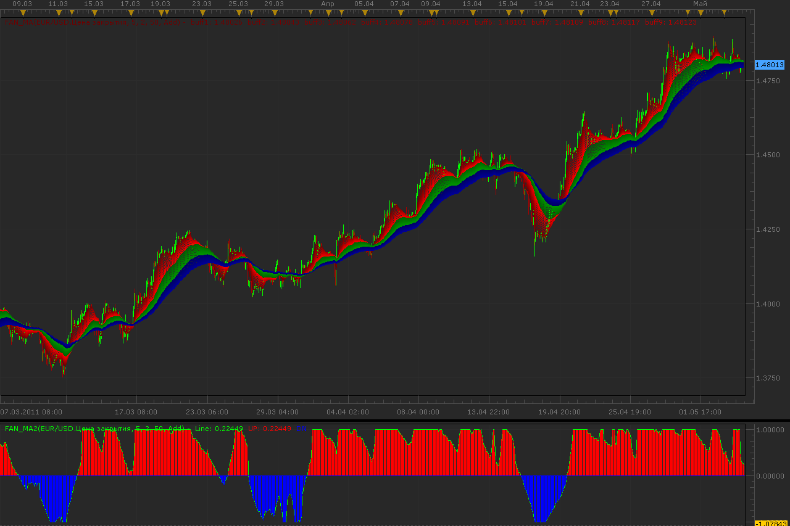

# Fan oscillators

> Source: https://fxcodebase.com/code/viewtopic.php?f=17&t=4104  
> Forum: 17 · Topic 4104 · 3 post(s)

---

## Fan oscillators

**Alexander.Gettinger** · Wed May 04, 2011 1:25 am

Oscillators are a continuation of [viewtopic.php?f=17&t=1102&p=2114](https://fxcodebase.com/code/viewtopic.php?f=17&t=1102&p=2114) in maybe more suitable version.
Value of oscillator show relative position line of fan and have range between -1 and 1.

 

Download:

 [Fan_MA2.lua](files/10289/Fan_MA2.lua)

Similar oscillators for CCI and RSI.
Download CCI fan oscillator:

 [Fan_CCI2.lua](files/10289/Fan_CCI2.lua)

Download RSI fan oscillator:

 [Fan_RSI2.lua](files/10289/Fan_RSI2.lua)

The indicator was revised and updated

---

## Re: Fan oscillators

**Alexander.Gettinger** · Wed May 04, 2011 2:04 am

Strategies based on this oscillators: [viewtopic.php?f=31&t=4106](https://fxcodebase.com/code/viewtopic.php?f=31&t=4106)

---

## Re: Fan oscillators

**Apprentice** · Sun Mar 12, 2017 5:42 pm

Indicator was revised and updated.
