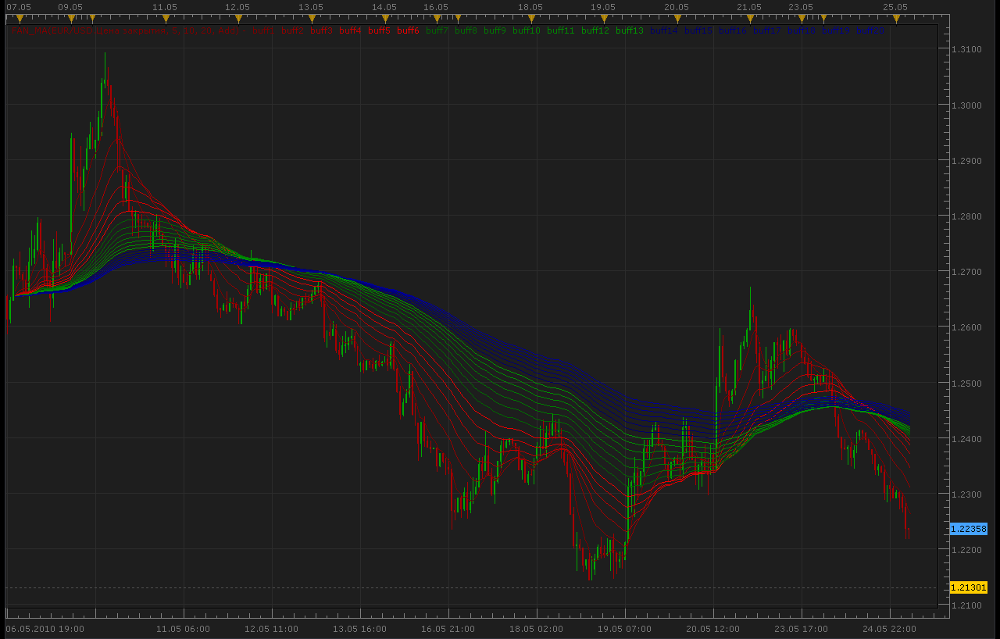
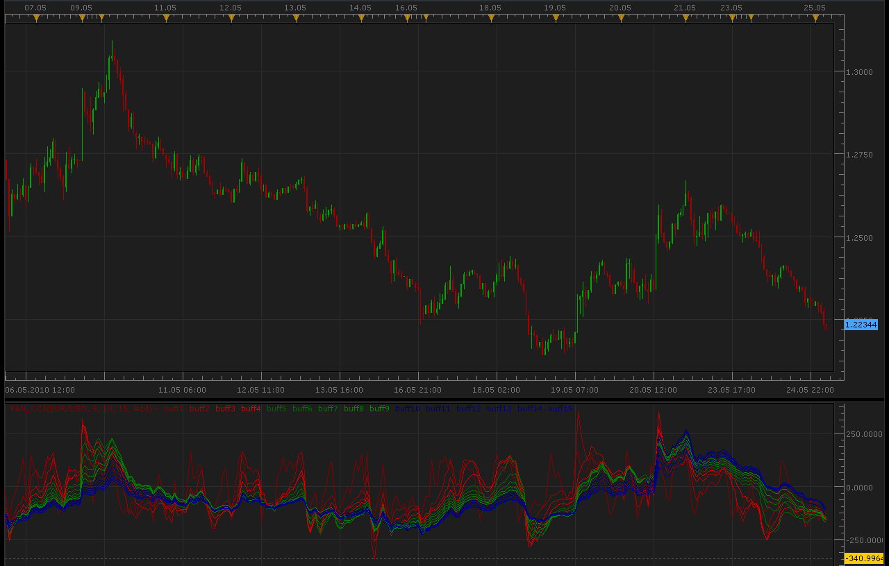
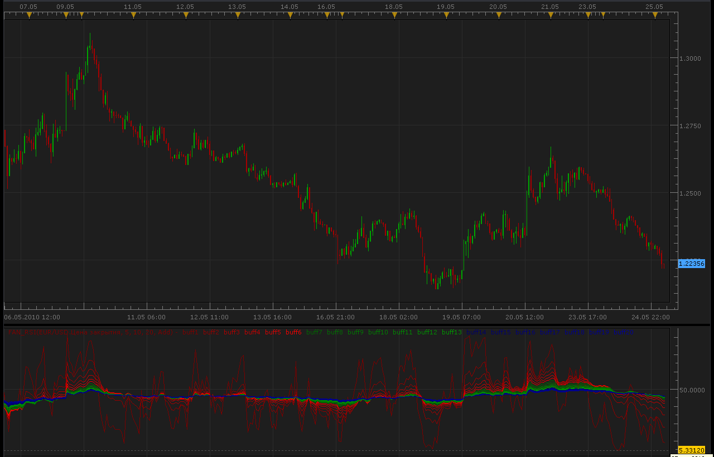
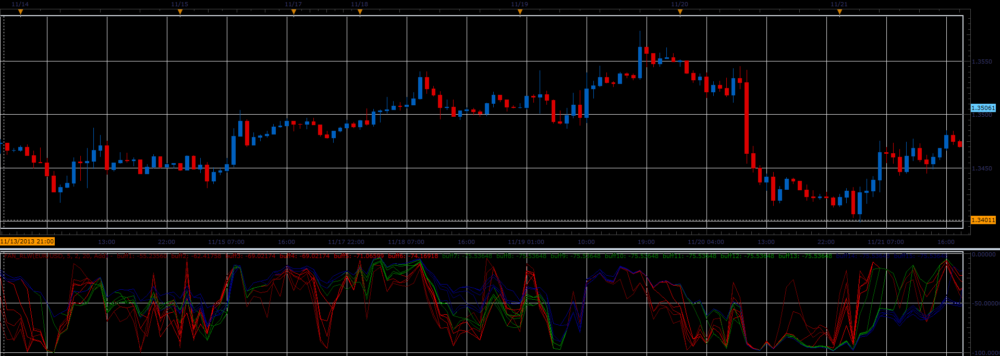
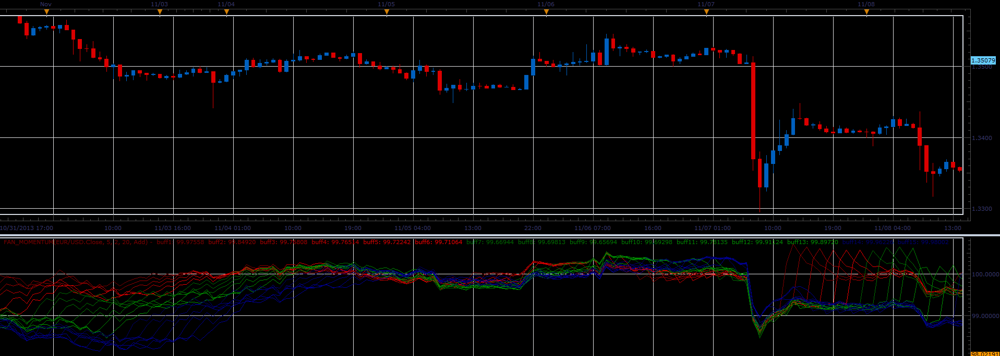

# Fans of variable number of MA, CCI, RSI, RLW, Momentum

> Source: https://fxcodebase.com/code/viewtopic.php?f=17&t=1102  
> Forum: 17 · Topic 1102 · 17 post(s)

---

## Fans of variable number of MA, CCI, RSI, RLW, Momentum

**Alexander.Gettinger** · Tue May 25, 2010 3:38 am

Fan of EMA.

 

Code: [Select all](https://fxcodebase.com/code/)
`function Init()
    indicator:name("FAN of EMA");
    indicator:description("");
    indicator:requiredSource(core.Tick);
    indicator:type(core.Indicator);

    indicator.parameters:addInteger("Period_1", "First period", "No description", 5);
    indicator.parameters:addString("Method", "Method", "", "Add");
    indicator.parameters:addStringAlternative("Method", "Add", "", "Add");
    indicator.parameters:addStringAlternative("Method", "Mult", "", "Mult");

    indicator.parameters:addInteger("K", "K", "No description", 2);
    indicator.parameters:addInteger("N", "Count of MA", "No description", 5);

end

local Period1;
local K;
local N;
local Method;

local first;
local source = nil;
local buffs={};

local Inds={};

function Prepare()
    Period1 = instance.parameters.Period_1;
    K = instance.parameters.K;
    N = instance.parameters.N;
    Method = instance.parameters.Method;
    source = instance.source;
    local Period=Period1;
    for i=1,N,1 do
     Ind=core.indicators:create("EMA", source, Period);
     Inds[i]=Ind;
     if Method=="Mult" then
      Period=Period*K;
     else
      Period=Period+K;
     end
    end
   
    first = Inds[N].DATA:first()+2;
    local name = profile:id() .. "(" .. source:name() .. ", " .. Period1 .. ", " .. K .. ", " .. N .. ", " .. Method .. ")";
    instance:name(name);
   
    for i=1,N,1 do
     if i<N/3 then
      Color=core.rgb(i*155*3/N+100,0,0);
     elseif i>=N/3 and i<2*N/3 then
      Color=core.rgb(0,(i-N/3)*155/N+100,0);
     else
      Color=core.rgb(0,0,(i-N*2/3)*155/N+100);
     end
     buffs[i] = instance:addStream("buff" .. i, core.Line, name .. ".buff" .. i, "buff" .. i, Color, first);
    end
end

function Update(period, mode)
 if (period>first) then
  for i=1,N,1 do
   Inds[i]:update(mode);
   buffs[i][period]=Inds[i].DATA[period];
  end
 
 end
end`

 [Fan_MA.lua](files/2114/Fan_MA.lua)

MT4/Mq4 veersion is available here.
[viewtopic.php?f=38&t=63780](https://fxcodebase.com/code/viewtopic.php?f=38&t=63780)

---

## Re: Fans of variable number of MA, CCI, RSI

**Alexander.Gettinger** · Tue May 25, 2010 3:40 am

Fan of CCI.

 

Code: [Select all](https://fxcodebase.com/code/)
`function Init()
    indicator:name("FAN of CCI");
    indicator:description("");
    indicator:requiredSource(core.Bar);
    indicator:type(core.Oscillator);

    indicator.parameters:addInteger("Period_1", "First period", "No description", 5);
    indicator.parameters:addString("Method", "Method", "", "Add");
    indicator.parameters:addStringAlternative("Method", "Add", "", "Add");
    indicator.parameters:addStringAlternative("Method", "Mult", "", "Mult");

    indicator.parameters:addInteger("K", "K", "No description", 2);
    indicator.parameters:addInteger("N", "Count of CCI", "No description", 5);

end

local Period1;
local K;
local N;
local Method;

local first;
local source = nil;
local buffs={};

local Inds={};

function Prepare()
    Period1 = instance.parameters.Period_1;
    K = instance.parameters.K;
    N = instance.parameters.N;
    Method = instance.parameters.Method;
    source = instance.source;
    local Period=Period1;
    for i=1,N,1 do
     Ind=core.indicators:create("CCI", source, Period);
     Inds[i]=Ind;
     if Method=="Mult" then
      Period=Period*K;
     else
      Period=Period+K;
     end
    end
   
    first = Inds[N].DATA:first()+2;
    local name = profile:id() .. "(" .. source:name() .. ", " .. Period1 .. ", " .. K .. ", " .. N .. ", " .. Method .. ")";
    instance:name(name);
   
    for i=1,N,1 do
     if i<N/3 then
      Color=core.rgb(i*155*3/N+100,0,0);
     elseif i>=N/3 and i<2*N/3 then
      Color=core.rgb(0,(i-N/3)*155/N+100,0);
     else
      Color=core.rgb(0,0,(i-N*2/3)*155/N+100);
     end
     buffs[i] = instance:addStream("buff" .. i, core.Line, name .. ".buff" .. i, "buff" .. i, Color, first);
    end
end

function Update(period, mode)
 if (period>first) then
  for i=1,N,1 do
   Inds[i]:update(mode);
   buffs[i][period]=Inds[i].DATA[period];
  end
 
 end
end`

 [Fan_CCI.lua](files/2115/Fan_CCI.lua)

MT4/Mq4 veersion is available here.
[viewtopic.php?f=38&t=63791](https://fxcodebase.com/code/viewtopic.php?f=38&t=63791)

---

## Re: Fans of variable number of MA, CCI, RSI

**Alexander.Gettinger** · Tue May 25, 2010 3:41 am

Fan of RSI.

 

Code: [Select all](https://fxcodebase.com/code/)
`function Init()
    indicator:name("FAN of RSI");
    indicator:description("");
    indicator:requiredSource(core.Tick);
    indicator:type(core.Oscillator);

    indicator.parameters:addInteger("Period_1", "First period", "No description", 5);
    indicator.parameters:addString("Method", "Method", "", "Add");
    indicator.parameters:addStringAlternative("Method", "Add", "", "Add");
    indicator.parameters:addStringAlternative("Method", "Mult", "", "Mult");

    indicator.parameters:addInteger("K", "K", "No description", 2);
    indicator.parameters:addInteger("N", "Count of RSI", "No description", 5);

end

local Period1;
local K;
local N;
local Method;

local first;
local source = nil;
local buffs={};

local Inds={};

function Prepare()
    Period1 = instance.parameters.Period_1;
    K = instance.parameters.K;
    N = instance.parameters.N;
    Method = instance.parameters.Method;
    source = instance.source;
    local Period=Period1;
    for i=1,N,1 do
     Ind=core.indicators:create("RSI", source, Period);
     Inds[i]=Ind;
     if Method=="Mult" then
      Period=Period*K;
     else
      Period=Period+K;
     end
    end
   
    first = Inds[N].DATA:first()+2;
    local name = profile:id() .. "(" .. source:name() .. ", " .. Period1 .. ", " .. K .. ", " .. N .. ", " .. Method .. ")";
    instance:name(name);
   
    for i=1,N,1 do
     if i<N/3 then
      Color=core.rgb(i*155*3/N+100,0,0);
     elseif i>=N/3 and i<2*N/3 then
      Color=core.rgb(0,(i-N/3)*155/N+100,0);
     else
      Color=core.rgb(0,0,(i-N*2/3)*155/N+100);
     end
     buffs[i] = instance:addStream("buff" .. i, core.Line, name .. ".buff" .. i, "buff" .. i, Color, first);
    end
end

function Update(period, mode)
 if (period>first) then
  for i=1,N,1 do
   Inds[i]:update(mode);
   buffs[i][period]=Inds[i].DATA[period];
  end
 
 end
end`

 [Fan_RSI.lua](files/2116/Fan_RSI.lua)

MT4/Mq4 veersion is available here.
[viewtopic.php?f=38&t=63789](https://fxcodebase.com/code/viewtopic.php?f=38&t=63789)

---

## Re: Fans of variable number of MA, CCI, RSI

**zmender** · Sun Jan 22, 2012 4:23 pm

Would it be possible to show only two moving averages, and shade the areas in between them?

[http://www.forex-tsd.com/indicators-met ... bon-3.html](http://www.forex-tsd.com/indicators-metatrader-4/15783-moving-average-ribbon-3.html)

---

## Re: Fans of variable number of MA, CCI, RSI

**Apprentice** · Sun Jan 22, 2012 4:52 pm

Try my MVA/EMA Cloud
[viewtopic.php?f=17&t=1589&hilit=cloud](https://fxcodebase.com/code/viewtopic.php?f=17&t=1589&hilit=cloud)

---

## Re: Fans of variable number of MA, CCI, RSI

**zmender** · Mon Jan 23, 2012 2:24 pm

exactly what i was looking. Thank you!

---

## Re: Fans of variable number of MA, CCI, RSI

**Hailkayy** · Sat Feb 04, 2012 10:20 pm

Funny Apprentice, you make too good indicators, which one am i supposed to use now ?

---

## Re: Fans of variable number of MA, CCI, RSI

**Apprentice** · Sun Feb 05, 2012 3:06 am

I really would not know.
I only write them, do not use them in my trading.
I can explain some theoretical basis,
 However forum is not appropriate medium.

---

## Re: Fans of variable number of MA, CCI, RSI

**Hailkayy** · Sun Feb 05, 2012 9:39 am

O.K tell me where i can write you so that, i can ask you some questions, and discuss a bit about trading and indi's. Just one or two message about general trading.
Just reply when ur off work or when u have time. Exchanging ideas really appreciated.
Thank you.

---

## Re: Fans of variable number of MA, CCI, RSI

**Apprentice** · Mon Feb 06, 2012 2:44 am

Use my Private Email.

---

## Re: Fans of variable number of MA, CCI, RSI

**transformer** · Thu Dec 20, 2012 6:27 am

hi,

can you create strategy based on fan ma indicator.

settings:

pairs: eurusd,gbpjpy

time frame: m15

first period :7
method: add
k: 2
count of ma 14

buy: buff 1>buff 10 and price cross over buff 1

sell: buff1< buff10 and price crossunder buff1

---

## Re: Fans of variable number of MA, CCI, RSI

**Apprentice** · Thu Dec 20, 2012 3:57 pm

Your request is added to the development list.

---

## Re: Fans of variable number of MA, CCI, RSI

**Forex Monkey** · Sun Dec 23, 2012 5:38 pm

Hi!

I have a request. I would like to add levels in "Fan of RSI". For example: levels of "70", "50" and "30".
Please help me.

**Merry Xmas**,
and
**Happy****New****Year!**

---

## Re: Fans of variable number of MA, CCI, RSI

**Apprentice** · Mon Dec 24, 2012 4:25 am

I update both, CCI and RSI Fans.

---

## Re: Fans of variable number of MA, CCI, RSI

**Apprentice** · Mon Dec 24, 2012 5:39 am

FAN of EMA Strategy can be found here.
[viewtopic.php?f=31&t=27944](https://fxcodebase.com/code/viewtopic.php?f=31&t=27944)

---

## Re: Fans of variable number of MA, CCI, RSI

**Alexander.Gettinger** · Mon Nov 25, 2013 2:16 pm

**Fan of RLW.**

 

Download:

 [Fan_RLW.lua](files/91094/Fan_RLW.lua)

MT4/Mq4 veersion is available here.
[viewtopic.php?f=38&t=63790](https://fxcodebase.com/code/viewtopic.php?f=38&t=63790)

**Fan of Momentum.**

 

Download:

 [Fan_Momentum.lua](files/91094/Fan_Momentum.lua)

MT4/Mq4 veersion is available here.
[viewtopic.php?f=38&t=63788](https://fxcodebase.com/code/viewtopic.php?f=38&t=63788)

---

## Re: Fans of variable number of MA, CCI, RSI, RLW, Momentum

**Apprentice** · Sun Feb 18, 2018 7:30 am

The indicator was revised and updated.
