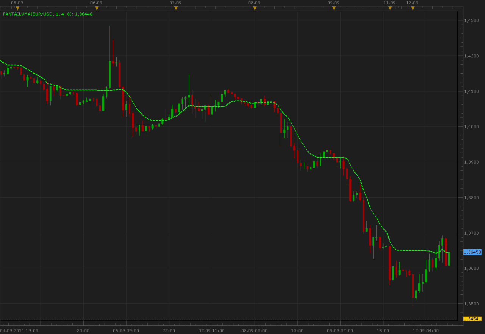

# FantailVMA

> Source: https://fxcodebase.com/code/viewtopic.php?f=17&t=6489  
> Forum: 17 · Topic 6489 · 2 post(s)

---

## FantailVMA

**Alexander.Gettinger** · Mon Sep 12, 2011 10:36 am

This indicator is a ported MQL5 indicator from [http://www.mql5.com/en/code/227](http://www.mql5.com/en/code/227).

 

Download:

 [FantailVMA.lua](files/14828/FantailVMA.lua)

The indicator was revised and updated

---

## Re: FantailVMA

**Apprentice** · Thu Mar 16, 2017 2:29 pm

Indicator was revised and updated.
