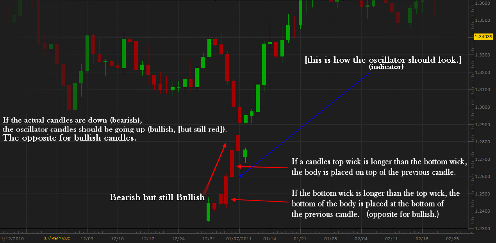
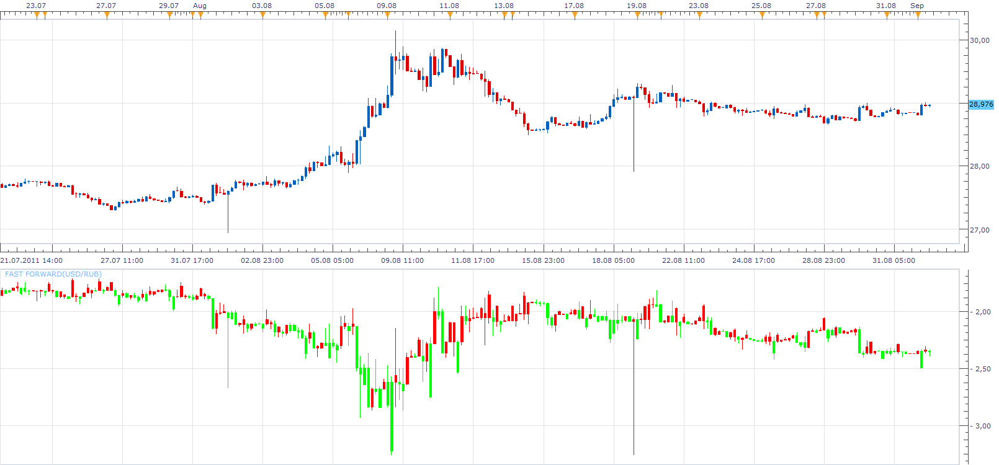
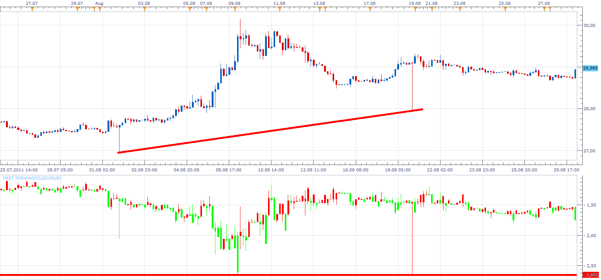

# Fast Forward

> Source: https://fxcodebase.com/code/viewtopic.php?f=17&t=6235  
> Forum: 17 · Topic 6235 · 14 post(s)

---

## Fast Forward

**Apprentice** · Thu Sep 01, 2011 9:25 am

 

 [Fast Forward.lua](files/14418/Fast%20Forward.lua)

The indicator was revised and updated

---

## Re: Fast Forward

**Apprentice** · Thu Sep 01, 2011 9:30 am

This indicator is written according to user specifications.

mennzz Can you explain in which way you use this indicator.

 

After a short test, I found that it gives an interesting level of resistance and support.

---

## Re: Fast Forward

**emjay-short** · Thu Sep 01, 2011 1:45 pm

Indeed, some actual trade examples would be useful.

---

## Re: Fast Forward

**mennzz** · Thu Sep 01, 2011 6:11 pm

I'm playing around with the indicators and stuff to figure out what uses we can get out of this indicator. Trend-lines like you said have good support and resistance points...

Also, I found a problem in the 'Data Source' place. When I add an indicator and the data source is from 'ZONE' (FF), everything is good. But, if I change the currency or time-frame, the indicator (for example 'SAR') goes away like I never added it.

---

## Re: Fast Forward

**sunshine** · Fri Sep 02, 2011 5:32 am

> **mennzz wrote:**
> Also, I found a problem in the 'Data Source' place. When I add an indicator and the data source is from 'ZONE' (FF), everything is good. But, if I change the currency or time-frame, the indicator (for example 'SAR') goes away like I never added it.

This is an issue in the indicator code. There is no ID specified for the candle group (see the second parameter, it's empty):

Code: [Select all](https://fxcodebase.com/code/)
`instance:createCandleGroup("ZONE", "", open, high, low, close);`
I've uploaded the corrected version in the top post. Please download and reinstall the indicator.

---

## Re: Fast Forward

**mennzz** · Fri Sep 02, 2011 8:59 am

Thanks! It works great!

---

## Re: Fast Forward

**mennzz** · Mon Sep 05, 2011 8:38 am

I think I found a great use for this indicator. The explanation is in the image below.

Remember, you have to have Heikin Ashi's 'Data Source' replaced with 'FF's. You also might want to enable 'Hide Source' to make Fast Forward indicator disappear so you can just see the 'HA' indicator only.

---

## Re: Fast Forward

**teammosquito** · Wed Sep 21, 2011 9:10 am

Hello,

This indicator looks very interesting. I downloaded it and installed it, however I can not change or adjust any of the properties. HA does not display, only the basic fast forward window with candlesticks. Do I need to download something else? It looks to me as presented that this indicator is all inclusive with all the bells and whistles already installed. Could someone guide me in the right direction. I have downloaded and used many indicators/strategies from this site and want to express my gratitude of thanks to those of you who dedicate your time and hard work for making all this possible.

Thank You all very Much!

---

## Re: Fast Forward

**Apprentice** · Wed Sep 21, 2011 9:27 am

This indicator do not have additional options.
No need to install Additional indicators.

Just add HA on with FF as Data source.

---

## Re: Fast Forward

**teammosquito** · Wed Sep 21, 2011 10:56 am

> **Apprentice wrote:**
> This indicator do not have additional options.
> No need to install Additional indicators.
>
> Just add HA on with FF as Data source.

Thank you for your reply, I added on HA but am unable to change or set Data Source to FF. I've been searching the site but can't find how to do it. Sorry to be a pain in the rear.

---

## Re: Fast Forward

**Coondawg71** · Wed Sep 21, 2011 2:40 pm

Nicely done! Simple and clean and effective.

sjc

---

## Re: Fast Forward

**mennzz** · Wed Sep 21, 2011 10:17 pm

**Instructions on opening 'HA' with 'FF' Source:**

**1.Set the 'Fast Forward' indicator on the chart.

2.Open but do not set the 'Heikin Ashi' ('HA') indicator.

3.In the 'HA' window, click 'Data Source' (on the right of 'parameters').

4.In the 'Data Source' window, click 'ZONE' and press 'OK'.**
There you have it. The Heikin Ashi indicator with the Fast Forward source.

Note: If you change the currency or timechart, the 'Fast Forward' indicator will become visible, which would tangle the 'HA' and 'FF' indicators together which you can't work with. So, you'll have to open back the 'FF' indicator and change the color of the bars to - 30;30;30 - which is the color of the chart background.

The rest, (the strategy: [download/file.php?id=4516&mode=view](https://fxcodebase.com/code/download/file.php?id=4516&mode=view)) is simple.

Enjoy.

---

## Re: Fast Forward

**teammosquito** · Thu Sep 22, 2011 3:29 pm

Thank's mennzz well done, works great.

---

## Re: Fast Forward

**Apprentice** · Sat Mar 18, 2017 7:56 am

Indicator was revised and updated.
