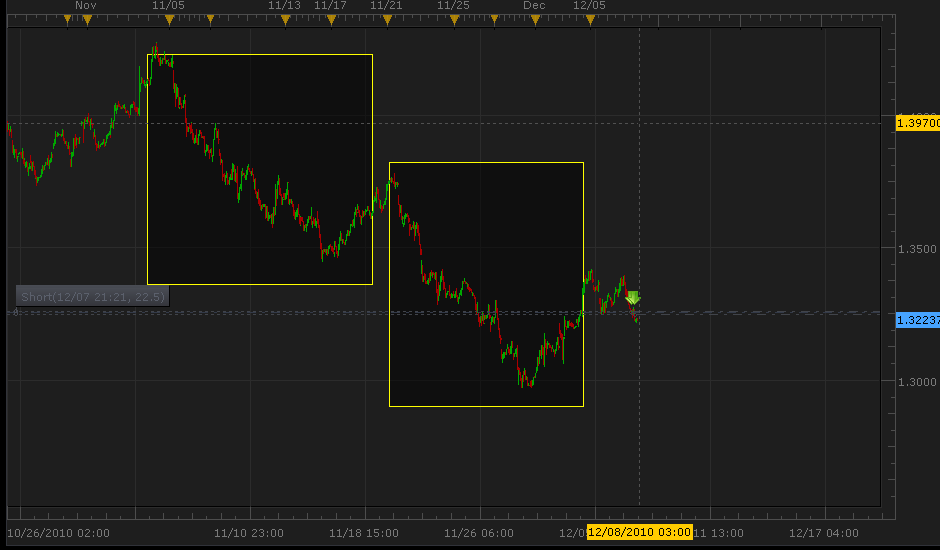
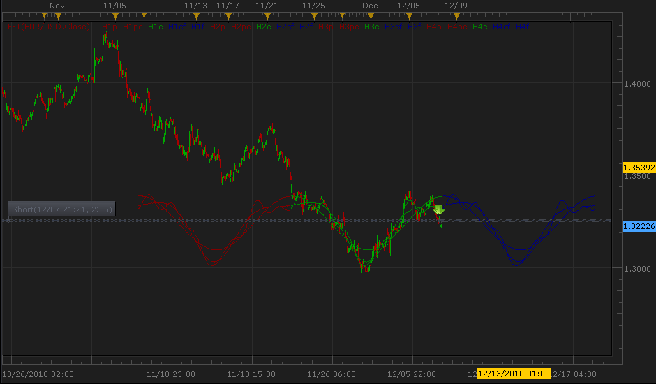
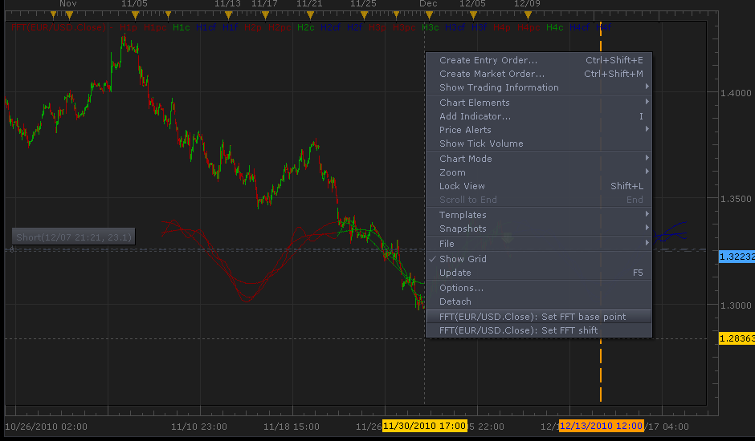
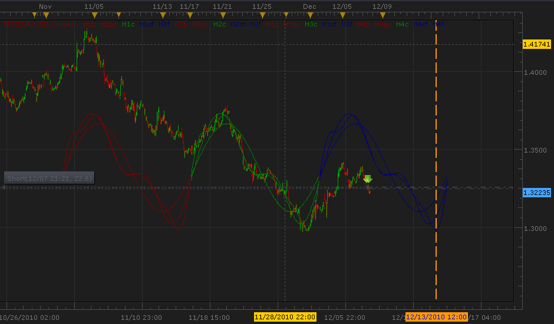

# Fast Fourier Transformation indicator

> Source: https://fxcodebase.com/code/viewtopic.php?f=17&t=2899  
> Forum: 17 · Topic 2899 · 13 post(s)

---

## Fast Fourier Transformation indicator

**uglock** · Wed Dec 08, 2010 1:10 am

**Fast Fourier Transformation applied to the pattern recognition.**

I’ve created an indicator that helps recognize repeated waves on the chart. The basic idea used for the indicator is that price changes are cyclic. Since there are a lot of “random” changes in the price we cannot just match one of the periods to another. We need somehow filter the small changes and keep only the main trend of price. I’ve used the Fast Fourier transformation (FFT) to get the main trend of price and filer the random noise.

Let’s use the FFT and try to find some pattern and predict the price moves.
This is the current H1 chart of EUR/USD.

 

We could see the two similar price moves. Let’s apply the FFT indicator. I’ve used the initial settings – 256 periods to analyze and no shift of waves.

 

Here you can see three “waves”: green, blue and red. The green wave is the representation of analyzed price movement – the last 256 periods of chart. The red wave is the copied green wave to the past, the blue one – to the future. The past wave could be shifted by a number of periods from the green wave.

After the FFT is applied we have to change the base point of the green wave to match the end of the trend.

 

---

## Re: Fast Fourier Transformation indicator

**uglock** · Wed Dec 08, 2010 1:12 am

After the base point is changed we could see that there are two repeated price movement and the third wave has started. We could predict that the EUR/USD will fall down until 12/13, when the price will go back. So, it is a good point to enter short and exit the market somewhere near 12/13.

 

If the price will not follow the blue wave it is safe to just exit the market and try to predict another wave

If you cannot recognize any pattern on the chart, try to change the number of periods to analyze in the indicator settings. Also it may indicate that market is not predictable at the moment (e.g. on news events).

PS sorry for my bad English. Please let me know if you have any questions.

---

## Re: Fast Fourier Transformation indicator

**Apprentice** · Wed Dec 08, 2010 5:23 am

Excellent work.
Harmonic Selector Added.
To be able to Display only a Single Harmonic.

---

## Re: Fast Fourier Transformation indicator

**a135711** · Fri Dec 10, 2010 3:43 am

great piece of work

would it be difficult to emphasize the points of inflection with a vertical line originating at the inflection and terminating at the tangent of the previous inflection?

thanks

---

## Re: Fast Fourier Transformation indicator

**uglock** · Fri Dec 10, 2010 11:43 am

Thank you!

Could you please draw an exaple of line you want to see. I'm sorry, I'm not clearly understand how it should be displayed.

---

## Re: Fast Fourier Transformation indicator

**a135711** · Fri Dec 10, 2010 12:57 pm

here is a picture showing the tangent lines. a line is drawn at each intersection of any 2 harmonic curves and at each point the curve changes direction(inflection). the lines should span the entire CURRENT period only.

also,
you have provided the option for the user to select up to 10 harmonic curves.

it would be extremely useful if one could select which ones of these 10 harmonic curves are visible and which ones are not visible on the chart.

it would also be really useful if i could select a color for each visible harmonic curve as well as a line type for horizontal lines as either dashed, dotted, solid, or dotted dashed, line thickness.

---

## Re: Fast Fourier Transformation indicator

**Apprentice** · Fri Dec 10, 2010 3:27 pm

Request added to the developmental cue.

---

## Re: Fast Fourier Transformation indicator

**vstrelnikov** · Thu Dec 23, 2010 4:58 pm

Attachment in the top post updated. (debug output removed)

---

## Harmonic Indicator

**cigarguy** · Tue Jan 22, 2013 10:27 pm

Great indicator but got this msg when I attempted to change NO to Yes for target lines;

An error occurred during the calculation of the indicator 'HARMONIC PATTERN'. The error details: [string "Harmonic Pattern.lua"]:599: Index is out of range.

Hope this can be fixed shortly.
Thanks, Cigarguy

---

## Re: Fast Fourier Transformation indicator

**Apprentice** · Wed Jan 23, 2013 8:48 am

Can you specify which indicator you use, post it here.
Do you mean the Harmonic Pattern Indicator posted here.
[viewtopic.php?f=17&t=4994&hilit=Harmonic+Pattern](https://fxcodebase.com/code/viewtopic.php?f=17&t=4994&hilit=Harmonic+Pattern)

---

## Re: Fast Fourier Transformation indicator

**cigarguy** · Wed Jan 23, 2013 9:49 am

yes, on the 5 minute t/f.

---

## Re: Fast Fourier Transformation indicator

**cigarguy** · Wed Jan 23, 2013 7:38 pm

Apprentice, not sure you got my previous post answering you question. Yes, it is the indi you posted here. I get that error msg when attempting to use it with the "Show Price Targets" on the 5m time frame.
Thank you and regards, Cigarguy

---

## Re: Fast Fourier Transformation indicator

**Apprentice** · Wed Feb 21, 2018 6:43 am

The Indicator was revised and updated.
