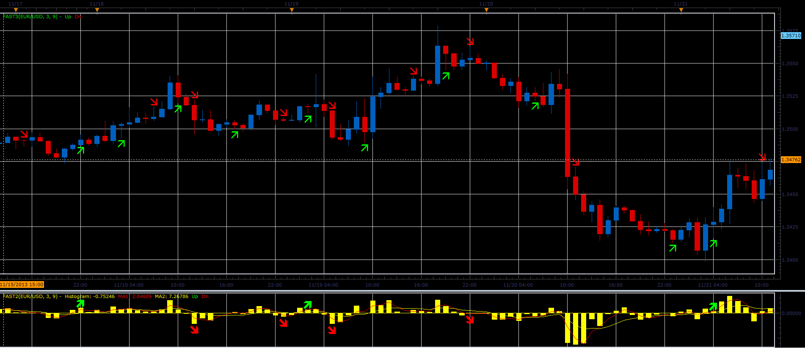

# "Fast indicators"

> Source: https://fxcodebase.com/code/viewtopic.php?f=17&t=60020  
> Forum: 17 · Topic 60020 · 6 post(s)

---

## "Fast indicators"

**Alexander.Gettinger** · Fri Nov 29, 2013 2:08 pm

This indicators are a ported MQL5 indicators from:
[http://www.mql5.com/en/code/1913](http://www.mql5.com/en/code/1913)
[http://www.mql5.com/en/code/1912](http://www.mql5.com/en/code/1912).

 

Download:

 [Fast2.lua](files/91229/Fast2.lua)

 [Fast3.lua](files/91229/Fast3.lua)

The indicator was revised and updated

---

## Re: "Fast indicators"

**Patrick Sweet** · Sun Dec 01, 2013 5:09 am

Hi Alexander!
Thanks for this!
It made me do some research.
I have read some of Nikolay Kositsin's paper's and approaches describing using smoothing algos and alternative calcs without using additional buffers. So I know that some of 'his versions' indies on mql5 site require that library as a base........That said,

The JFATL 3HTF (multi-timeframe smoothed FATL) looked very interesting. Do you know it? Shall I send the link?

Wondering if it is possible to bring that into lua?

Cheers!
Patrick

---

## Re: "Fast indicators"

**Apprentice** · Sun Dec 01, 2013 5:18 am

Please post indicator that you want to translate.
Make sure this is uncoded version. MQ4 ot Mq5.

---

## Re: "Fast indicators"

**Patrick Sweet** · Sun Dec 01, 2013 5:32 am

Ok.
Let me come back.
I could find many.
I will do some prioritizing to make sure the best I can that I am not asking for something that a) already exists or can be emulated with existing indicators...i.e., a true addition to the codebase, b) is in Mq4.
Patrick

---

## Re: "Fast indicators"

**Patrick Sweet** · Sun Dec 01, 2013 7:13 am

As it often the case, I am a little behind.
I found most of what I am curious about already translated and existing on CodeBase somewhere in some form.
You guys are great!
P

---

## Re: "Fast indicators"

**Apprentice** · Sun Aug 06, 2017 7:27 am

The indicator was revised and updated.
