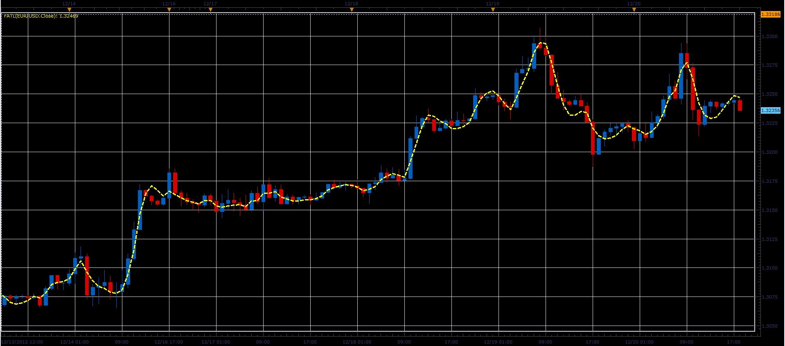

# FATL - Fast Adaptive Trend Line

> Source: https://fxcodebase.com/code/viewtopic.php?f=17&t=27885  
> Forum: 17 · Topic 27885 · 4 post(s)

---

## FATL - Fast Adaptive Trend Line

**Alexander.Gettinger** · Fri Dec 21, 2012 5:31 pm

The indicator is written using digital low pass filter.

 

Download:

 [Fatl.lua](files/48930/Fatl.lua)

The indicator was revised and updated

---

## Re: FATL - Fast Adaptive Trend Line

**Coondawg71** · Fri May 24, 2013 11:55 pm

Can we please request this indicator converted from Lua.

Thanks,

sjc

[http://www.mql5.com/en/code/430](http://www.mql5.com/en/code/430)

---

## Re: FATL - Fast Adaptive Trend Line

**Apprentice** · Sun Jun 02, 2013 11:59 am

Your request is added to the development list.

---

## Re: FATL - Fast Adaptive Trend Line

**Apprentice** · Thu Apr 27, 2017 4:10 am

Indicator was revised and updated.
