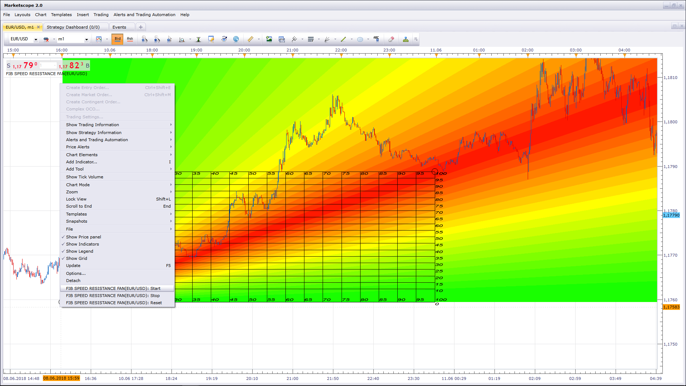

# Fib Speed Resistance Fan

> Source: https://fxcodebase.com/code/viewtopic.php?f=17&t=66184  
> Forum: 17 · Topic 66184 · 5 post(s)

---

## Fib Speed Resistance Fan

**Apprentice** · Mon Jun 11, 2018 8:06 am

 [Fib Speed Resistance Fan.lua](files/119529/Fib%20Speed%20Resistance%20Fan.lua)

---

## Re: Fib Speed Resistance Fan

**High&Low** · Mon Jun 11, 2018 1:44 pm

Thank you for your time and effort. It is perfect.

 Could you please add two options to the indicator ?

 1- I would like to add several Fib Speed to the chart at the same time , for example one from high to low and one from low to high or use two or three different swings at the same time but it does not allow me to add two or more Fib and use different starts and stops at the same time. Could you solve this issue.

2. I would be thankful if you could add an option to turn on & off the colorful background then we would be able to use only the lines when we add several Fibs.

I appreciate it.

---

## Re: Fib Speed Resistance Fan

**Apprentice** · Wed Jun 13, 2018 8:43 am

1.
Use "Unique ID", prior to update was Label
2.
Use "Show Background"

---

## Re: Fib Speed Resistance Fan

**ronanFR** · Tue Mar 31, 2020 12:07 pm

hello ,
indicator isn't displayed.
Help me please

---

## Re: Fib Speed Resistance Fan

**Apprentice** · Wed Apr 01, 2020 5:58 am

Did you define Start and Stop?
