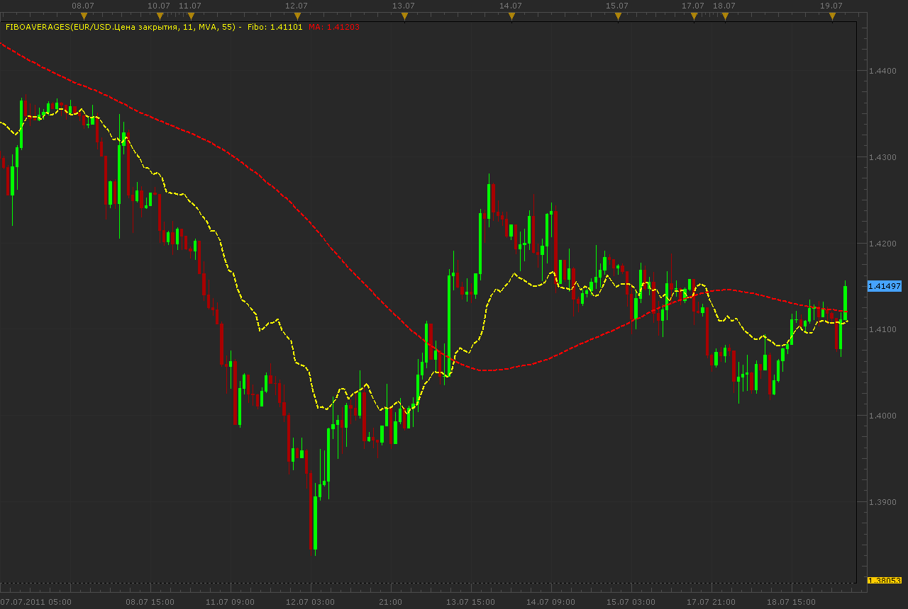

# Fibo averages indicator

> Source: https://fxcodebase.com/code/viewtopic.php?f=17&t=5277  
> Forum: 17 · Topic 5277 · 2 post(s)

---

## Fibo averages indicator

**Alexander.Gettinger** · Tue Jul 19, 2011 2:42 am

Formulas:
Fibo is a average of [FiboCount] prices with fibo shift. For example, if [FiboCount]=8 Fibo[i]=(Price[i]+Price[i-1]+Price[i-1]+Price[i-2]+Price[i-3]+Price[i-5]+Price[i-8]+Price[i-13])/8.
MA is a average of Fibo.

 

Download:

 [FiboAverages.lua](files/12838/FiboAverages.lua)

For this indicator must be installed AVERAGES indicator ([http://www.fxcodebase.com/code/viewtopi ... =17&t=2430](http://www.fxcodebase.com/code/viewtopic.php?f=17&t=2430)).

MT4/MQ4 version.
[viewtopic.php?f=38&t=64531](https://fxcodebase.com/code/viewtopic.php?f=38&t=64531)

The indicator was revised and updated

---

## Re: Fibo averages indicator

**Apprentice** · Thu Mar 16, 2017 5:26 am

Indicator was revised and updated.
