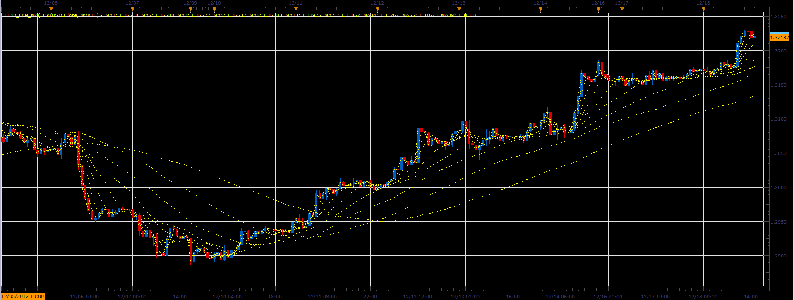

# Fibo fan MA

> Source: https://fxcodebase.com/code/viewtopic.php?f=17&t=27808  
> Forum: 17 · Topic 27808 · 2 post(s)

---

## Fibo fan MA

**Alexander.Gettinger** · Tue Dec 18, 2012 3:09 pm

Fan of moving averages with the Fibonacci sequence periods.

 

Download:

 [Fibo_Fan_MA.lua](files/48729/Fibo_Fan_MA.lua)

For this indicator must be installed Averages indicator ([viewtopic.php?f=17&t=2430](https://fxcodebase.com/code/viewtopic.php?f=17&t=2430)).

The indicator was revised and updated

---

## Re: Fibo fan MA

**Apprentice** · Thu Apr 27, 2017 3:53 am

Indicator was revised and updated.
