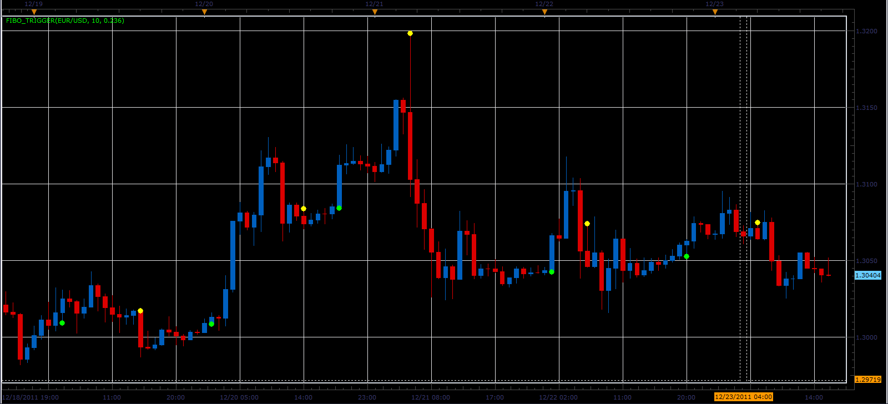
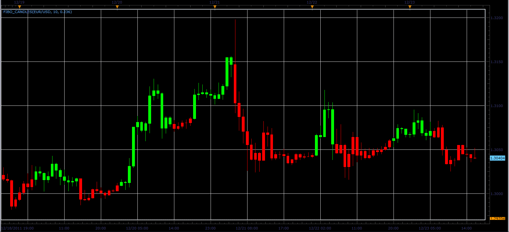

# Fibo trigger and candles indicators.

> Source: https://fxcodebase.com/code/viewtopic.php?f=17&t=10401  
> Forum: 17 · Topic 10401 · 12 post(s)

---

## Fibo trigger and candles indicators.

**Alexander.Gettinger** · Sun Dec 25, 2011 2:46 pm

This indicator is a ported MQL5 indicator from [http://www.mql5.com/en/code/682](http://www.mql5.com/en/code/682).

The indicator changes color when the conditions:
UP condition: Range*FiboLevel>=Close-MinLow,
DN condition: Range*FiboLevel>=MaxHigh-Close, where
Range=MaxHigh-MinLow,
MaxHigh and MinLow are a maximum and minimum prices at range from (i-Period) to (i).

 

Download:

 [Fibo_Trigger.lua](files/21610/Fibo_Trigger.lua)

 

Download:

 [Fibo_Candles.lua](files/21610/Fibo_Candles.lua)

 [Fibo_Candles with Alert.lua](files/21610/Fibo_Candles%20with%20Alert.lua)

---

## Re: Fibo trigger and candles indicators.

**Alexander.Gettinger** · Mon Dec 26, 2011 7:12 am

Strategy based on Fibo candles indicator: [viewtopic.php?f=31&t=10450](https://fxcodebase.com/code/viewtopic.php?f=31&t=10450)

---

## Re: Fibo trigger and candles indicators.

**pudge71381** · Fri Jan 13, 2012 11:40 am

Would you be able to add the "Type of signal" option that is included in the strategy? My FIBO trigger isn't matching up with the strategy.

---

## Re: Fibo trigger and candles indicators.

**nowaishy** · Tue Feb 25, 2014 8:51 pm

A Fibo trigger strategy with sound & email alarm would be very useful if developed. thanks

---

## Re: Fibo trigger and candles indicators.

**Apprentice** · Wed Feb 26, 2014 4:19 pm

What about above-mentioned strategy.
It does not meet your trading conditions/style.

---

## Re: Fibo trigger and candles indicators.

**Apprentice** · Fri Jun 02, 2017 6:32 am

Indicator was revised and updated.

---

## Re: Fibo trigger and candles indicators.

**fjasonfx** · Fri Jun 01, 2018 10:46 am

Hi Apprentice,
 If it is not too much trouble could you please make a MT4 version of the Fibo Candles indicator?

Thanks,
Jason

---

## Re: Fibo trigger and candles indicators.

**Apprentice** · Sun Jun 03, 2018 7:39 am

Your request is added to the development list under Id Number 4158

---

## Re: Fibo trigger and candles indicators.

**Apprentice** · Mon Jun 18, 2018 6:33 am

Try this version.
[viewtopic.php?f=38&t=66203](https://fxcodebase.com/code/viewtopic.php?f=38&t=66203)

---

## Re: Fibo trigger and candles indicators.

**fjasonfx** · Thu Sep 20, 2018 5:52 pm

Apprentice,
 Could we get alerts for the fibo candles indictor for when the candles change colors? Just the normal stuff like email, pop ups and what not. With the ability to turn them off if so desired.

Thank you,

Jason

---

## Re: Fibo trigger and candles indicators.

**Apprentice** · Mon Sep 24, 2018 9:38 am

Fibo_Candles with Alert.lua added.

---

## Re: Fibo trigger and candles indicators.

**fjasonfx** · Thu Sep 27, 2018 12:17 am

Thank you Apprentice!
