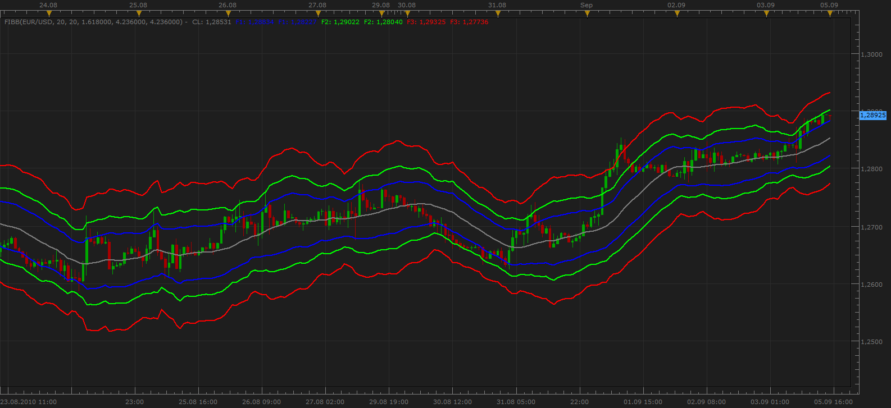
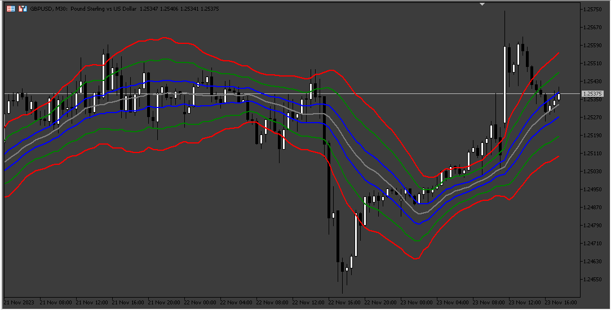

# Fibonacci Bollinger Bands

> Source: https://fxcodebase.com/code/viewtopic.php?f=17&t=2065  
> Forum: 17 · Topic 2065 · 24 post(s)

---

## Fibonacci Bollinger Bands

**Apprentice** · Sun Sep 05, 2010 2:28 pm

The Fibonacci Bollinger Bands indicator use ATR in place of standard deviation as measure of volatility.

Bands are constructed by multiplying ATR with Fibonacci factors (1.6180, 2.6180, and 4.2360) .

 [FIBB.lua](files/4227/FIBB.lua)

 [Resetting Moving Average FIBB.lua](files/4227/Resetting%20Moving%20Average%20FIBB.lua)

 [Modified Resetting Moving Average FIBB.lua](files/4227/Modified%20Resetting%20Moving%20Average%20FIBB.lua)

 

 [FIBB.mq5](files/4227/FIBB.mq5)

---

## Re: Fibonacci Bollinger Bands

**wizardpro** · Mon Oct 25, 2010 4:47 am

Do you have any instructoring how to use this ? I failes to understand.

---

## Re: Fibonacci Bollinger Bands

**Apprentice** · Mon Oct 25, 2010 7:56 am

Basically it is Bullinger Band.
But instead of one, has two belts.
Specific multipliers.

---

## Re: Fibonacci Bollinger Bands

**Apprentice** · Sat May 26, 2012 8:06 am

Give Audio / Email Alerts on Price /Band Crossover/Touch.

 [FIBB with Alert.lua](files/34130/FIBB%20with%20Alert.lua)

Compatibility issue fixed.
_Alert Helper is not longer needed.

---

## Re: Fibonacci Bollinger Bands

**4xtr8r** · Fri Jun 01, 2012 9:35 am

Thx Apprentice.

Could you make this into a strategy. Example. Hits outer band = short, Hits lower band = buy?

Thanks.

---

## Re: Fibonacci Bollinger Bands

**4xtr8r** · Fri Jun 01, 2012 9:41 am

Also..for stops and targets... if there is a way to use ATR. So stops would be ATR + 5 and target would be ATR.

If I could also have the ability to scale out, that would be perfect. So target 1 would be ATR value. Target 2 would be ATR value x 2 (or some value I could edit).

Thanks!

---

## Re: Fibonacci Bollinger Bands

**Apprentice** · Mon Jun 04, 2012 1:36 am

Your request is added to the development list.

---

## Re: Fibonacci Bollinger Bands

**Apprentice** · Tue Jun 05, 2012 5:22 am

This is what I managed wrote for now.
No ATR Targets for now.
[viewtopic.php?f=31&t=19904](https://fxcodebase.com/code/viewtopic.php?f=31&t=19904)

---

## Re: Fibonacci Bollinger Bands

**cashmoney** · Tue Jun 05, 2012 12:23 pm

Brilliant. Thank you.

---

## Re: Fibonacci Bollinger Bands

**Coondawg71** · Mon Nov 18, 2013 1:15 pm

I believe there may be a small flaw in this indicator. Only "uptrend" alerts are being displayed. All Alerts below central line are showing "uptrend" colorization.

thanks,

sjc

---

## Re: Fibonacci Bollinger Bands

**Coondawg71** · Mon Nov 18, 2013 1:21 pm

Another flaw, +1 and +3 Alerts are reversed.

Thanks,

sjc

---

## Re: Fibonacci Bollinger Bands

**Apprentice** · Mon Nov 18, 2013 4:12 pm

Affirmative about reversed.
If you use touch algo, all alert use Up trend coloring.
This is intentional.

---

## Re: Fibonacci Bollinger Bands

**delsan** · Fri Dec 20, 2013 11:04 am

Is there anyway you can add a limit to the amount of trades it takes in one direction?
Thanks in advance.

---

## Re: Fibonacci Bollinger Bands

**Apprentice** · Sat Dec 21, 2013 7:39 am

Your request is added to the development list.

---

## Re: Fibonacci Bollinger Bands

**Apprentice** · Wed Oct 01, 2014 11:01 am

Update.

---

## Re: Fibonacci Bollinger Bands

**Apprentice** · Mon Dec 07, 2015 7:42 am

Compatibility issue fixed.
_Alert Helper is not longer needed.

---

## Re: Fibonacci Bollinger Bands

**Apprentice** · Fri Jul 21, 2017 8:35 am

The indicator was revised and updated.

---

## Re: Fibonacci Bollinger Bands

**Apprentice** · Fri Dec 08, 2017 5:55 am

Resetting Moving Average FIBB.lua added.

---

## Re: Fibonacci Bollinger Bands

**Cactus** · Fri Dec 08, 2017 1:39 pm

> **Apprentice wrote:**
> Resetting Moving Average FIBB.lua added.

Interesting, thanks
But I don't think it behaves as I imagined

I can never get the resetting version to match the original indicator values with the same settings even for a short period.
I was thinking they should be exactly the same, but only reset on certain deviation hit, then continue showing different values for MA period bars and eventually return to normal to be the same again until high deviation resets the band again?

Original indicator has only 2 parameters (FIBB Periods and ATR Periods) and 3 levels to specify
Resetting average version has 6 parameters and 3 levels to specify

FIBB Periods in original indicator is the same as MA Lookback Period in average version?
ATR Periods in original is the same as ATR Lookback Period? in average version?
What is classical ATR Period then

Can you make it so the "MA Barrier" be turned off, just like "Use Resetting ATR" can be switched to False. Will this make it appear same as original indicator then? Just for testing

Perhaps I just don't understand what settings to use yet.
The indicator re-draws the more we scroll back, but the original does not repaint

---

## Re: Fibonacci Bollinger Bands

**Apprentice** · Fri Dec 15, 2017 6:40 am

Modified Resetting Moving Average FIBB.lua added.

---

## Re: Fibonacci Bollinger Bands

**Apprentice** · Wed Mar 28, 2018 3:54 pm

The Indicator was revised and updated.

---

## Re: Fibonacci Bollinger Bands

**jacryptoking** · Sun Nov 19, 2023 4:32 am

> **Apprentice wrote:**
>
>
> FIBB.png
>
>
>
> The Fibonacci Bollinger Bands indicator use ATR in place of standard deviation as measure of volatility.
>
> Bands are constructed by multiplying ATR with Fibonacci factors (1.6180, 2.6180, and 4.2360) .
>
>
>
> FIBB.lua
>
>
>
>
> Resetting Moving Average FIBB.lua
>
>
>
>
> Modified Resetting Moving Average FIBB.lua

Good day . Do you have mt5 version? If not can you make a mt5 version, please.?

---

## Re: Fibonacci Bollinger Bands

**Apprentice** · Tue Nov 21, 2023 8:29 am

We have added your request to the development list.
Development reference 1035

---

## Re: Fibonacci Bollinger Bands

**Apprentice** · Fri Nov 24, 2023 3:36 am

 [FIBB.mq5](files/153392/FIBB.mq5)
