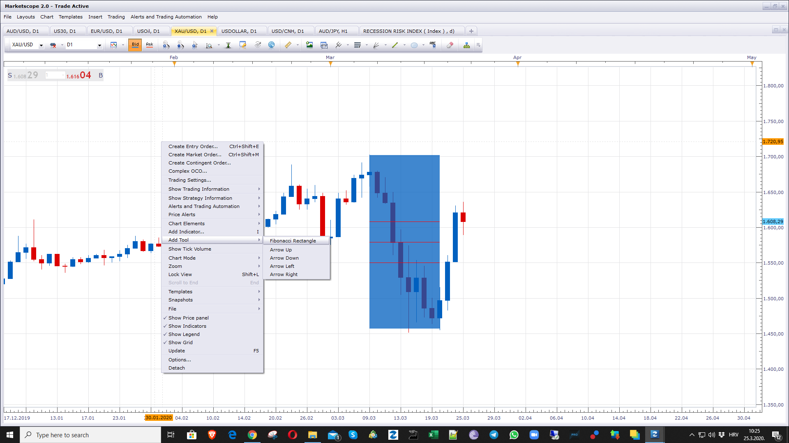

# Fibonacci Rectangle

> Source: https://fxcodebase.com/code/viewtopic.php?f=17&t=69574  
> Forum: 17 · Topic 69574 · 5 post(s)

---

## Fibonacci Rectangle

**Apprentice** · Wed Mar 25, 2020 6:17 am

 

 [Fibonacci Rectangle.lua](files/132261/Fibonacci%20Rectangle.lua)

MT4 version
[https://fxcodebase.com/code/viewtopic.p ... 53#p160853](https://fxcodebase.com/code/viewtopic.php?f=38&t=76368&p=160853#p160853)

---

## Re: Fibonacci Rectangle

**yolerap** · Wed Mar 25, 2020 6:24 am

Thank you !

---

## Re: Fibonacci Rectangle

**khanatd** · Mon Sep 29, 2025 10:32 pm

plz mt4 version with arrows too.

thanks a lot sir
khan

---

## Re: Fibonacci Rectangle

**Apprentice** · Wed Oct 01, 2025 6:07 am

We have added your request to the development list.
Development reference 612

---

## Re: Fibonacci Rectangle

**Apprentice** · Sun Oct 12, 2025 2:02 am

MT4 version
[https://fxcodebase.com/code/viewtopic.p ... 53#p160853](https://fxcodebase.com/code/viewtopic.php?f=38&t=76368&p=160853#p160853)
