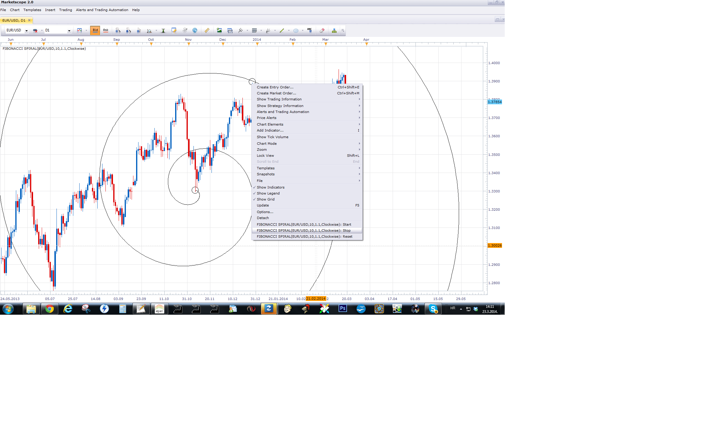
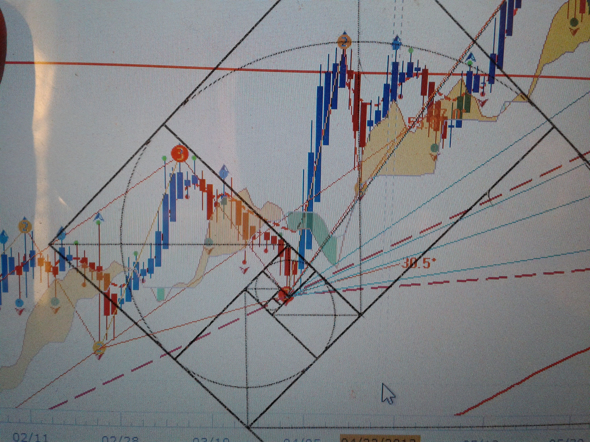

# Fibonacci Spiral

> Source: https://fxcodebase.com/code/viewtopic.php?f=17&t=60446  
> Forum: 17 · Topic 60446 · 4 post(s)

---

## Fibonacci Spiral

**Apprentice** · Sun Mar 23, 2014 8:10 am

 

U need to define the Start and Stop Point.
For this purpose I have added a custom commands,
available within left mouse menu.

 [Fibonacci Spiral.lua](files/93193/Fibonacci%20Spiral.lua)

The indicator was revised and updated

---

## Re: Fibonacci Spiral

**danilohyatt** · Sun Mar 23, 2014 4:35 pm

Dear Apprentice,

I appreciate your contributions and developments.

I would like to know how active the fibonacci spiral.

Could you include the squares that make up each increment?

Could you include the projected lines of the squares that make up each increment?

Thank you,

---

## Re: Fibonacci Spiral

**Apprentice** · Mon Mar 24, 2014 2:23 am

Thank you for your suggestion.
will not be able to implement this,
at least for now, because I have limited resources.
I'll come back to this when the conditions change.

---

## Re: Fibonacci Spiral

**Apprentice** · Sun Jun 18, 2017 12:50 pm

The indicator was revised and updated.
