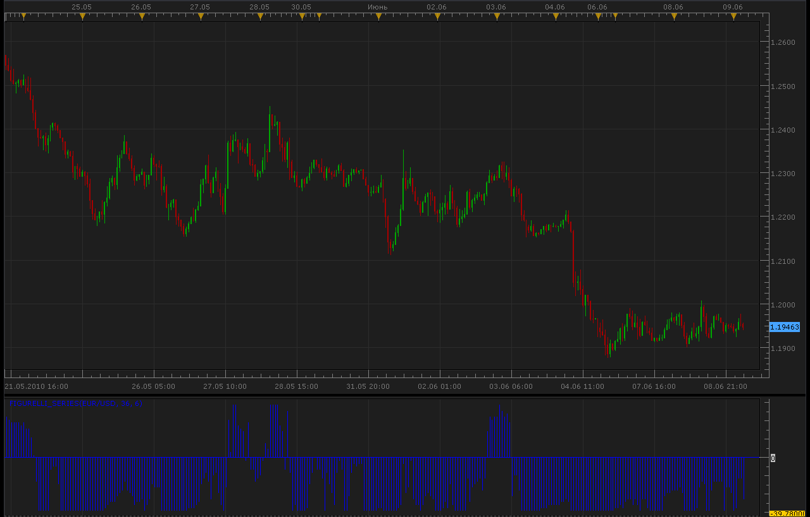

# Figurelli Series indicator

> Source: https://fxcodebase.com/code/viewtopic.php?f=17&t=1289  
> Forum: 17 · Topic 1289 · 4 post(s)

---

## Figurelli Series indicator

**Alexander.Gettinger** · Wed Jun 09, 2010 3:58 am

Calculates multiple moving averages trend, looking for divergence, start of reversal and strong trends.
Default configuration: 36 moving averages series trends compared each other. If indicator value is 36 or -36 indicates a strong rise/fall trend.

 



```lua
function Init()
    indicator:name("Figurelli Series indicator");
    indicator:description("Figurelli Series indicator");
    indicator:requiredSource(core.Bar);
    indicator:type(core.Oscillator);
   
    indicator.parameters:addInteger("series", "series", "series", 36);
    indicator.parameters:addInteger("interval", "interval", "interval", 6);

    indicator.parameters:addColor("clr", "Color", "Color", core.rgb(0, 0, 255));
end

local first;
local source = nil;
local series;
local interval;
local FS=nil;

function Prepare()
    source = instance.source;
    series=instance.parameters.series;
    interval=instance.parameters.interval;
    first = source:first()+2;
    local name = profile:id() .. "(" .. source:name() .. ", " .. instance.parameters.series .. ", " .. instance.parameters.interval .. ")";
    instance:name(name);
    FS = instance:addStream("FS", core.Bar, name .. ".FS", "FS", instance.parameters.clr, first);
    FS:addLevel(0);
end

function Update(period, mode)
    if (period>first+interval*series) then
     local tot_Ask=0;
     local tot_Bid=0;
     local sma;
     for i=0,series-1,1 do
      sma=core.avg(source.close,core.rangeTo(period,interval*(1+i)));
      if source.close[period]<sma then
       tot_Ask=tot_Ask+1;
      end
      if source.close[period]>sma then
       tot_Bid=tot_Bid+1;
      end
     end
     local tot=tot_Bid-tot_Ask;
     FS[period]=tot;
    end
end
```

The indicator was revised and updated

---

## Re: Figurelli Series indicator

**Coondawg71** · Wed Apr 24, 2013 8:39 pm

Can we please request the Strategy for this indicator converted to Lua.

Thanks,

sjc

[http://www.mql5.com/en/code/1641](http://www.mql5.com/en/code/1641)

---

## Re: Figurelli Series indicator

**Apprentice** · Thu Apr 25, 2013 4:36 am

Your request is added to the development list.

---

## Re: Figurelli Series indicator

**Apprentice** · Thu May 11, 2017 1:46 pm

Indicator was revised and updated.
