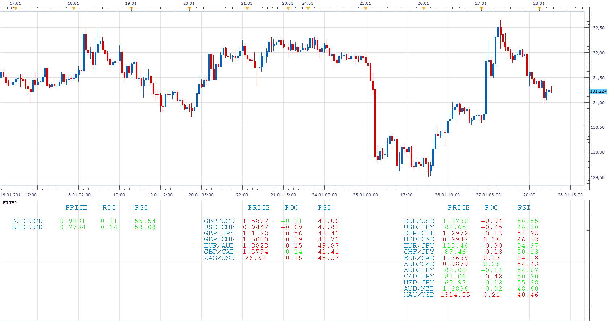
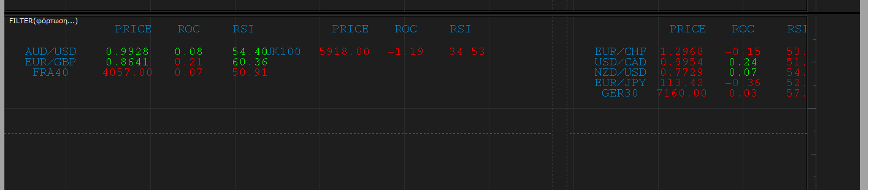
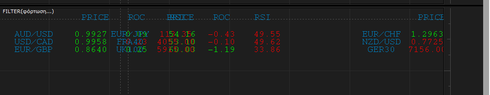

# Filter (Bulls and Bears)

> Source: https://fxcodebase.com/code/viewtopic.php?f=17&t=3262  
> Forum: 17 · Topic 3262 · 12 post(s)

---

## Filter (Bulls and Bears)

**Apprentice** · Thu Jan 27, 2011 5:48 am

This is another prototype of an indicator.
Allows you to filter all currency pairs you are subscribed.

 [Filter.lua](files/7733/Filter.lua)

Create three lists Bull and Bear Lists and Conflicting.
Currency is on Bull list if all filters are Bullisch.
Currency is on Bear list if all filters are Bearisch.

Currently, you can define up to three filters (for now).
Currently supported only three filters, RSI, ROC and Price.

For example, you define
 RSI + ROC + PRICE or RSI (H1) + RSI (m30) + RSI (D1) and variations.

Improvements and new features like sorting, new filters, complex filters defining, planning to add in the future.

Description of current filters.

**Bull**
Price - If the price rises.
ROC> 0
RSI> 50
**Bear**
Price - If the price falls.
ROC <0
RSI <50

A similar list,which allows you to monitor all available currency pairs,
Displays Pip or the percentage change for the defined time frames
[viewtopic.php?f=17&t=3234&p=7691&hilit=list#p7691](https://fxcodebase.com/code/viewtopic.php?f=17&t=3234&p=7691&hilit=list#p7691)

A similar list,which allows you to monitor all the currency pairs that contain a defined currency.
[viewtopic.php?f=17&t=8257&p=18259#p18259](https://fxcodebase.com/code/viewtopic.php?f=17&t=8257&p=18259#p18259)
MAMA.lua is available here.
[viewtopic.php?f=17&t=23283&p=40098&hilit=mama#p40098](https://fxcodebase.com/code/viewtopic.php?f=17&t=23283&p=40098&hilit=mama#p40098)

---

## Re: Filter (Bulls and Bears)

**alepan72** · Thu Jan 27, 2011 10:34 am

Nice tool.
Ask you something...?
Which period use the indicator for RSI and ROC?
Thanx and best regards!!!

---

## Re: Filter (Bulls and Bears)

**Apprentice** · Thu Jan 27, 2011 12:29 pm

Period is 14 for both.

But I plan to soon offer a version where you can change the parameters.

---

## Re: Filter (Bulls and Bears)

**Apprentice** · Thu Jan 27, 2011 2:54 pm

Price Decimal Places fix.
Growth Or Decline is now shown by color.
Indikator Options added.

---

## Re: Filter (Bulls and Bears)

**alepan72** · Fri Jan 28, 2011 6:11 am

Much better
But I have a screen problem. Take a look below... first is appearance in my 22" monitor and the second is from my 17" monitor

 

 

Can you fix it?
Best regards and thanx for your services!!!

Kisses from Greece!

---

## Re: Filter (Bulls and Bears)

**Apprentice** · Fri Jan 28, 2011 7:56 am

This should fix things.
Not the best solution, but I had no time for a better one.

I need to make radical changes to make it good.

---

## Re: Filter (Bulls and Bears)

**Apprentice** · Sun Jan 30, 2011 12:15 pm

PMA Filter Added.
Compares the position of the closing price in relation to the moving average.

MAMA Filter Added.
Compares Two MA positions in relation to Each other.

Fourth filter option added.

---

## Re: Filter (Bulls and Bears)

**nookie** · Wed Nov 16, 2011 4:26 am

I tried to add myself adx option but the following error comes out:

An error occurred during the calculation of the indicator 'ADX FILTER'. The error details: [string "ADX Filter.lua"]:342: [string "ADX.lua"]:67: [string "DMI.lua"]:97: attempt to index field 'high' (a nil value).

Not sure why value of DMI is mentioned, I need only ADX ones. Please help

---

## Re: Filter (Bulls and Bears)

**Apprentice** · Wed Nov 16, 2011 5:22 pm

It is difficult to say it this way.
Can you send me your code on my private mail.

---

## Re: Filter (Bulls and Bears)

**SANTOSH** · Sat Nov 28, 2015 2:59 am

> **Apprentice wrote:**
> PMA Filter Added.
> Compares the position of the closing price in relation to the moving average.
>
> MAMA Filter Added.
> Compares Two MA positions in relation to Each other.
>
> Fourth filter option added.

where can I look for the **updated version**of the above mentioned indicator " Filter (Bulls and Bears) " ?

---

## Re: Filter (Bulls and Bears)

**Apprentice** · Tue Dec 01, 2015 6:09 am

Topmost, first post in this topic.

---

## Re: Filter (Bulls and Bears)

**Apprentice** · Sun Feb 04, 2018 7:20 am

The Indicator was revised and updated.
