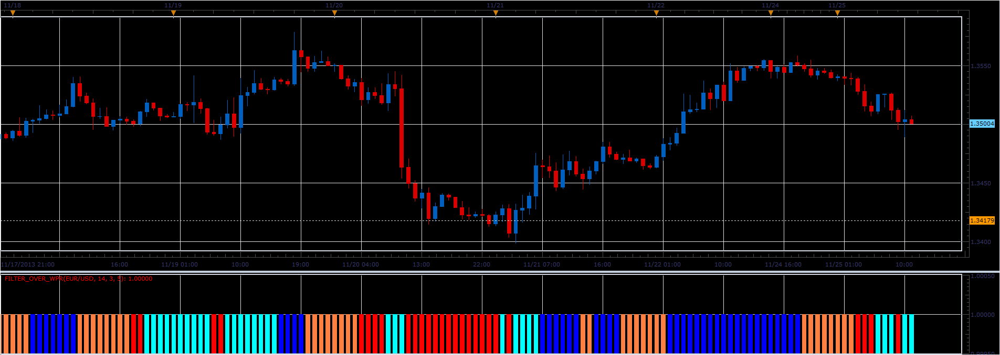

# Filter over WPR oscillator

> Source: https://fxcodebase.com/code/viewtopic.php?f=17&t=59992  
> Forum: 17 · Topic 59992 · 2 post(s)

---

## Filter over WPR oscillator

**Alexander.Gettinger** · Tue Nov 26, 2013 4:44 pm

This indicator is a ported MQL5 indicator from [http://www.mql5.com/en/code/1878](http://www.mql5.com/en/code/1878).

 

Download:

 [Filter_Over_WPR.lua](files/91149/Filter_Over_WPR.lua)

The indicator was revised and updated

---

## Re: Filter over WPR oscillator

**Apprentice** · Sat Jun 17, 2017 4:32 am

The indicator was revised and updated.
