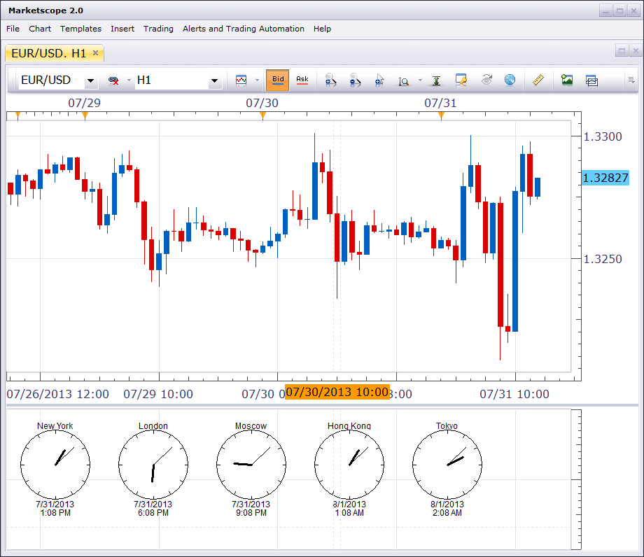

# Finance Clock

> Source: https://fxcodebase.com/code/viewtopic.php?f=17&t=58432  
> Forum: 17 · Topic 58432 · 2 post(s)

---

## Finance Clock

**Nikolay.Gekht** · Wed Jul 31, 2013 12:31 pm

The indicator simply displays a number of clocks in different time zones (NY, London, Tokyo and so on) in a separate area.

 

Download:

 [world_clock.lua](files/87593/world_clock.lua)

The indicator was revised and updated

---

## Re: Finance Clock

**Apprentice** · Sun Jun 04, 2017 6:24 am

The indicator was revised and updated.
