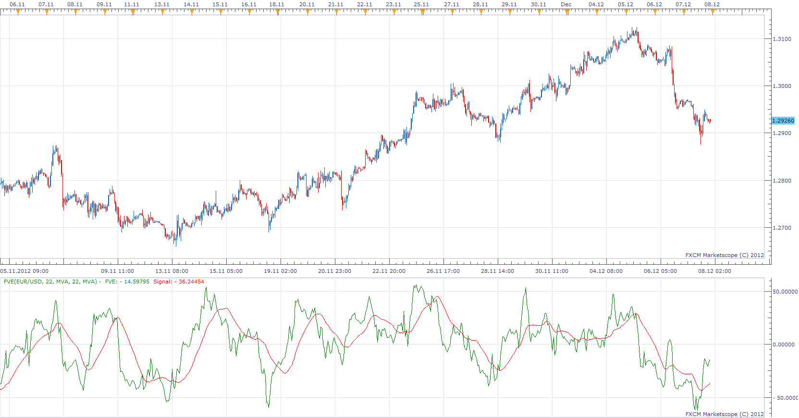

# Finite Volume Elements

> Source: https://fxcodebase.com/code/viewtopic.php?f=17&t=27510  
> Forum: 17 · Topic 27510 · 9 post(s)

---

## Finite Volume Elements

**Apprentice** · Sun Dec 09, 2012 5:53 am

Finite Volume Element Indicator (FVE) is a money flow indicator.
It was developed by Markos Katsanos and introduced in the April 2003 issue of Technical Analysis of Stocks & Commodities magazine.
It was modified in the September 2003 issue of TASC.

Values above zero are bullish and indicate accumulation,
 while values below zero indicate distribution.
Divergences between price and the indicator can be leading signals to possible change in trend.

 [FVE.lua](files/48143/FVE.lua)

MT4/MQ4 version
[viewtopic.php?f=38&t=61060](https://fxcodebase.com/code/viewtopic.php?f=38&t=61060)

---

## Re: Finite Volume Elements

**cash4u** · Sun Dec 09, 2012 7:56 am

hi apprentice,

nice indicator.

can u create strategy based on this indicator/

buy level:0
sell level:0

buy: fve> buy level and fve cross over signal
sell: fve < sell level and fve cross under signal

exit buy: signal cross under buy level
exit sell: signal cross over sell level.

thank you.

---

## Re: Finite Volume Elements

**Apprentice** · Sun Dec 09, 2012 6:11 pm

Requested can be found here.
[viewtopic.php?f=31&t=27543](https://fxcodebase.com/code/viewtopic.php?f=31&t=27543)

---

## Re: Finite Volume Elements

**Coondawg71** · Sat Dec 07, 2013 11:25 am

Can we please request a Finite Volume Elements Divergence version of this indicator.

Thanks,

sjc

---

## Re: Finite Volume Elements

**Apprentice** · Sun Dec 08, 2013 6:46 am

Your request is added to the development list.

---

## Re: Finite Volume Elements

**Alexander.Gettinger** · Wed Aug 20, 2014 10:08 am

MQL4 version of Finite Volume Elements oscillator: [viewtopic.php?f=38&t=61060](https://fxcodebase.com/code/viewtopic.php?f=38&t=61060).

---

## Re: Finite Volume Elements

**Coondawg71** · Sat Mar 14, 2015 5:44 am

Can we bump this up please. Thanks!!!

sjc

---

## Re: Finite Volume Elements

**SANTOSH** · Mon Jul 06, 2015 12:51 pm

HI,

CAN WE GET A DIVERGENCE INDICATOR FOR THE FINITE VOLUME ELEMENT INDICATOR ?

---

## Re: Finite Volume Elements

**Apprentice** · Fri Oct 12, 2018 5:13 am

The indicator was revised and updated.
