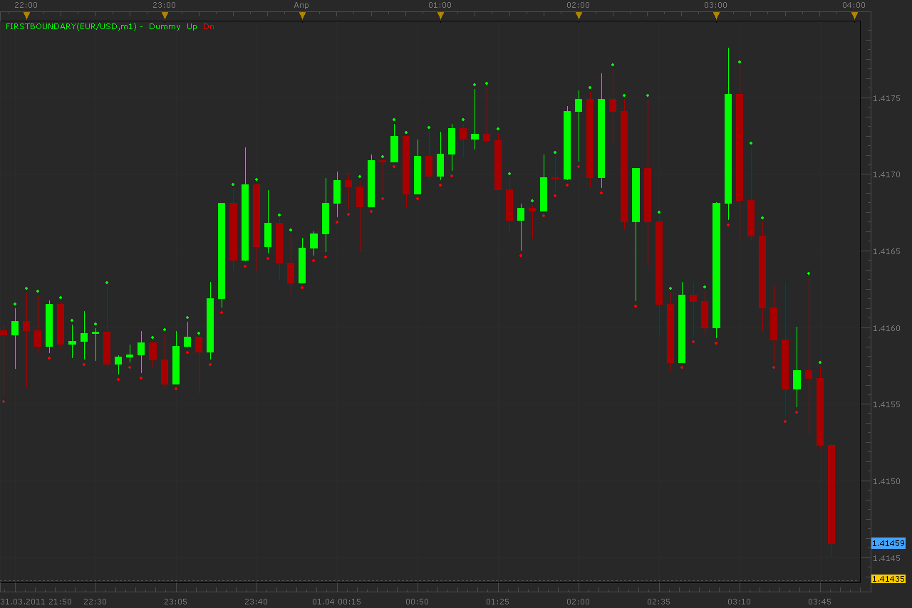

# First boundary indicator

> Source: https://fxcodebase.com/code/viewtopic.php?f=17&t=3808  
> Forum: 17 · Topic 3808 · 2 post(s)

---

## First boundary indicator

**Alexander.Gettinger** · Fri Apr 01, 2011 3:37 am

Indicator show top or bottom of a bar was touch first.
I recommended choose timeframe on one or two points less current.

 

Download:

 [FirstBoundary.lua](files/9276/FirstBoundary.lua)

The indicator was revised and updated

---

## Re: First boundary indicator

**Apprentice** · Fri Mar 03, 2017 9:36 am

Indicator was revised and updated.
