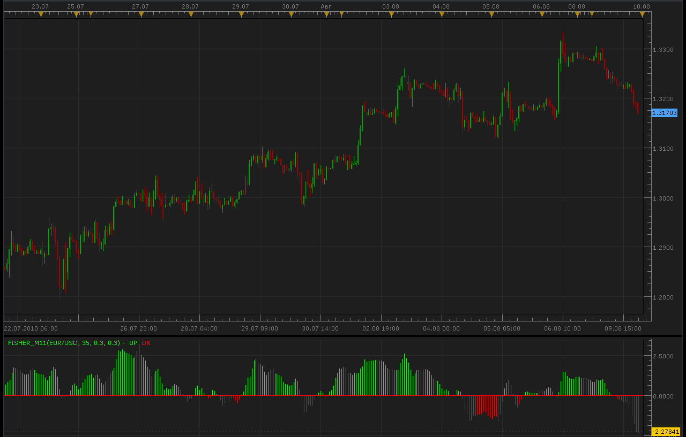
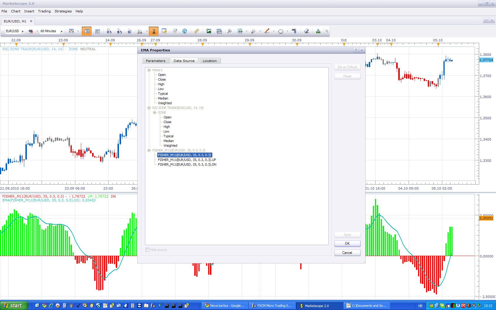

# Fisher indicator

> Source: https://fxcodebase.com/code/viewtopic.php?f=17&t=1729  
> Forum: 17 · Topic 1729 · 16 post(s)

---

## Fisher indicator

**Alexander.Gettinger** · Mon Aug 09, 2010 9:47 pm

[viewtopic.php?f=27&t=1703](https://fxcodebase.com/code/viewtopic.php?f=27&t=1703)

 

 [Fisher_m11.lua](files/3453/Fisher_m11.lua)

 [One stream Fisher_m11.lua](files/3453/One%20stream%20Fisher_m11.lua)

 [Fisher.lua](files/3453/Fisher.lua)

---

## Re: Fisher indicator

**jcervinka** · Fri Sep 24, 2010 6:04 am

Hi

Is it possible to have a sound signal for this indicator??
Whenever it change the color, to have a sound signal.

Thanks

Jernej

---

## Re: Fisher indicator

**Apprentice** · Sun Sep 26, 2010 8:19 am

This signal can be found here.
[viewtopic.php?f=29&t=2268](https://fxcodebase.com/code/viewtopic.php?f=29&t=2268)

---

## Re: Fisher indicator

**Apprentice** · Tue Oct 05, 2010 6:06 am

I added a third data stream, from which you can calculate a moving average.
I chose this solution in order to preserve compatibility with signals / strategies that are already using old solution.
Make sure you choose the appropriate data source.

 

 [Fisher_m11.lua](files/5016/Fisher_m11.lua)

 [Fisher M11 with Alert.lua](files/5016/Fisher%20M11%20with%20Alert.lua)

This indicator provides Audio / Email Alerts if and whenFisher indicator cross over/under Alert Level.

Dec 14, 2015: Compatibility issue Fixed. _Alert helper is not longer needed.

---

## Re: Fisher indicator

**to_be5** · Wed Oct 06, 2010 2:17 am

thank u for your help

---

## Re: Fisher indicator

**to_be5** · Wed Apr 06, 2011 9:18 am

THE OPTION TO USE MOVING AVERAGE BOTH SIDE IS BLOCKED AGAIN FOR SOME REASON
CAN IT BE FIXED

---

## Re: Fisher indicator

**Apprentice** · Wed Apr 06, 2011 5:02 pm

Which version you use.
From me or from Alex.
My version of the individual has a complete data stream.
On which you can apply a moving average,

---

## Re: Fisher indicator

**to_be5** · Thu Apr 07, 2011 2:30 pm

i use your version (i think) fisher_m11

---

## Re: Fisher indicator

**Coondawg71** · Thu Jun 19, 2014 10:45 am

Can we please add Alert functionalies to this useful indicator.

a. ) Please allow user to specify threshold for Alert such as 2.00, 2.50 and conversely -2.00, -2.50
b. ) Please show "dot" on price chart indicating buy or sell signals with color and text size options according to level broken.

c. ) Please add horizontal level lines in Fisher M11 indicator window at specified levels defined by user, such as 2.0, 2.5 and conversely -2.0, -2.5. Current indicator does not show horizontal levels.

d. ) Please allow Dialog Box pop up for visual indication of Alert...

Indicator Cross Up through 2.0
Indicator Cross Down through 2.0

Indicator Cross Down through -2.0
Indicator Cross Up through -2.0

Please see attached image for assistance of request.

Thanks!!!

sjc

---

## Re: Fisher indicator

**Apprentice** · Thu Jun 19, 2014 11:39 am

Fisher M11 with Alert.lua Added.

---

## Re: Fisher indicator

**Coondawg71** · Thu Jun 19, 2014 5:39 pm

Looks great! Thank you.

sjc

---

## Re: Fisher indicator

**fxcyberman** · Wed Nov 11, 2015 2:41 am

Is it possible to have a one stream version or tick version ?
Thanks in advance.

---

## Re: Fisher indicator

**Apprentice** · Fri Nov 13, 2015 4:42 am

One stream Fisher_m11 added.
As it is Negative on tick version, can you provide algorithm.

---

## Re: Fisher indicator

**Apprentice** · Mon Dec 14, 2015 7:29 am

Dec 14, 2015: Compatibility issue Fixed. _Alert helper is not longer needed.

If you want to use updated version of this indicator,
please make sure to use TS Version 01.14.101415. or higher.

---

## Re: Fisher indicator

**Apprentice** · Sun Oct 21, 2018 5:47 am

The indicator was revised and updated.

---

## Re: Fisher indicator

**Apprentice** · Fri May 27, 2022 6:22 am

Indicator-based strategy.
[https://fxcodebase.com/code/viewtopic.p ... 12#p146112](https://fxcodebase.com/code/viewtopic.php?f=31&t=72218&p=146112#p146112)
