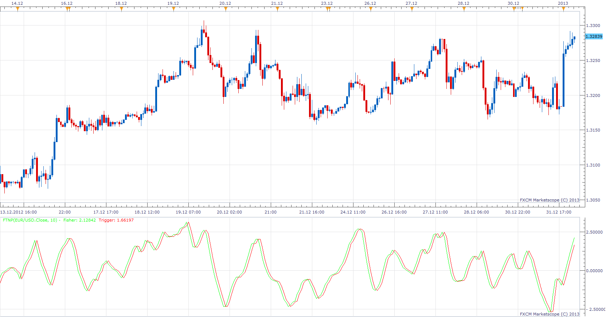

# Fisher Transform of Normalized Prices

> Source: https://fxcodebase.com/code/viewtopic.php?f=17&t=28097  
> Forum: 17 · Topic 28097 · 6 post(s)

---

## Fisher Transform of Normalized Prices

**Apprentice** · Wed Jan 02, 2013 5:32 am

 [FTNP.lua](files/49352/FTNP.lua)

 

 [FTNP with Alert.lua](files/49352/FTNP%20with%20Alert.lua)

---

## Re: Fisher Transform of Normalized Prices

**Alexander.Gettinger** · Mon Sep 22, 2014 9:40 am

MQL4 version of Fisher Transform of Normalized Prices: [viewtopic.php?f=38&t=61213](https://fxcodebase.com/code/viewtopic.php?f=38&t=61213).

---

## Re: Fisher Transform of Normalized Prices

**Apprentice** · Sat Jun 24, 2017 5:14 am

The indicator was revised and updated.

---

## Re: Fisher Transform of Normalized Prices

**mulligan** · Wed May 12, 2021 7:22 pm

Could we please get FTNP with alert based on crossing of Fisher and trigger lines.

Many thanks

---

## Re: Fisher Transform of Normalized Prices

**Apprentice** · Thu May 13, 2021 5:10 am

Your request is added to the development list.
Development reference 472.

---

## Re: Fisher Transform of Normalized Prices

**Apprentice** · Sun May 16, 2021 3:44 am

FTNP with Alert.lua added.
