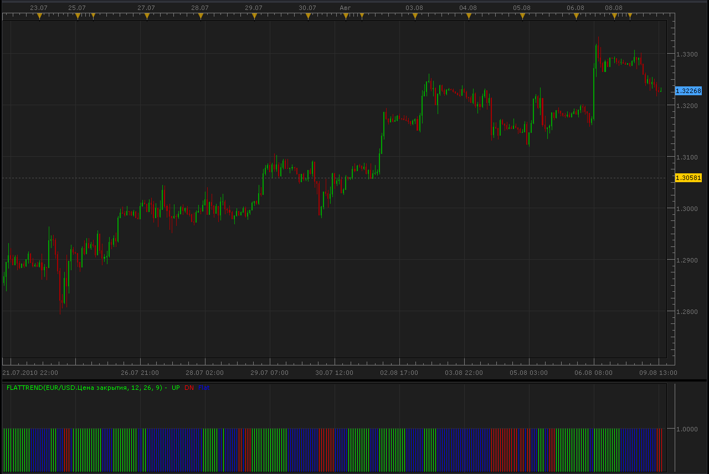
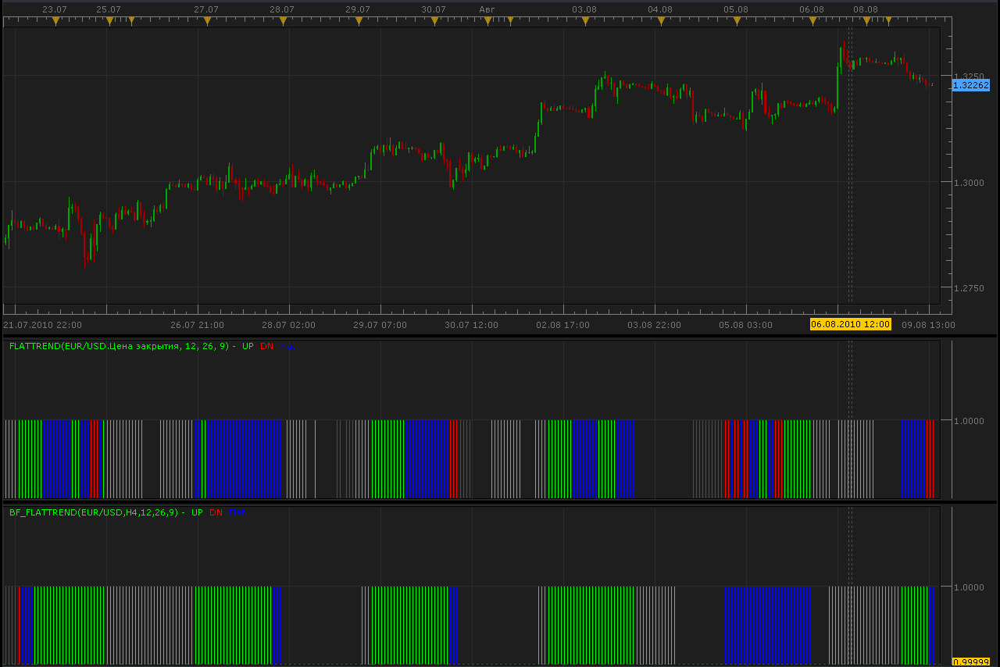

# Flat/Trend MACD indicator

> Source: https://fxcodebase.com/code/viewtopic.php?f=17&t=1719  
> Forum: 17 · Topic 1719 · 11 post(s)

---

## Flat/Trend MACD indicator

**Alexander.Gettinger** · Mon Aug 09, 2010 2:06 pm

The indicator formula is
if SignalMACD<MACD and MACD>0 then indicator show up trend,
if SignalMACD>MACD and MACD<0 then indicator show down trend
else indicator show flat.

 [FlatTrend.lua](files/3432/FlatTrend.lua)

 

 [MTF MCP FlatTrend Heat Map.lua](files/3432/MTF%20MCP%20FlatTrend%20Heat%20Map.lua)

MT4/MQ4 version
[viewtopic.php?f=38&t=65314&p=115740#p115740](https://fxcodebase.com/code/viewtopic.php?f=38&t=65314&p=115740#p115740)

 

 [MTF MCP FLAT TREND INDICATOR LIST.lua](files/3432/MTF%20MCP%20FLAT%20TREND%20INDICATOR%20LIST.lua)

MT4/MQ4 version
[viewtopic.php?f=38&t=65313&p=115739#p115739](https://fxcodebase.com/code/viewtopic.php?f=38&t=65313&p=115739#p115739)

---

## Re: Flat/Trend MACD indicator

**Alexander.Gettinger** · Mon Aug 09, 2010 2:08 pm

And this indicator for higher timeframe.

 

Code: [Select all](https://fxcodebase.com/code/)
`function Init()
    indicator:name("Bigger timeframe Flat/Trend indicator");
    indicator:description("");
    indicator:requiredSource(core.Bar);
    indicator:type(core.Oscillator);

    indicator.parameters:addGroup("Calculation");
    indicator.parameters:addString("BS", "Time frame to calculate indicator", "", "D1");
    indicator.parameters:setFlag("BS", core.FLAG_PERIODS);
    indicator.parameters:addInteger("MACD_Fast", "MACD_Fast", "Period for fast MACD", 12);
    indicator.parameters:addInteger("MACD_Slow", "MACD_Slow", "Period for slow MACD", 26);
    indicator.parameters:addInteger("MACD_MA", "MACD_MA", "Period for signal MACD", 9);

    indicator.parameters:addGroup("Display");
    indicator.parameters:addColor("clrUP", "UP trend", "UP trend", core.rgb(0, 255, 0));
    indicator.parameters:addColor("clrDN", "DN trend", "DN trend", core.rgb(255, 0, 0));
    indicator.parameters:addColor("clrFL", "Flat", "Flat", core.rgb(0, 0, 255));

end

local source;                   -- the source
local bf_data = nil;          -- the high/low data
local MACD_Fast;
local MACD_Slow;
local MACD_MA;
local BS;
local bf_length;                 -- length of the bigger frame in seconds
local dates;                    -- candle dates
local host;
local buffUP=nil;
local buffDN=nil;
local buffFL=nil;
local day_offset;
local week_offset;
local extent;
local FlatTrend;

function Prepare()
    source = instance.source;
    host = core.host;

    day_offset = host:execute("getTradingDayOffset");
    week_offset = host:execute("getTradingWeekOffset");

    BS = instance.parameters.BS;
    MACD_Fast = instance.parameters.MACD_Fast;
    MACD_Slow = instance.parameters.MACD_Slow;
    MACD_MA = instance.parameters.MACD_MA;
    extent = MACD_Slow*2;

    local s, e, s1, e1;

    s, e = core.getcandle(source:barSize(), core.now(), 0, 0);
    s1, e1 = core.getcandle(BS, core.now(), 0, 0);
    assert ((e - s) <= (e1 - s1), "The chosen time frame must be bigger than the chart time frame!");
    bf_length = math.floor((e1 - s1) * 86400 + 0.5);

    local name = profile:id() .. "(" .. source:name() .. "," .. BS .. "," .. MACD_Fast .. "," .. MACD_Slow .. "," .. MACD_MA .. ")";
    instance:name(name);
    buffUP = instance:addStream("UP", core.Bar, name .. ".UP", "UP", instance.parameters.clrUP, 0);
    buffDN = instance:addStream("DN", core.Bar, name .. ".DN", "DN", instance.parameters.clrDN, 0);
    buffFL = instance:addStream("FL", core.Bar, name .. ".Flat", "Flat", instance.parameters.clrFL, 0);
end

local loading = false;
local loadingFrom, loadingTo;
local pday = nil;

-- the function which is called to calculate the period
function Update(period, mode)
    -- get date and time of the hi/lo candle in the reference data
    local bf_candle;
    bf_candle = core.getcandle(BS, source:date(period), day_offset, week_offset);

    -- if data for the specific candle are still loading
    -- then do nothing
    if loading and bf_candle >= loadingFrom and (loadingTo == 0 or bf_candle <= loadingTo) then
        return ;
    end

    -- if the period is before the source start
    -- the do nothing
    if period < source:first() then
        return ;
    end

    -- if data is not loaded yet at all
    -- load the data
    if bf_data == nil then
        -- there is no data at all, load initial data
        local to, t;
        local from;

        if (source:isAlive()) then
            -- if the source is subscribed for updates
            -- then subscribe the current collection as well
            to = 0;
        else
            -- else load up to the last currently available date
            t, to = core.getcandle(BS, source:date(period), day_offset, week_offset);
        end

        from = core.getcandle(BS, source:date(source:first()), day_offset, week_offset);
        buffUP:setBookmark(1, period);
        -- shift so the bigger frame data is able to provide us with the stoch data at the first period
        from = math.floor(from * 86400 - (bf_length * extent) + 0.5) / 86400;
        local nontrading, nontradingend;
        nontrading, nontradingend = core.isnontrading(from, day_offset);
        if nontrading then
            -- if it is non-trading, shift for two days to skip the non-trading periods
            from = math.floor((from - 2) * 86400 - (bf_length * extent) + 0.5) / 86400;
        end
        loading = true;
        loadingFrom = from;
        loadingTo = to;
        bf_data = host:execute("getHistory", 1, source:instrument(), BS, loadingFrom, to, source:isBid());
        FlatTrend = core.indicators:create("FLATTREND", bf_data.close, MACD_Fast, MACD_Slow, MACD_MA);
        return ;
    end

    -- check whether the requested candle is before
    -- the reference collection start
    if (bf_candle < bf_data:date(0)) then
        buffUP:setBookmark(1, period);
        if loading then
            return ;
        end
        -- shift so the bigger frame data is able to provide us with the stoch data at the first period
        from = math.floor(bf_candle * 86400 - (bf_length * extent) + 0.5) / 86400;
        local nontrading, nontradingend;
        nontrading, nontradingend = core.isnontrading(from, day_offset);
        if nontrading then
            -- if it is non-trading, shift for two days to skip the non-trading periods
            from = math.floor((from - 2) * 86400 - (bf_length * extent) + 0.5) / 86400;
        end
        loading = true;
        loadingFrom = from;
        loadingTo = bf_data:date(0);
        host:execute("extendHistory", 1, bf_data, loadingFrom, loadingTo);
        return ;
    end

    -- check whether the requested candle is after
    -- the reference collection end
    if (not(source:isAlive()) and bf_candle > bf_data:date(bf_data:size() - 1)) then
        buffUP:setBookmark(1, period);
        if loading then
            return ;
        end
        loading = true;
        loadingFrom = bf_data:date(bf_data:size() - 1);
        loadingTo = bf_candle;
        host:execute("extendHistory", 1, bf_data, loadingFrom, loadingTo);
        return ;
    end

    FlatTrend:update(mode);
    local p;
    p = findDateFast(bf_data, bf_candle, true);
    if p == -1 then
        return ;
    end
    if FlatTrend:getStream(0):hasData(p) then
        buffUP[period] = FlatTrend:getStream(0)[p];
    end
    if FlatTrend:getStream(1):hasData(p) then
        buffDN[period] = FlatTrend:getStream(1)[p];
    end
    if FlatTrend:getStream(2):hasData(p) then
        buffFL[period] = FlatTrend:getStream(2)[p];
    end
end

-- the function is called when the async operation is finished
function AsyncOperationFinished(cookie)
    local period;

    pday = nil;
    period = buffUP:getBookmark(1);

    if (period < 0) then
        period = 0;
    end
    loading = false;
    instance:updateFrom(period);
end

function findDateFast(stream, date, precise)
    local datesec = nil;
    local periodsec = nil;
    local min, max, mid;

    datesec = math.floor(date * 86400 + 0.5)

    min = 0;
    max = stream:size() - 1;

    while true do
        mid = math.floor((min + max) / 2);
        periodsec = math.floor(stream:date(mid) * 86400 + 0.5);
        if datesec == periodsec then
            return mid;
        elseif datesec > periodsec then
            min = mid + 1;
        else
            max = mid - 1;
        end
        if min > max then
            if precise then
                return -1;
            else
                return min - 1;
            end
        end
    end
end`

 [BF_FlatTrend.lua](files/3433/BF_FlatTrend.lua)

---

## Re: Flat/Trend MACD indicator

**jcervinka** · Tue Aug 10, 2010 2:13 am

Hi there
The indicator work perfect. Great job!!

Thanks

JC.

---

## Re: Flat/Trend MACD indicator

**RJH501** · Thu Jul 14, 2011 5:10 am

I observed that there are two settings for "Color of Short Up" I would surmise that one of the settings should be "Color of Short Down" - most likely the bright red 255;0;0.

Your thoughts please.

RJH

---

## Re: Flat/Trend MACD indicator

**Apprentice** · Sun Jan 25, 2015 7:52 am

MTF MCP FlatTrend Heat Map.lua Added
FlatTrend.lua Update

---

## Re: Flat/Trend MACD indicator

**transformer** · Tue Feb 10, 2015 10:00 pm

HI APPRENTICE,

CAN YOU CREAT MTF MCP LIST FLAT TREND INDICATOR.

THANK YOU

---

## Re: Flat/Trend MACD indicator

**Apprentice** · Wed Feb 11, 2015 4:23 am

MTF MCP FLAT TREND INDICATOR LIST Added.

---

## Re: Flat/Trend MACD indicator

**transformer** · Wed Feb 11, 2015 4:59 am

THANK YOU CREATINGI THIS INDICATOR

ONE MORE REQUEST TO MODIFY THIS INDICATOR

1.CAN YOU EXTEND THE LINE TO CURRENCY PAIRS . IF IT IS LOOKING LIKE ALL CURRENCY PAIR GRAB LIST INDICATOR IT WILL LOOK BETTER.

2.CAN YOU
HIGH LIGHT THE CURRENCY PAIR WITH GREEN WHEN SELECTED TIME FRAME ARE IN UP TREND{ AND }
HIGHLIGHT IT WITH RED WHEN ALL TIME FRAME SELECTED IN LIST ARE IN DOWN TREND

ALL CURRENCY PAIR GRAB INDICATOR IS FOUND IN FOLLOWING PAGE

[http://fxcodebase.com/code/viewtopic.ph ... RAB#p95491](https://fxcodebase.com/code/viewtopic.php?f=17&t=6256&p=95491&hilit=GRAB#p95491)

---

## Re: Flat/Trend MACD indicator

**Apprentice** · Thu Feb 12, 2015 5:02 am

Your request is added to the development list.

In the meantime, try update version.
This will fix, presentation, if a small number of time frames is used.

---

## Re: Flat/Trend MACD indicator

**Apprentice** · Wed Nov 15, 2017 10:35 am

The indicator was revised and updated.

---

## Re: Flat/Trend MACD indicator

**Apprentice** · Fri Jun 29, 2018 7:11 am

The indicator was revised and updated.
