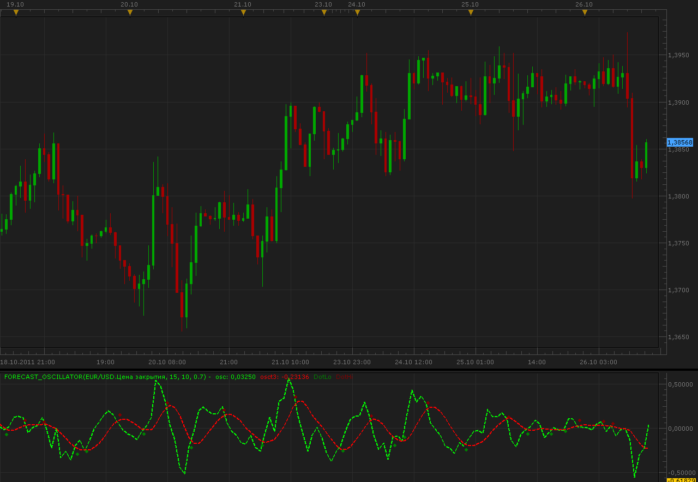

# Forecast Oscillator

> Source: https://fxcodebase.com/code/viewtopic.php?f=17&t=7637  
> Forum: 17 · Topic 7637 · 3 post(s)

---

## Forecast Oscillator

**Alexander.Gettinger** · Wed Oct 26, 2011 12:32 pm

This indicator is a ported MQL4 indicator from request: [viewtopic.php?f=27&t=7201](https://fxcodebase.com/code/viewtopic.php?f=27&t=7201)

 

Download:

 [Forecast_Oscillator.lua](files/16934/Forecast_Oscillator.lua)

The indicator was revised and updated

---

## Re: Forecast Oscillator

**Blackcat2** · Wed Oct 26, 2011 5:38 pm

Thanks Alexander

I'll give it a try..

BC

---

## Re: Forecast Oscillator

**Apprentice** · Sun Mar 19, 2017 10:39 am

Indicator was revised and updated.
