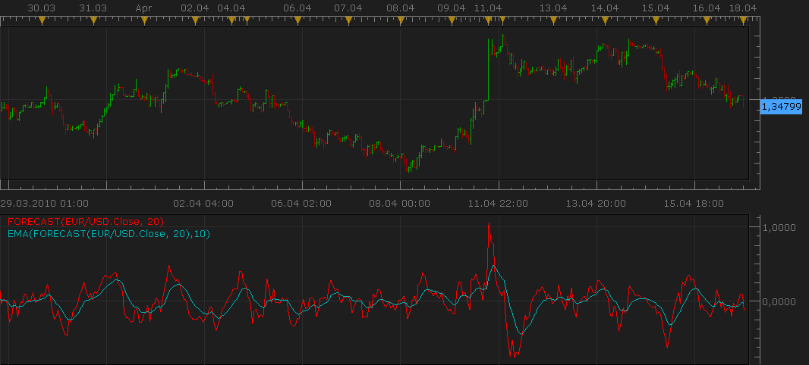

# Forecast oscillator

> Source: https://fxcodebase.com/code/viewtopic.php?f=17&t=693  
> Forum: 17 · Topic 693 · 4 post(s)

---

## Forecast oscillator

**Nikolay.Gekht** · Sun Apr 18, 2010 2:50 pm

The forecast oscillator is developed by by Tushar Chande and is an extension of the Time Frame Forecast method.

The formula is:
Forecast Oscillator = Price - Previous Time Series Forecast / Price * 100

Interpretation:
The positive value of the indicator forecasts higher prices. The negative value forecasts the lower prices. Chande also recommends to user 3-day smoothing line as a trigger. When the oscillator falls below or crosses above the trigger line it shows a change of the trend.

 

Download:

 [forecast.lua](files/1252/forecast.lua)

 [forecast with alert.lua](files/1252/forecast%20with%20alert.lua)

The indicator was revised and updated

---

## Re: Forecast oscillator

**Apprentice** · Sun Dec 25, 2016 7:08 am

Indicator was revised and updated.

---

## Re: Forecast oscillator

**mulligan** · Thu Jan 12, 2017 10:40 am

Would very much like to have an alert on this indicator based on crossing above or below the zero line. Your consideration is appreciated.

---

## Re: Forecast oscillator

**Apprentice** · Fri Jan 13, 2017 7:04 am

forecast with alert.lua added.
