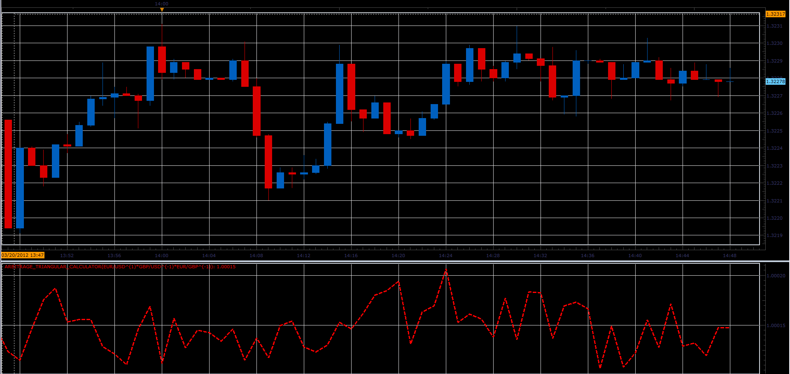
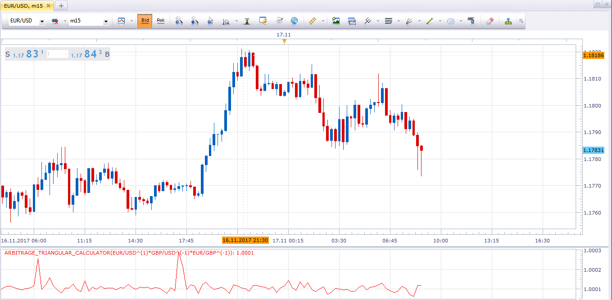

# Forex arbitrage triangular calculator

> Source: https://fxcodebase.com/code/viewtopic.php?f=17&t=14957  
> Forum: 17 · Topic 14957 · 16 post(s)

---

## Forex arbitrage triangular calculator

**Alexander.Gettinger** · Tue Mar 20, 2012 1:46 pm

The indicator calculates the deviation of the ratio of currency pairs.

For example:
for pairs EUR/USD, GBP/USD and EUR/GBP must be correlation: (EUR/USD)/((GBP/USD)*(EUR/GBP))=1.
But this relationship does not always happen. This provides possibility for arbitrage.
The indicator detects such possibilities.

 

Download:

 [Arbitrage_Triangular_Calculator.lua](files/28344/Arbitrage_Triangular_Calculator.lua)

MT4/MQ4 version.
[viewtopic.php?f=38&t=67025](https://fxcodebase.com/code/viewtopic.php?f=38&t=67025)

---

## Re: Forex arbitrage triangular calculator

**rose123** · Wed Mar 21, 2012 3:02 am

how we have to use this indicator

---

## Re: Forex arbitrage triangular calculator

**Alexander.Gettinger** · Wed Mar 21, 2012 8:51 am

Any deviation must disappear and the system returns to equilibrium.

---

## Re: Forex arbitrage triangular calculator

**ababsammma** · Mon Dec 08, 2014 4:05 pm

hello

why don't we make a strategy using this indicator,
as number 1 is our datum so we can make an order to buy and sell pairs at 1.00010 and close them when it reaches 1.00050 as example

thank you

---

## Re: Forex arbitrage triangular calculator

**Apprentice** · Tue Dec 09, 2014 5:24 am

Strategy is an independent entity, should be written based on this indicator.
Can you specify the complete strategy Entry / Exit rules.

---

## Re: Forex arbitrage triangular calculator

**ababsammma** · Tue Dec 09, 2014 5:39 am

ok
as example
strategy Entry : when the indicator is lower than 1.00025
Exit rules : when the indicator reach 1.00050 "it can be close all"
or can be exit only

---

## Re: Forex arbitrage triangular calculator

**Apprentice** · Fri Dec 12, 2014 4:32 am

Your request is added to the development list.

---

## Re: Forex arbitrage triangular calculator

**oisin12** · Thu Jan 01, 2015 7:21 pm

> **Alexander.Gettinger wrote:**
> The indicator calculates the deviation of the ratio of currency pairs.
>
> For example:
> for pairs EUR/USD, GBP/USD and EUR/GBP must be correlation: (EUR/USD)/((GBP/USD)*(EUR/GBP))=1.
> But this relationship does not always happen. This provides possibility for arbitrage.
> The indicator detects such possibilities.
>
>
>
> Arbitrage_Triangular_Calculator.PNG
>
>
>
> Download:
>
>
> Arbitrage_Triangular_Calculator.lua

Hi, do you know if there is a strategy version of this indicator?

---

## Re: Forex arbitrage triangular calculator

**Apprentice** · Fri Jan 02, 2015 2:27 am

It does not exist.
Can you define the strategy rules.

---

## Re: Forex arbitrage triangular calculator

**oisin12** · Fri Jan 02, 2015 6:43 am

> **Apprentice wrote:**
> It does not exist.
> Can you define the strategy rules.

Unfortunately I do not know enough about triangular arbitrage to be able to define strategy rules. Maybe someone reading this has a greater understanding

---

## Re: Forex arbitrage triangular calculator

**Apprentice** · Tue Jul 18, 2017 7:28 am

The indicator was revised and updated.

---

## Re: Forex arbitrage triangular calculator

**isamegrelo** · Fri Nov 17, 2017 10:46 am

How to use this indicator?

 

---

## Re: Forex arbitrage triangular calculator

**Apprentice** · Thu Apr 26, 2018 7:28 am

The indicator was revised and updated.

---

## Re: Forex arbitrage triangular calculator

**James.Ma** · Mon Nov 26, 2018 1:36 pm

> **Alexander.Gettinger wrote:**
> The indicator calculates the deviation of the ratio of currency pairs.
>
> For example:
> for pairs EUR/USD, GBP/USD and EUR/GBP must be correlation: (EUR/USD)/((GBP/USD)*(EUR/GBP))=1.
> But this relationship does not always happen. This provides possibility for arbitrage.
> The indicator detects such possibilities.
>
>
>
> Arbitrage_Triangular_Calculator.PNG
>
>
>
> Download:
>
>
> Arbitrage_Triangular_Calculator.lua

hello, Sorry, my English is not good，Can you develop this MQL4 indicator? Thanks!!!

---

## Re: Forex arbitrage triangular calculator

**Apprentice** · Tue Nov 27, 2018 5:53 am

Your request is added to the development list under Id Number 4330

---

## Re: Forex arbitrage triangular calculator

**Apprentice** · Thu Nov 29, 2018 1:56 pm

MT4/MQ4 version.
[viewtopic.php?f=38&t=67025](https://fxcodebase.com/code/viewtopic.php?f=38&t=67025)
