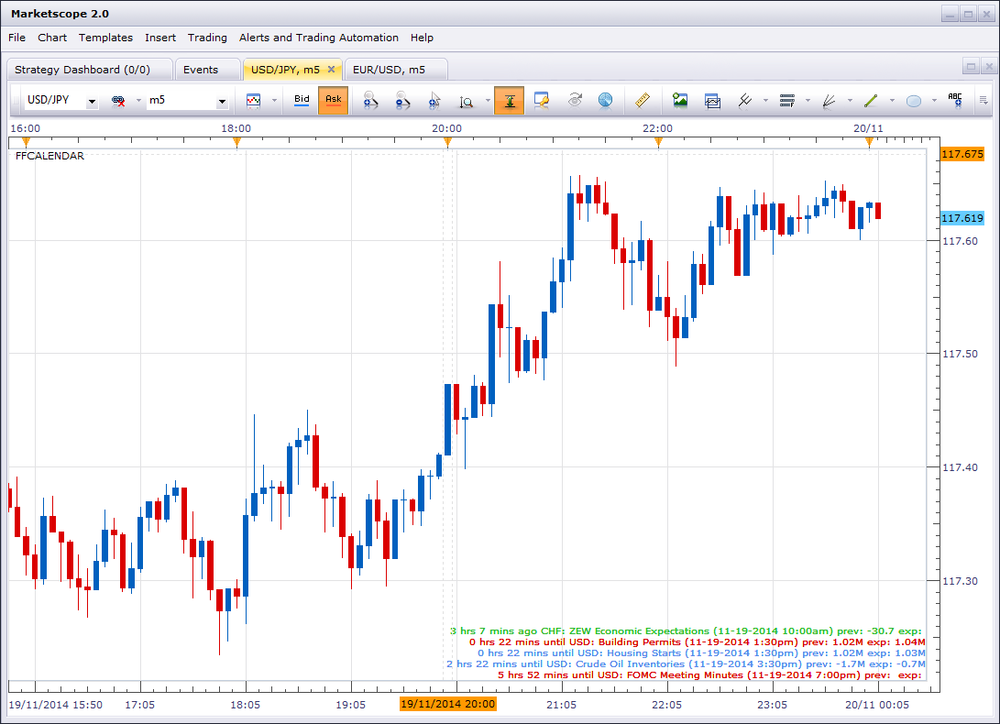
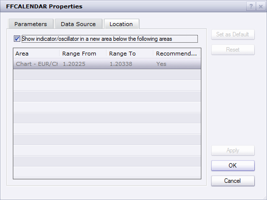
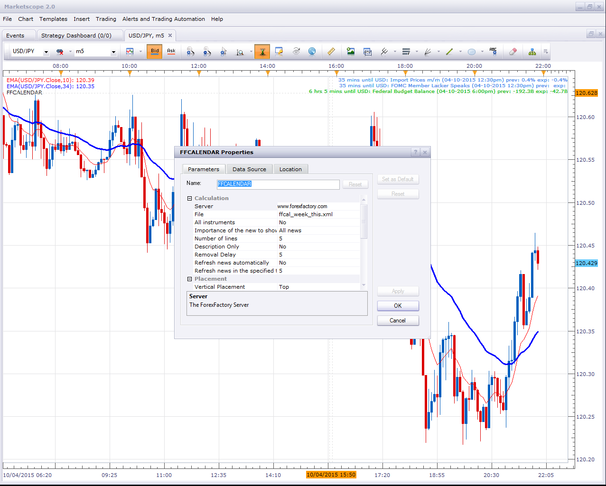

# ForexFactory Calendar

> Source: https://fxcodebase.com/code/viewtopic.php?f=17&t=61485  
> Forum: 17 · Topic 61485 · 24 post(s)

---

## ForexFactory Calendar

**moomoofx** · Wed Nov 19, 2014 8:09 am

As requested on here: [viewtopic.php?f=27&t=61079](https://fxcodebase.com/code/viewtopic.php?f=27&t=61079)

A live parse of the ForexFactory calendar. ForexFactory only expose the calendar on a weekly basis. This indicator gets this file, parses it, and updated accordingly. The file does not contain ACTUAL values, only PREVIOUS and FORECAST/expected values. Refreshing the file won't help. As such, this indicator only refreshes the file on initial load. You can force a refresh via the context menu, or in the config it can refresh periodically but there really is no point since the file never updates.

Additionally:
- You can configure the color coding to use.
- It counts down for you until the news in hours/minutes.
- You can choose to keep historical news hanging around, controlled in minutes. Default is 5.

 

Calendar as an Indicator on the main Chart

 [ffcalendar.lua](files/97199/ffcalendar.lua)

Previously I had two versions of this indicator, one for the main chart and one as an oscillator. However, I just learned that you can do it another way. In the configuration of the indicators, you can choose the location. Just check the checkbox like in the screenshot below. That is much cleaner than maintaining two source codes.

 

Enjoy.

Cheers,
MooMooForex

---

## Re: ForexFactory Calendar

**BTrade** · Wed Nov 19, 2014 9:27 am

Hi MooMooFX,

Thanks for developing the indicator!

if you could, please, make the following improvements.

1. add a background with an option to select the color
2. add an option for showing less text. only the event description, without the date, time, previous and expected value.
3. add an option to place it in a sub window such as volume or an indicator. I tried by changing the location, but it keep returning into the main chart.

Once again, thank you for spending the time to develop this indicator!

---

## Re: ForexFactory Calendar

**moomoofx** · Fri Nov 21, 2014 7:10 am

Hi,

I have...
- Added background option.
- Added the Description Only option.
- made it print one line "No News" when there are no news.

I'm not sure how to programmatically force the indicator to draw in a window or not based off parameters, so I have made an oscillator version of the indicator that draws in a separate window.

Cheers,
MooMooForex

---

## Re: ForexFactory Calendar

**moomoofx** · Tue Nov 25, 2014 7:07 pm

There was a bug in the implementation that converted news times between 12:00am and 12:59am incorrectly to 12:xx instead of 00:xx resulting in news being "12 hours xx minutes until" when it was only xx minutes away.

This has now been fixed. Thanks to Roy for reporting the issue.

---

## Re: ForexFactory Calendar

**moomoofx** · Thu Nov 27, 2014 9:04 am

And another quick fix concerning the opposite problem of times between 12pm and 12:59pm ... *sigh*. I also noticed the 'Description Only' parameter was inversed so I have fixed that too.

Please redownload file from the first post. Hopefully, no more problems!

Cheers,
MooMooForex

---

## Re: ForexFactory Calendar

**BTrade** · Mon Dec 01, 2014 8:12 pm

THANKS!!!

---

## Re: ForexFactory Calendar

**BTrade** · Mon Mar 02, 2015 5:54 pm

Hi MooMooFX,

all of a sudden, this indicator is not working since last week. I assume it is related to the URL address. Could you, please, help me fix it?

Thanks

---

## Re: ForexFactory Calendar

**moomoofx** · Thu Apr 09, 2015 11:00 pm

Still works for me.

---

## Re: ForexFactory Calendar

**BTrade** · Fri Apr 10, 2015 12:27 am

Hi MooMooFx,

Could you, please, let me know the Server and File you use?

It does not work for me ... I have not changed anything in the settings ... the only thing that comes to mind is, if ForexFactory had changed their files.

I really like the option to have the list of upcoming events. HOPE you can help make this indicator works again.

---

## Re: ForexFactory Calendar

**moomoofx** · Fri Apr 10, 2015 7:33 am

I'm simply using the default settings.

 

Are you sure you don't just have some firewall or blocking app preventing the connection?

---

## Re: ForexFactory Calendar

**rtsayers** · Sun Nov 01, 2015 1:56 pm

Something is wrong...the feed is not working for me? I wish we where able to get a proper working news feed the dailyfx not working and now this one not working??

---

## Re: ForexFactory Calendar

**mechanicjon** · Thu Jan 21, 2016 3:02 am

> **pinimo wrote:**
> This indicator has always worked well, but with the latest update of the trading station it has stopped working.
>
> Nothing appears!
>
> With the latest updates also other indicators have malfunction .
> Are there suggestions to solve ?
>
>
> Thanks

It's a known issue they're working on it. In the meantime use this one:
[http://fxcodebase.com/code/download/file.php?id=15177](https://fxcodebase.com/code/download/file.php?id=15177)
from this topic
[http://fxcodebase.com/code/viewtopic.php?f=17&t=1972&hilit=FFCALENDAR](https://fxcodebase.com/code/viewtopic.php?f=17&t=1972&hilit=FFCALENDAR)

---

## Re: ForexFactory Calendar

**Apprentice** · Sun Feb 04, 2018 1:56 pm

The indicator was revised and updated.

---

## Re: ForexFactory Calendar

**Apprentice** · Mon Apr 15, 2019 5:26 am

The url has changed.

---

## Re: ForexFactory Calendar

**amvt85** · Mon Apr 15, 2019 12:21 pm

> **Apprentice wrote:**
> The url has changed.

Yes, that seems to be the problem. Lua does not have "Allow DLL imports"?

[https://www.forexfactory.com/showthread ... 93&page=42](https://www.forexfactory.com/showthread.php?t=19293&page=42)

---

## Re: ForexFactory Calendar

**minifire18** · Mon Jun 17, 2019 4:27 am

Hi Apprentice ,
Can this be coded for MT4
Thanks minifire

---

## Re: ForexFactory Calendar

**Apprentice** · Mon Jun 17, 2019 7:36 am

Your request is added to the development list under Id Number 4726

---

## Re: ForexFactory Calendar

**7510109079** · Wed Jun 19, 2019 4:12 am

> **minifire18 wrote:**
> Hi Apprentice ,
> Can this be coded for MT4
> Thanks minifire

if you look on Forex Factory and other places there are many calendar indicators for MT4 that already exist and are more than fit for purpose

---

## Re: ForexFactory Calendar

**scandisk** · Tue Sep 03, 2024 2:38 pm

Hi Calendar not loading or working? It loads from time to time but most disappears?
Please fix thanks!

---

## Re: ForexFactory Calendar

**Apprentice** · Sun Sep 08, 2024 4:00 pm

We have added your request to the development list.
Development reference 698

---

## Re: ForexFactory Calendar

**Victor.Tereschenko** · Sun Dec 01, 2024 10:09 pm

> **scandisk wrote:**
> Hi Calendar not loading or working? It loads from time to time but most disappears?
> Please fix thanks!

This one doesn’t have any issues: [https://fxcodebase.com/code/download/file.php?id=32315](https://fxcodebase.com/code/download/file.php?id=32315) If you still have an issue then take a look in the events->log tab. Is there any errors?

---

## Re: ForexFactory Calendar

**scandisk** · Mon Dec 09, 2024 10:11 am

When you change the settings and when it updates it disappears? It would be a nice to see it fixed?

---

## Re: ForexFactory Calendar

**Apprentice** · Fri Dec 13, 2024 4:26 pm

We have added your request to the development list.
Development reference 918

---

## Re: ForexFactory Calendar

**Apprentice** · Mon Jun 09, 2025 11:34 am

It’s not a bug.
When you update the settings it reloads all data.
