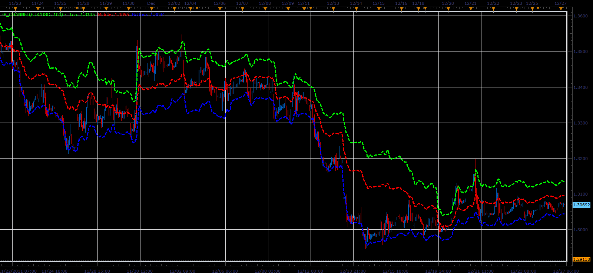

# FP channel

> Source: https://fxcodebase.com/code/viewtopic.php?f=17&t=10503  
> Forum: 17 · Topic 10503 · 3 post(s)

---

## FP channel

**Alexander.Gettinger** · Tue Dec 27, 2011 4:24 am

Original idea Nick A. Zhilin

Formulas:
Middle line=sum/3,
Top line=(sum-min)/2,
Bottom line=(sum-max)/2, where
sum=max+min+pivot,
max(i), min(i) - maximum and minimum prices at range from (i-Period) to (i),
pivot(i)=(Close(i-1)+Close(i-2)+Close(i-3))/3.

 

Download:

 [FP_Channel.lua](files/21763/FP_Channel.lua)

The indicator was revised and updated

---

## Re: FP channel

**Alexander.Gettinger** · Wed Dec 28, 2011 8:34 am

Strategy based on FP channel indicator: [viewtopic.php?f=31&t=10555](https://fxcodebase.com/code/viewtopic.php?f=31&t=10555)

---

## Re: FP channel

**Apprentice** · Mon Mar 20, 2017 8:13 am

Indicator was revised and updated.
