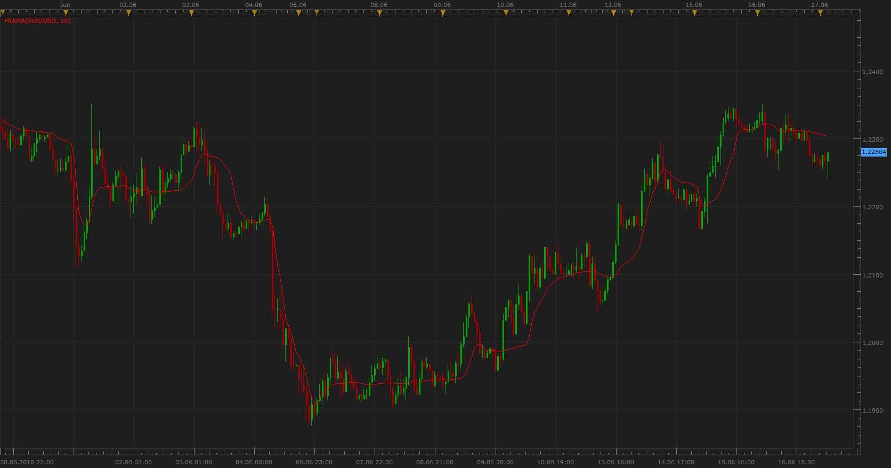

# Fractal Adaptive Moving Average (FRAMA)

> Source: https://fxcodebase.com/code/viewtopic.php?f=17&t=1355  
> Forum: 17 · Topic 1355 · 8 post(s)

---

## Fractal Adaptive Moving Average (FRAMA)

**Apprentice** · Thu Jun 17, 2010 2:51 am

*FRAMA*

 Fractal Adaptive Moving Average(FRAMA) - by John Ehlers, use adaptive smoothing based on the assumption that market moves are fractal.

Follows significant changes in price, ignores, eliminat whipsaw patterns that occur in congestion zones.

 [Frama.lua](files/2599/Frama.lua)

 [Modified Frama.lua](files/2599/Modified%20Frama.lua)

The indicator was revised and updated

---

## Re: Fractal Adaptive Moving Average (FRAMA)

**zekelogan** · Thu Jun 17, 2010 3:30 am

I like this already.

A great compliment to traditional MA's when viewed together

---

## Re: Fractal Adaptive Moving Average (FRAMA)

**thetruth** · Wed Nov 03, 2010 8:15 am

can you develop the signal?

---

## Re: Fractal Adaptive Moving Average (FRAMA)

**Apprentice** · Wed Nov 03, 2010 9:31 am

Requested signal, I added within the existing signal.
[viewtopic.php?f=29&t=2386&p=5151#p5151](https://fxcodebase.com/code/viewtopic.php?f=29&t=2386&p=5151#p5151)

If you need cross signal.
If you need another type of signal,
 specify what kind of signals you need.

---

## Re: Fractal Adaptive Moving Average (FRAMA)

**dorobou** · Fri Mar 06, 2015 11:54 pm

Dear Apprentice,

Is it possible to change the indicator as "Modified FRAMA" in [http://etfhq.com/blog/2010/09/30/fractal-adaptive-moving-average-frama/](http://etfhq.com/blog/2010/09/30/fractal-adaptive-moving-average-frama/)

Thank you!

---

## Re: Fractal Adaptive Moving Average (FRAMA)

**Apprentice** · Sun Mar 08, 2015 5:54 am

Modified Frama added.

---

## Re: Fractal Adaptive Moving Average (FRAMA)

**dorobou** · Sun Mar 08, 2015 6:41 am

Thank you very much, Apprentice!
Have a nice day!

---

## Re: Fractal Adaptive Moving Average (FRAMA)

**Apprentice** · Sun Jul 02, 2017 1:02 pm

The indicator was revised and updated.
