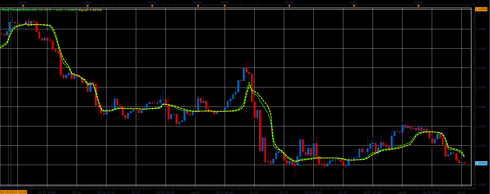

# Fractal AMA indicator

> Source: https://fxcodebase.com/code/viewtopic.php?f=17&t=32559  
> Forum: 17 · Topic 32559 · 2 post(s)

---

## Fractal AMA indicator

**Alexander.Gettinger** · Thu Feb 28, 2013 6:44 pm

This indicator is a ported MQL5 indicators from [http://www.mql5.com/en/code/1547](http://www.mql5.com/en/code/1547).

Formulas:
AMA[i]=Alpha*Close[i]+(1-Alpha)*AMA[i-1],
Signal[i]=AlphaS*AMA[i]+(1-AlphaS)*Signal[i-1], where
Aplha=Exp(-Multiplier*(DE-1)),
AlphaS=Exp(-SMultiplier*(DE-1)),
DE=(ln(R1+R2)-ln(R3))/ln(2),
R1 - price range from (i-Period/2) to i,
R2 - price range from (i-i-Period) to (i-Period/2),
R3 - price range from (i-Period) to i.

 

Download:

 [FractalAMA.lua](files/55460/FractalAMA.lua)

The indicator was revised and updated

---

## Re: Fractal AMA indicator

**Apprentice** · Mon May 01, 2017 6:42 am

Indicator was revised and updated.
