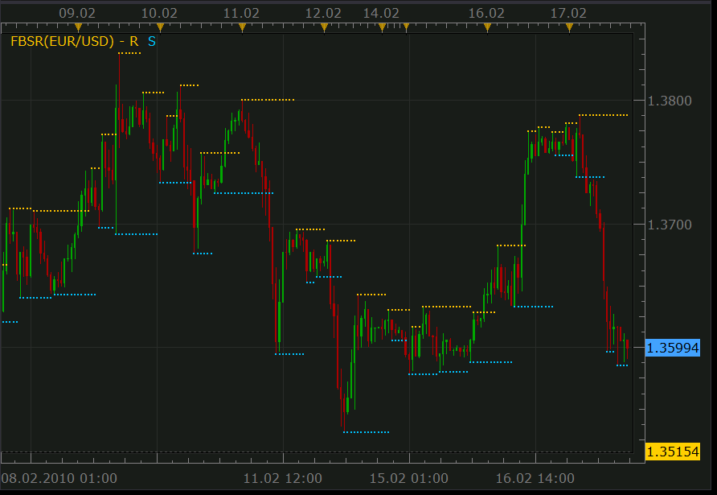
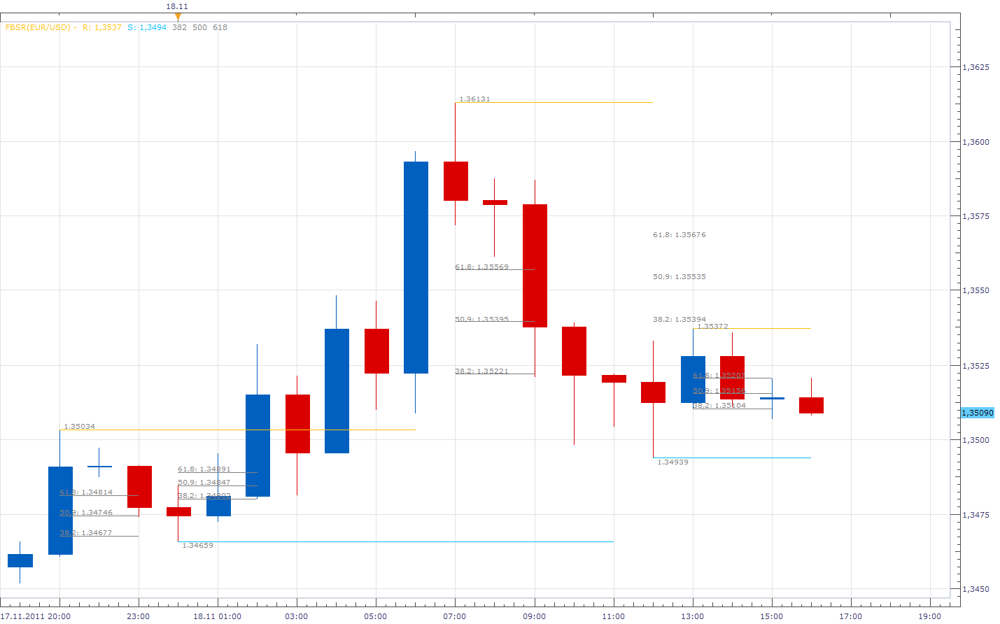
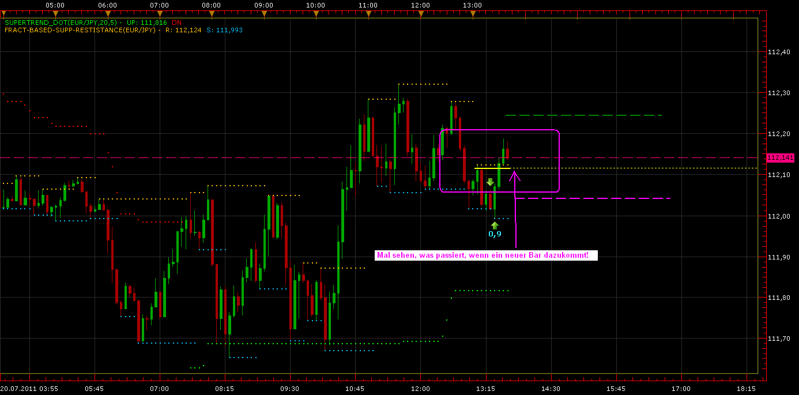
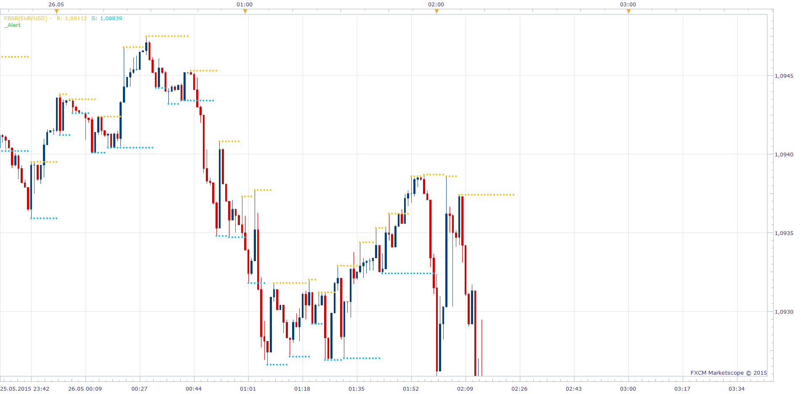
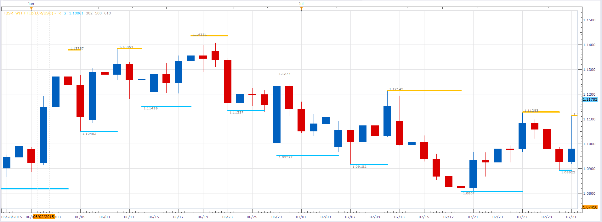

# Fractal-based Support/Resistance Lines

> Source: https://fxcodebase.com/code/viewtopic.php?f=17&t=367  
> Forum: 17 · Topic 367 · 24 post(s)

---

## Fractal-based Support/Resistance Lines

**Nikolay.Gekht** · Wed Feb 17, 2010 5:30 pm

The simple indicator which starts a new support/resistance line every time when up or down fractal appears.

 

Download:

 [FBSR.lua](files/606/FBSR.lua)

FBSR with Fibonacci levels

 

 [FBSR_With_Fib.lua](files/606/FBSR_With_Fib.lua)

The indicator was revised and updated

---

## Re: Fractal-based Support/Resistance Lines

**kytkable** · Wed Oct 20, 2010 11:09 am

Hi,
I am a new one. My English is not well.
So many people download the indicator.
It shows that is very useful and helpful.Very thanks to
the worker and fxcodebase.com. I have a request, if
possible, Could anyone show me how to change the
R/S line form "....." to "____"?

Very thanks

---

## Re: Fractal-based Support/Resistance Lines

**thetruth** · Wed Nov 03, 2010 8:03 am

if you need lines only have to change core.Dot for core.Line in function prepare in lines
R= and S=.

Code: [Select all](https://fxcodebase.com/code/)
`function Prepare()
    source = instance.source;
    first = source:first() + 4;

    local name = profile:id() .. "(" .. source:name() .. ")";
    instance:name(name);
    --core.Dot=core.Line
   R = instance:addStream("R", core.Line, name .. ".R", "R", instance.parameters.R_color, first);
    S = instance:addStream("S", core.Line, name .. ".S", "S", instance.parameters.S_color, first);
end`

---

## Re: Fractal-based Support/Resistance Lines

**kelvincha** · Sun Dec 19, 2010 10:46 am

Good Job
That almost the best indicator ever
but I have a request
can i change the resistance and support to fiboncci retracement level of previous day
Thanks a lot

---

## Re: Fractal-based Support/Resistance Lines

**Apprentice** · Sun Dec 19, 2010 10:59 am

It is possible, but then it will be quite a different indicator.

---

## Re: Fractal-based Support/Resistance Lines

**Nikolay.Gekht** · Mon Dec 20, 2010 11:53 am

> **kelvincha wrote:**
> Good Job
> That almost the best indicator ever
> but I have a request
> can i change the resistance and support to fiboncci retracement level of previous day
> Thanks a lot

Hm... As far as I see, this can be done just using PIVOT indicator. Choose "Fibonacci Retarement" in the mode, choose the levels you need and switch the historical mode "on" if you need to see historical levels.

---

## Re: Fractal-based Support/Resistance Lines

**TradeKing** · Fri Feb 25, 2011 3:41 pm

How do we change this indicator to lines instead of dots? I see it posted that we have to change core.dot from dot to lines but I don't even know where that would be done. Can someone please assist or change the indicator please. Thanks!

TradeKing

---

## Re: Fractal-based Support/Resistance Lines

**Apprentice** · Sat Feb 26, 2011 5:51 am

Something like this.

 [FBSR.lua](files/8455/FBSR.lua)

---

## Re: Fractal-based Support/Resistance Lines

**TradeKing** · Wed Mar 02, 2011 2:43 pm

Perfect! Thank you very much!

---

## Re: Fractal-based Support/Resistance Lines

**dollar** · Fri Apr 08, 2011 1:13 am

I have downloaded and transfered FBSR.Lua to my tradestation platform however it does not have this appearance as there are also vertical lines connecting to the horizonal lines which are very distracting and make the chart very busy. Is there a way for the code to be changed so that only the horizonal lines appear? The example would fit my eye very nicely for support and resistance only. THANK YOU in advance. Gene Dollar
 [[email protected]](https://fxcodebase.com/cdn-cgi/l/email-protection#f793989b9b9685c4c2c4ceb78e969f9898d994989a)

---

## Re: Fractal-based Support/Resistance Lines

**Apprentice** · Fri Apr 08, 2011 4:06 am

How many people, so many preferences.
Probably you have installed the version upon request.
User have requested this functionality.
With First Post (Top Most) version you should be satisfied.

---

## Re: Fractal-based Support/Resistance Lines

**gimmegimme** · Tue May 24, 2011 9:37 am

Is it possible to add options for bigger time frames and filter how many times the price has to touch the line before it is drawn? ex: only draws a line after 2 fractals on the same line. Thanks

---

## Re: Fractal-based Support/Resistance Lines

**gimmegimme** · Tue May 24, 2011 9:39 am

Oh, and an option to extend such lines whether it is broken or not. Thanks

---

## Re: Fractal-based Support/Resistance Lines

**Apprentice** · Tue May 24, 2011 4:16 pm

Bigger Time Frame is Possible.
As for other requests, I'm not sure that we are on the same page.
The lines are generated each time a new fractal is generated.
Line crossover have no weight in the current implementation.

As for the multiple, confirmation.
The lines are almost never on the Level.
Defining a belt or tolerance would be a better solution

---

## Re: Fractal-based Support/Resistance Lines

**gimmegimme** · Tue May 24, 2011 9:41 pm

Even the time frame select would be very useful. I like to trade breakouts of horizontal trend lines more than diagonal ones. There are already many auto trend lines that are diagonal but I don't see any horizontals, other than pivots but that's not really the same as what I look for.

---

## Re: Fractal-based Support/Resistance Lines

**Apprentice** · Wed May 25, 2011 3:08 am

Other or biger time frame version of advanced fractal You can find here.
[viewtopic.php?f=17&t=724&hilit=fractal](https://fxcodebase.com/code/viewtopic.php?f=17&t=724&hilit=fractal)

As for the horizontal trend line, give me time to come up with such an indicator.

---

## Re: Fractal-based Support/Resistance Lines

**Cha Lee** · Wed Jul 20, 2011 8:26 am

Hi,

i found out, that the indicator frequently changes indicator lines.
Here the screenshot before and after the switch to a new bar:

 

*A few seconds before creating the new bar*

---

## Re: Fractal-based Support/Resistance Lines

**Cha Lee** · Wed Jul 20, 2011 8:28 am

Hi,

... and that ist after creting the new bar:

 

M y Question: is this behaviour intended or a fault?

---

## Re: Fractal-based Support/Resistance Lines

**Apprentice** · Sun Nov 20, 2011 4:45 am

FBSR with Fibonacci levels added.

---

## Re: Fractal-based Support/Resistance Lines

**Avignon** · Mon May 25, 2015 5:56 pm

Hi,

Is it possible to add option price or to select history on data source ?

Thanks.

---

## Re: Fractal-based Support/Resistance Lines

**Apprentice** · Tue May 26, 2015 3:09 am

Make sure to download FBSR.lua from first post in this topic.
Also you could appreciate Support Resistance indicator.
[viewtopic.php?f=17&t=59367&hilit=support](https://fxcodebase.com/code/viewtopic.php?f=17&t=59367&hilit=support)

---

## Re: Fractal-based Support/Resistance Lines_FIB

**jenniferFX888** · Sat Sep 05, 2015 8:35 am

Hi,

Can you change the support/resistance line to stop when new support/resistance starts new one

Thanks,

jennifer

---

## Re: Fractal-based Support/Resistance Lines

**Alexander.Gettinger** · Tue Sep 08, 2015 12:15 pm

Please, see this version.

 

Download:

 [FBSR_With_Fib.lua](files/102231/FBSR_With_Fib.lua)

---

## Re: Fractal-based Support/Resistance Lines

**Apprentice** · Mon Jul 31, 2017 4:55 am

The indicator was revised and updated.
