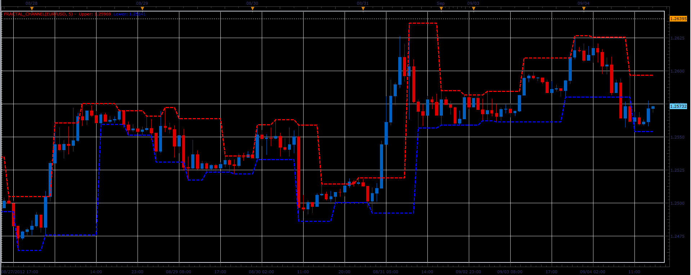
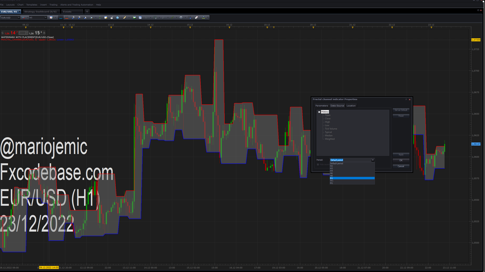

# Fractal channel

> Source: https://fxcodebase.com/code/viewtopic.php?f=17&t=23005  
> Forum: 17 · Topic 23005 · 6 post(s)

---

## Fractal channel

**Alexander.Gettinger** · Tue Sep 04, 2012 2:15 pm

The indicator draws a channel on fractals.

 

Download:

 [Fractal_Channel.lua](files/39654/Fractal_Channel.lua)

 

2. Line Color is determined by Price position within Channel
3. Line color is determined by Candle direction

 [MTF MCP Fractal_Channel Multimeter.lua](files/39654/MTF%20MCP%20Fractal_Channel%20Multimeter.lua)

---

## Re: Fractal channel

**Apprentice** · Mon Apr 17, 2017 6:23 am

Indicator was revised and updated.

---

## Re: Fractal channel

**ahmedalhosenyy** · Tue Dec 20, 2022 5:15 pm

Dear sir,
may you add Multi time frame option
Many thankx for great efforts.
Regards

---

## Re: Fractal channel

**Apprentice** · Thu Dec 22, 2022 9:31 am

We have added your request to the development list.
Development reference 847.

---

## Re: Fractal channel

**Apprentice** · Fri Dec 23, 2022 2:29 am

Please use these parameters to get a higher time frame version.

 

 

---

## Re: Fractal channel

**Apprentice** · Fri Dec 23, 2022 3:30 am

MTF MCP Fractal_Channel Multimeter.lua added.
