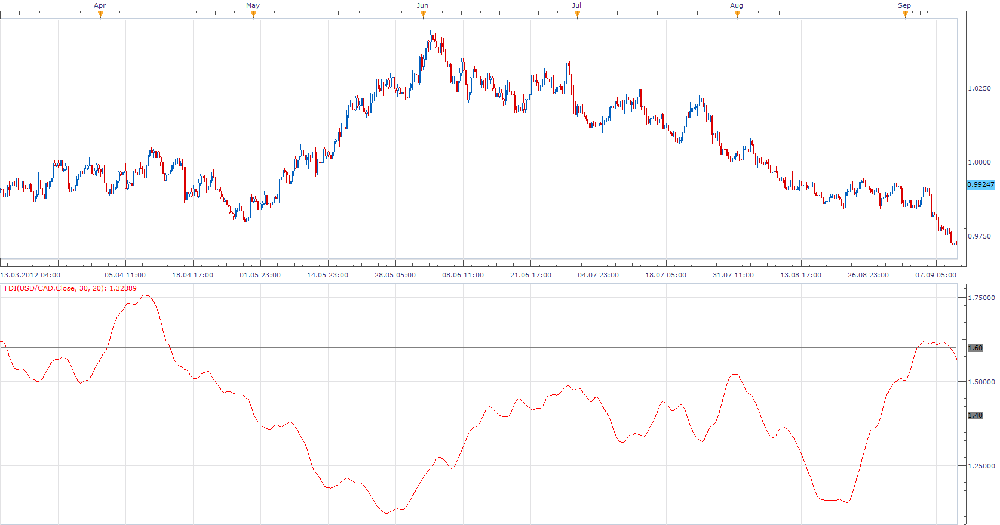

# FRACTAL DIMENSION INDICATOR

> Source: https://fxcodebase.com/code/viewtopic.php?f=17&t=26614  
> Forum: 17 · Topic 26614 · 3 post(s)

---

## FRACTAL DIMENSION INDICATOR

**Apprentice** · Sun Nov 25, 2012 12:36 pm

 Fractal Dimension as a Market Mode Sensor” by John F. Ehlers and Ric Way
that is published in June 2010 edition of Technical Analysis of Stocks and Commodities.

The existence of a trend
FDI> Bottom Line
The absence of a trend
FDI < Bottom Line

 [FDI.lua](files/46376/FDI.lua)

The indicator was revised and updated

---

## Re: FRACTAL DIMENSION INDICATOR

**Alexander.Gettinger** · Thu Sep 25, 2014 9:56 am

MQL4 version of Fractal Dimension: [viewtopic.php?f=38&t=61258](https://fxcodebase.com/code/viewtopic.php?f=38&t=61258).

---

## Re: FRACTAL DIMENSION INDICATOR

**Apprentice** · Fri Jun 23, 2017 6:48 am

The indicator was revised and updated.
