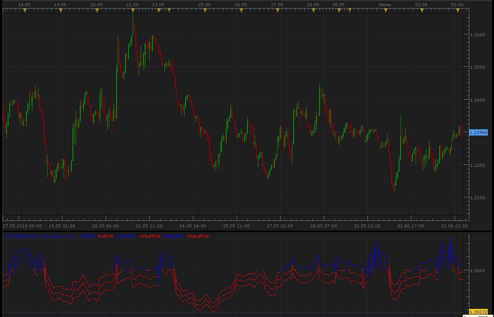

# Fractal Graph Dimension Indicator (FGDI)

> Source: https://fxcodebase.com/code/viewtopic.php?f=17&t=1250  
> Forum: 17 · Topic 1250 · 3 post(s)

---

## Fractal Graph Dimension Indicator (FGDI)

**Alexander.Gettinger** · Thu Jun 03, 2010 4:21 am

This indicator do not shows trend direction, but it shows the market is in trend or in volatility.

The indicator is described in Technical Analysis of Stocks and Commodities, in a article by Radha Panini, in March, 2007, which is based on Carlos Sevcik, "A procedure to Estimate the Fractal Dimension of Waveforms" article.

 

Code: [Select all](https://fxcodebase.com/code/)
`function Init()
    indicator:name("Fractal_Graph_Dimension");
    indicator:description("Fractal_Graph_Dimension");
    indicator:requiredSource(core.Bar);
    indicator:type(core.Oscillator);
   
    indicator.parameters:addInteger("Period", "Period", "Period", 30);
    indicator.parameters:addString("app_price", "app_price", "", "close");
    indicator.parameters:addStringAlternative("app_price", "close", "", "close");
    indicator.parameters:addStringAlternative("app_price", "open", "", "open");
    indicator.parameters:addStringAlternative("app_price", "high", "", "high");
    indicator.parameters:addStringAlternative("app_price", "low", "", "low");
    indicator.parameters:addStringAlternative("app_price", "median", "", "median");
    indicator.parameters:addStringAlternative("app_price", "typical", "", "typical");
    indicator.parameters:addStringAlternative("app_price", "weighted", "", "weighted");

    indicator.parameters:addDouble("Random_Line", "Random_Line", "Random_Line", 1.5);

    indicator.parameters:addColor("clr_buffUP", "Color of buffUp", "Color of buffUp", core.rgb(0, 0, 255));
    indicator.parameters:addColor("clr_buffDN", "Color of buffDn", "Color of buffDn", core.rgb(255, 0, 0));
    indicator.parameters:addColor("clr_UPbuffUP", "Color of UPbuffUp", "Color of UPbuffUp", core.rgb(0, 0, 255));
    indicator.parameters:addColor("clr_UPbuffDN", "Color of UPbuffDn", "Color of UPbuffDn", core.rgb(255, 0, 0));
    indicator.parameters:addColor("clr_DNbuffUP", "Color of DNbuffUp", "Color of DNbuffUp", core.rgb(0, 0, 255));
    indicator.parameters:addColor("clr_DNbuffDN", "Color of DNbuffDn", "Color of DNbuffDn", core.rgb(255, 0, 0));
end

local first;
local source = nil;
local Period;
local app_price;
local Random_Line;
local Price;
local buffUP=nil;
local buffDN=nil;

function Prepare()
    source = instance.source;
    Period=instance.parameters.Period;
    app_price=instance.parameters.app_price;
    Random_Line=instance.parameters.Random_Line;
    first = source:first()+2;
    local name = profile:id() .. "(" .. source:name() .. ", " .. instance.parameters.Period .. ", " .. instance.parameters.app_price .. ", " .. instance.parameters.Random_Line .. ")";
    instance:name(name);
    Price = instance:addInternalStream(0, 0);
    buffUP = instance:addStream("buffUP", core.Line, name .. ".buffUP", "buffUP", instance.parameters.clr_buffUP, first);
    buffDN = instance:addStream("buffDN", core.Line, name .. ".buffDN", "buffDN", instance.parameters.clr_buffDN, first);
    UPbuffUP = instance:addStream("UPbuffUP", core.Line, name .. ".UPbuffUP", "UPbuffUP", instance.parameters.clr_UPbuffUP, first);
    UPbuffDN = instance:addStream("UPbuffDN", core.Line, name .. ".UPbuffDN", "UPbuffDN", instance.parameters.clr_UPbuffDN, first);
    DNbuffUP = instance:addStream("DNbuffUP", core.Line, name .. ".DNbuffUP", "DNbuffUP", instance.parameters.clr_DNbuffUP, first);
    DNbuffDN = instance:addStream("DNbuffDN", core.Line, name .. ".DNbuffDN", "DNbuffDN", instance.parameters.clr_DNbuffDN, first);
    buffUP:addLevel(Random_Line);
end

function Update(period, mode)
    if app_price=="close" then
     Price[period]=source.close[period];
    elseif app_price=="open" then
     Price[period]=source.open[period];
    elseif app_price=="high" then
     Price[period]=source.high[period];
    elseif app_price=="low" then
     Price[period]=source.low[period];
    elseif app_price=="median" then
     Price[period]=(source.high[period]+source.low[period])/2.;
    elseif app_price=="typical" then
     Price[period]=(source.high[period]+source.low[period]+source.close[period])/3.;
    else
     Price[period]=(source.high[period]+source.low[period]+2.*source.close[period])/4.;
    end
     
    if (period>first+Period) then

     local priceMax=core.max(Price,core.rangeTo(period,Period));
     local priceMin=core.min(Price,core.rangeTo(period,Period));
     local length=0.;
     local priorDiff=0.;
     local sum=0.;
     
     for i=period-Period+1,period,1 do
      if priceMax-priceMin>0. then
       diff=(Price[i]-priceMin)/(priceMax-priceMin);
       if i>period-Period+1 then
        length=length+math.sqrt(math.pow(diff-priorDiff,2)+(1./math.pow(Period,2)));
       end
       priorDiff=diff;
      end
     end
     
     local variance;
     local fdi;
     if length>0. then
      fdi=1.+(math.log(length)+math.log(2.))/math.log(2.*(Period-1));
      local mean=length/(Period-1);
      local delta;
      for i=period-Period+1,period,1 do
       if priceMax-priceMin>0. then
        diff=(Price[i]-priceMin)/(priceMax-priceMin);
        if i>period-Period+1 then
         delta=math.sqrt(math.pow(diff-priorDiff,2)+(1./math.pow(Period,2)));
         sum=sum+math.pow(delta-length/(Period-1),2);
        end
        priorDiff=diff;
       end
      end
      variance=sum/(math.pow(length,2)*math.pow(math.log(2.*(Period-1)),2));
     else
      fdi=0.;
      variance=0.;
     end
     local stddev=math.sqrt(variance);
     
     if fdi>Random_Line then
      buffUP[period]=fdi;
      buffUP[period-1]=math.max(buffUP[period-1],buffDN[period-1]);
      buffDN[period]=nil;
      UPbuffUP[period]=fdi+stddev;
      UPbuffUP[period-1]=buffUP[period-1]+stddev;
      UPbuffDN[period]=nil;
      if fdi-stddev>Random_Line then
       DNbuffUP[period]=fdi-stddev;
       DNbuffUP[period-1]=buffUP[period-1]-stddev;
       DNbuffDN[period]=nil;
      else
       DNbuffDN[period]=fdi-stddev;
       DNbuffDN[period-1]=buffUP[period-1]-stddev;
       DNbuffUP[period]=nil;
      end
     else
      buffDN[period]=fdi;
      buffDN[period-1]=math.max(buffUP[period-1],buffDN[period-1]);
      buffUP[period]=nil;
      if fdi+stddev>Random_Line then
       UPbuffUP[period]=fdi+stddev;
       UPbuffUP[period-1]=buffDN[period-1]+stddev;
       UPbuffDN[period]=nil;
      else
       UPbuffDN[period]=fdi+stddev;
       UPbuffDN[period-1]=buffDN[period-1]+stddev;
       UPbuffUP[period]=nil;
      end
      DNbuffDN[period]=fdi-stddev;
      DNbuffDN[period-1]=buffDN[period-1]-stddev;
      DNbuffUP[period]=nil;
     end

    end
end`
MT4 / MQ4 version is available here.
[viewtopic.php?f=38&t=63912](https://fxcodebase.com/code/viewtopic.php?f=38&t=63912)

---

## Re: Fractal Graph Dimension Indicator (FGDI)

**Apprentice** · Thu Jan 12, 2017 8:49 am

Indicator was revised and updated.

---

## Re: Fractal Graph Dimension Indicator (FGDI)

**Apprentice** · Mon Feb 05, 2018 7:33 am

The Indicator was revised and updated.
