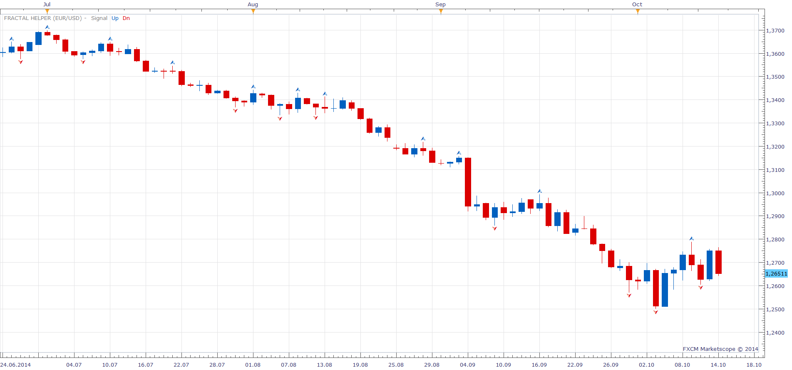

# Fractal Helper

> Source: https://fxcodebase.com/code/viewtopic.php?f=17&t=61323  
> Forum: 17 · Topic 61323 · 2 post(s)

---

## Fractal Helper

**Apprentice** · Tue Oct 14, 2014 4:22 am

Your buildin Fractal Indicator.

I have add Signal Mode as an option.
If On will signal
  1 for Up Fractal
-1 Dor Down Fractal
It is intended for use from within strategys.

 [Fractal Helper .lua](files/96517/Fractal%20Helper%20.lua)

The indicator was revised and updated

---

## Re: Fractal Helper

**Apprentice** · Mon Jun 26, 2017 3:41 am

The indicator was revised and updated.
