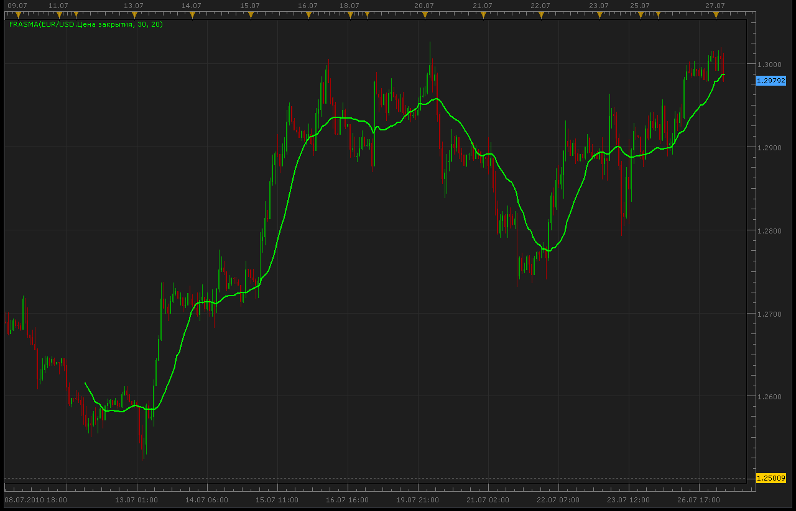

# FRASMA

> Source: https://fxcodebase.com/code/viewtopic.php?f=17&t=1590  
> Forum: 17 · Topic 1590 · 4 post(s)

---

## FRASMA

**Alexander.Gettinger** · Tue Jul 27, 2010 2:32 am

Fractally Modified Simple Moving Average.

The SMA is accelerated during a trend and slowed down during a sideways market, so as to avoid false signals.

 

The indicator was revised and updated

---

## Re: FRASMA

**Coondawg71** · Thu Nov 29, 2012 5:41 pm

Can this indicator please be update to INCLUDE the indicator window below the price chart as shown in this attached illustration.

Thanks,

sjc

[http://codebase.mql4.com/5308](http://codebase.mql4.com/5308)

---

## Re: FRASMA

**Apprentice** · Fri Nov 30, 2012 2:52 am

If you try to add this indicator to MT4,
you'll notice that these are in fact two different indicators.
Ones below can be found here.
[viewtopic.php?f=17&t=26614&p=46376&hilit=FDI#p46376](https://fxcodebase.com/code/viewtopic.php?f=17&t=26614&p=46376&hilit=FDI#p46376)

---

## Re: FRASMA

**Apprentice** · Mon Apr 17, 2017 6:51 am

Indicator was revised and updated.
