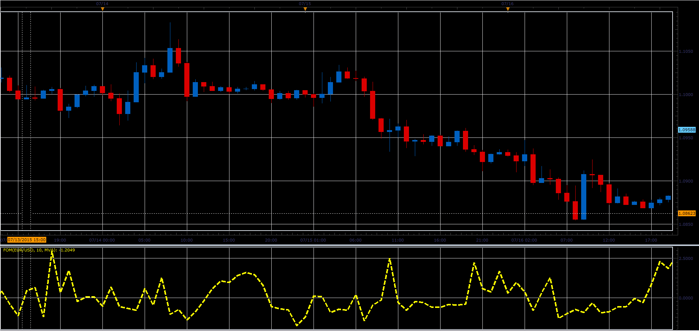

# Freedom of Movement oscillator

> Source: https://fxcodebase.com/code/viewtopic.php?f=17&t=62457  
> Forum: 17 · Topic 62457 · 2 post(s)

---

## Freedom of Movement oscillator

**Alexander.Gettinger** · Fri Jul 24, 2015 10:09 am

Formula:
FoM[i] = (vByM[i]-avF)/sdF, where
sdF - StdDev(vByM) with [Period] number of periods,
avF - MA(vByM) with [Period] number of periods and [Method] type,
vByM = Vol/Move,
Vol = 1+9*(RV-MinV)/Abs(demonV),
demonV = MaxV-MinV,
MaxV, MinV - maximum and minimum values of RV at range from [i-Period+1] to [i],
Move = 1+9*(aMove-MinM)/Abs(demonM),
demomM = MaxM-MinM,
MaxM, MinM - maximum and minimum values of aMove at range [i-Period+1] to [i],
aMove[i] = Abs(Close[i]-Close[i-1])/Close[i-1],
RV = (Volume-av)/sd,
sd - StdDev(Volume) with [Period] number of periods,
av - MA(Volume) with [Period] number of periods and [Method] type.

 

Download:

 [FoM.lua](files/101542/FoM.lua)

For this indicator must be installed Averages indicator ([viewtopic.php?f=17&t=2430](https://fxcodebase.com/code/viewtopic.php?f=17&t=2430)).
For this indicator must be installed StdDev indicator
[viewtopic.php?f=17&t=870&hilit=STDDEV](https://fxcodebase.com/code/viewtopic.php?f=17&t=870&hilit=STDDEV)

The indicator was revised and updated

---

## Re: Freedom of Movement oscillator

**Apprentice** · Tue Jul 04, 2017 9:40 am

The indicator was revised and updated.
