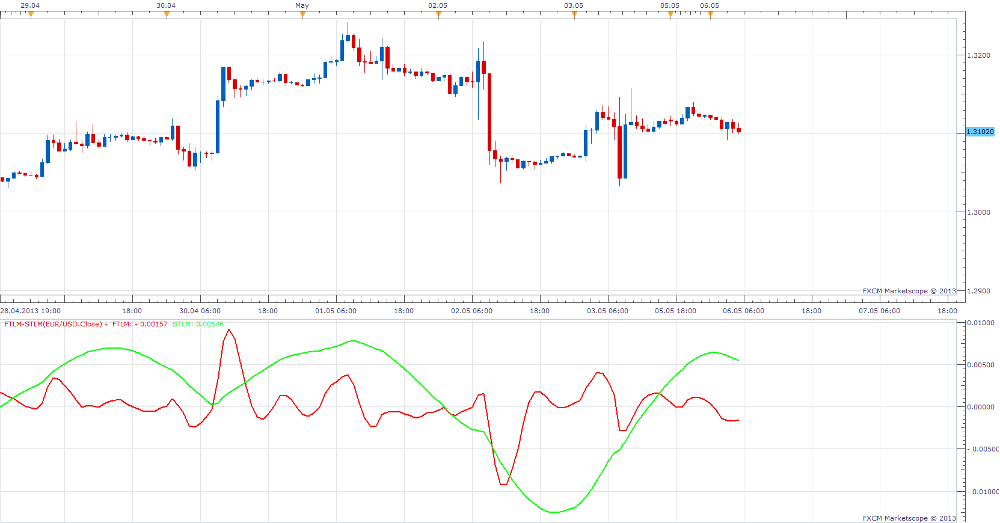
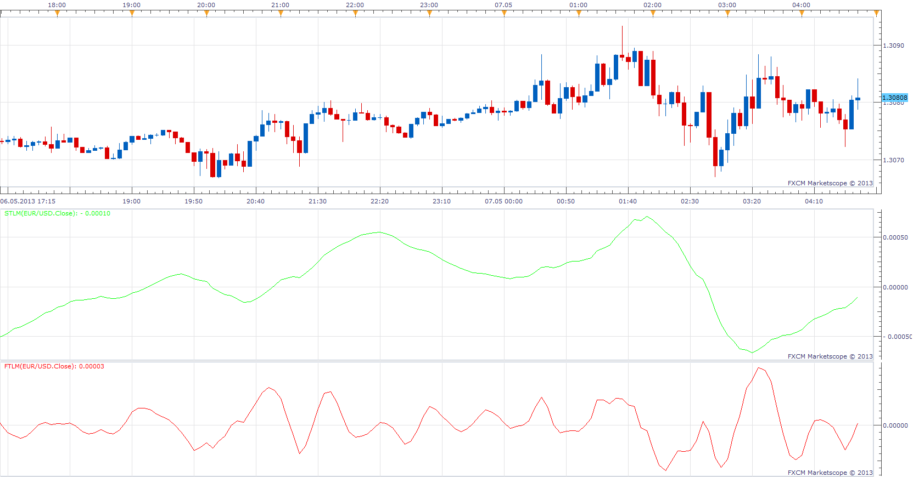

# FTLM-STLM oscillator

> Source: https://fxcodebase.com/code/viewtopic.php?f=17&t=36625  
> Forum: 17 · Topic 36625 · 15 post(s)

---

## FTLM-STLM oscillator

**Apprentice** · Mon May 06, 2013 6:08 am

 Fast Trend Line Momentum (FTLM) and Slow Trend Line Momentum (SLTM) indicators show the rate of price change, FATL and SATL are calculated the similar way as Momentum indicator.
FTLM(bar) = FATL(bar) – RFTL(bar)
STLM(bar) = SATL(bar) – RSTL(bar)

where:
FATL(bar) - FATL digital filter;
RFTL(bar) - RFTL digital filter;
SATL(bar) - SATL digital filter;
RSTL(bar) - RSTL digital filter;

 [FTLM-STLM.lua](files/61319/FTLM-STLM.lua)

---

## Re: FTLM-STLM oscillator

**StefPasc** · Mon May 06, 2013 11:38 pm

This is very interesting and an excellant job of Apprentice, as always !!
I think it would be very helpfull to the analysis, to add 2 more indicators : FATL and SATL
The possibility to display FATL and SATL as indepented indicators will help the interpretion of FTLM and STLM according to the author.
I think it is easy to create these 2 indicators as long as they are already in the calculation of FTLM and STLM.
Thank you in advance

---

## Re: FTLM-STLM oscillator

**Apprentice** · Tue May 07, 2013 5:06 am

Separate versions.

 [FTLM.lua](files/61446/FTLM.lua)

 [STLM.lua](files/61446/STLM.lua)

 [FTLM-STLM Components.lua](files/61446/FTLM-STLM%20Components.lua)

---

## Re: FTLM-STLM oscillator

**StefPasc** · Tue May 07, 2013 6:05 am

Dear Apprentice
I was talking about the **FATL** and **SATL** indicators in separate versions.
Kindly have a look at the calculation of FTLM and STLM that is
FTLM(bar) = **FATL**(bar) – RFTL(bar)
STLM(bar) = **SATL**(bar) – RSTL(bar)

I am reffering to FATL and SATL not the FTLM and STLM.
Thank you again

---

## Re: FTLM-STLM oscillator

**Apprentice** · Wed May 08, 2013 5:36 am

Try, FTLM-STLM Components.

---

## Re: FTLM-STLM oscillator

**StefPasc** · Wed May 08, 2013 3:08 pm

> **Apprentice wrote:**
> Try, FTLM-STLM Components.

Dear Apprentice ,

please believe me I dont know how to thank you !
This is a lot more than I expected !
Thank you again .
Please , **if and when** you have the time add 2 more conponents that are the last 2 ones to integrate the analysis

These components are :

1) RBCI , where
RBCI = FATL - SATL

2) PCCI where
PCCI = close - FATL

Thank you again and kindly forgive me for asking so much !
Many greetings from Greece

Stefanos

---

## Re: FTLM-STLM oscillator

**Apprentice** · Sat May 11, 2013 2:24 am

Your request is added to the development list.

---

## Re: FTLM-STLM oscillator

**StefPasc** · Sun May 12, 2013 3:55 am

> **Apprentice wrote:**
> Your request is added to the development list.

thank you again Apprentice
I will wait patiently !

---

## Re: FTLM-STLM oscillator

**Apprentice** · Tue May 14, 2013 12:19 pm

components added

---

## Re: FTLM-STLM oscillator

**Coondawg71** · Tue May 14, 2013 1:35 pm

download error after last components addition from today.

Error states:

FTLM-STLM Components.lua 337"=" expected near "out"

Thanks,

sjc

---

## Re: FTLM-STLM oscillator

**Apprentice** · Tue May 14, 2013 3:42 pm

Bug Fixed.
By mistake, I uploaded the wrong version.

---

## Re: FTLM-STLM oscillator

**Coondawg71** · Tue May 21, 2013 10:03 am

Can we please add this Strategy (8Dimensions) to the Developement que. This request may be the most promising I have ever asked for. I find the FATL components extremely useful for fast accurate reading of market. This strategy already has been explained on web so I will attach post as not to confuse matters. I look forward posting of strategy.

Thanks!

sjc

[http://www.tradingdimensions.com/pages/overview8.php](http://www.tradingdimensions.com/pages/overview8.php)

AT ^ CF indicator package which plots FATL components in same indicator window

[http://www.mql5.com/en/code/456](http://www.mql5.com/en/code/456)

---

## Re: FTLM-STLM oscillator

**StefPasc** · Wed May 22, 2013 6:38 am

> **Coondawg71 wrote:**
> Can we please add this Strategy (8Dimensions) to the Developement que. This request may be the most promising I have ever asked for. I find the FATL components extremely useful for fast accurate reading of market. This strategy already has been explained on web so I will attach post as not to confuse matters. I look forward posting of strategy.
>
> Thanks!
>
> sjc

+1

---

## Re: FTLM-STLM oscillator

**Apprentice** · Fri May 24, 2013 3:46 am

One of the first version of this indicator, is likely to have a bug.
Redownload and reinstall, this will probably fix the problem.

---

## Re: FTLM-STLM oscillator

**Apprentice** · Mon Feb 19, 2018 8:11 am

The Indicator was revised and updated.
