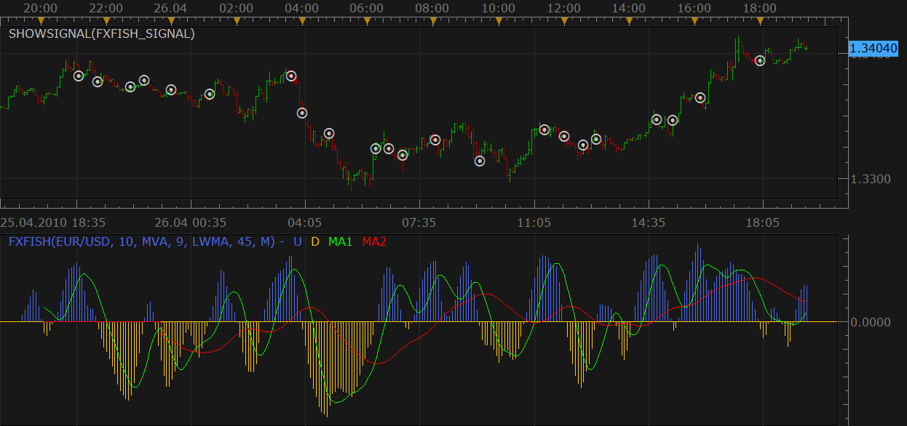

# fx_fish Fisher transform with 2 moving averages.

> Source: https://fxcodebase.com/code/viewtopic.php?f=17&t=850  
> Forum: 17 · Topic 850 · 6 post(s)

---

## fx_fish Fisher transform with 2 moving averages.

**Nikolay.Gekht** · Mon Apr 26, 2010 6:34 pm

The indicator is a port of [Kiko Segui's MT4 indicator FX_FISH_2MA.mq4](http://codebase.mql4.com/2075)

 

Download the indicator:

 [FXFISH.lua](files/1521/FXFISH.lua)

You can also play with beta version of the signal on the base of fxfish indicator. Up to me the signals looks pretty strange, so, probably, additional research must be done...

Download the signal:

 [FXFISH_Signal.lua](files/1521/FXFISH_Signal.lua)

(do not forget that signal must be installed via Manage Custom **Signals** command under Signals menu).

To test the signal on historical data, use the standard **SHOWSIGNAL** indicator.

The indicator was revised and updated

---

## Re: fx_fish Fisher transform with 2 moving averages.

**leah123** · Sun Nov 27, 2011 8:14 pm

Does this indicator repaint? Not trying to knock it. It is a very smooth indicator!

---

## Re: fx_fish Fisher transform with 2 moving averages.

**Poupouille** · Tue Dec 27, 2011 4:01 am

This indicator is not really the same that the indicator for the original for MT4 !
Crossing of the line 0 are not the same !
It would be possible that he is totally identical to the original ?
Thank you for your help

---

## Re: fx_fish Fisher transform with 2 moving averages.

**Apprentice** · Mon Mar 20, 2017 8:31 am

Indicator was revised and updated.

---

## Re: fx_fish Fisher transform with 2 moving averages.

**easytrading** · Fri Apr 20, 2018 1:42 am

Hello Apprentice,

could u please, change the histogram to be one value as H instead of 2 as it is now U & D so to be one stream instead of 2 like the MACD Histogram with my appreciation .

---

## Re: fx_fish Fisher transform with 2 moving averages.

**Apprentice** · Sat Apr 21, 2018 8:32 am

Try this version.

 [FXFISH2.lua](files/118735/FXFISH2.lua)
