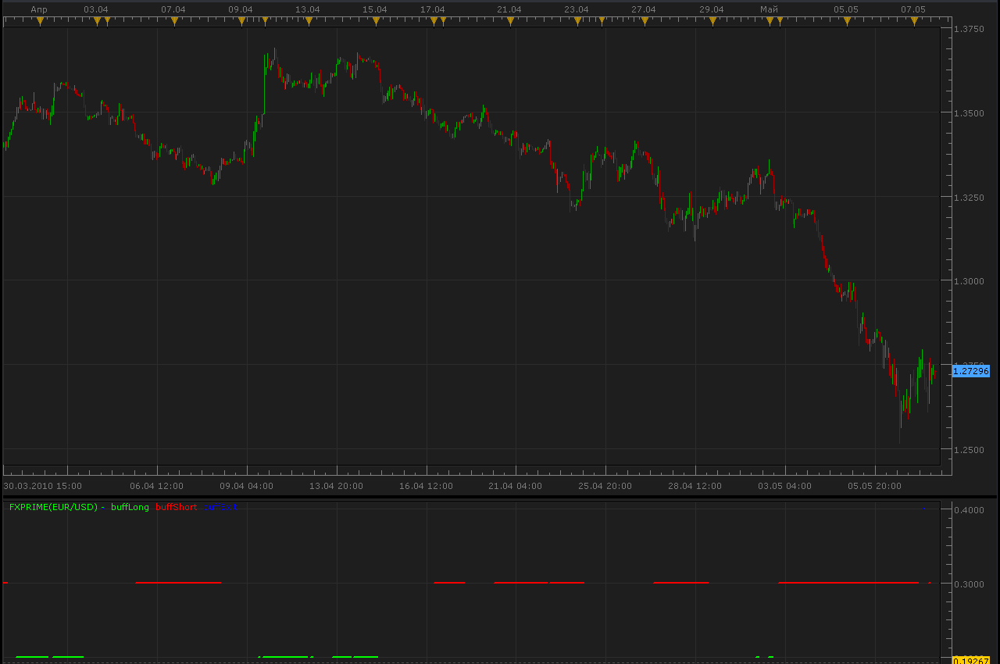

# FX prime indicator

> Source: https://fxcodebase.com/code/viewtopic.php?f=17&t=990  
> Forum: 17 · Topic 990 · 12 post(s)

---

## FX prime indicator

**Alexander.Gettinger** · Sun May 09, 2010 11:40 am

[viewtopic.php?f=27&t=762](https://fxcodebase.com/code/viewtopic.php?f=27&t=762)

 

 [fxprime.lua](files/1842/fxprime.lua)

 [FxPrimeBar.lua](files/1842/FxPrimeBar.lua)

The indicator was revised and updated

---

## Re: FX prime indicator

**compulsive** · Wed Mar 23, 2011 8:46 pm

Is it possible that you could overlay this into the price bars? Thanks

---

## Re: FX prime indicator

**Alexander.Gettinger** · Fri Mar 25, 2011 3:00 am

Do you want version of the indicator with color candles looks like as [viewtopic.php?f=17&t=3695](https://fxcodebase.com/code/viewtopic.php?f=17&t=3695)?

---

## Re: FX prime indicator

**compulsive** · Mon Mar 28, 2011 2:54 pm

without the blue or as an option

---

## Re: FX prime indicator

**newton** · Sat Aug 02, 2014 9:10 pm

can you add line width option to increase line size to this indicator.

---

## Re: FX prime indicator

**Apprentice** · Sun Aug 03, 2014 3:19 am

Style Options Added.

---

## Re: FX prime indicator

**newton** · Sun Aug 03, 2014 7:08 am

THANK YOU APPRENTICE.

ONE MORE REQUEST TO MODIFY THIS INDICATOR:

**1. LINES IN THIS INDICATOR ARE IN THREE LEVELS . CAN YOU BRING IT TO SINGLE LINE
2. IN BETWEEN GREEN AND RED COLORS AND GAP WITH IN RED COLOR AND GREEN COLOR ADD NEUTRAL COLOR{YELLOW}**

IN REQUEST TO MODIFY THIS INDICATOR LIKE TDI BAR WHICH IS IN NEARBY POST

[viewtopic.php?f=17&t=24940](http://www.fxcodebase.com/code/viewtopic.php?f=17&t=24940)

---

## Re: FX prime indicator

**Apprentice** · Mon Aug 04, 2014 8:47 am

FxPrimeBar.lua Added.

---

## Re: FX prime indicator

**rose123** · Thu Mar 10, 2016 7:36 am

CAN YOU CREATE A STRATEGY BASED ON FX PRIME BAR

**TIME FRAMES: H1, H4**

**BUY;**

H4 FX PRIME BAR IS HAVING GREEN IN PAST 3 BARS AND
H1 FX PRIME BAR OF CLOSED CANDLE IS GREEN
H1 FX PRIME BAR OF PREVIOUS CANDLE IS GREY OR BLUE.

**SELL**:

H4 FX PRIME BAR IS HAVING RED IN PAST 3 BARS AND
H1 FX PRIME BAR OF CLOSED CANDLE IS RED
H1 FX PRIME BAR OF PREVIOUS CANDLE IS GREY OR BLUE.

---

## Re: FX prime indicator

**Apprentice** · Fri Mar 11, 2016 3:27 pm

can you explain "IN PAST 3 BARS"

---

## Re: FX prime indicator

**Apprentice** · Fri Mar 11, 2016 5:02 pm

Requested can be found here.
[viewtopic.php?f=31&t=63248](https://fxcodebase.com/code/viewtopic.php?f=31&t=63248)

---

## Re: FX prime indicator

**Apprentice** · Sun Jul 30, 2017 10:47 am

The indicator was revised and updated.
