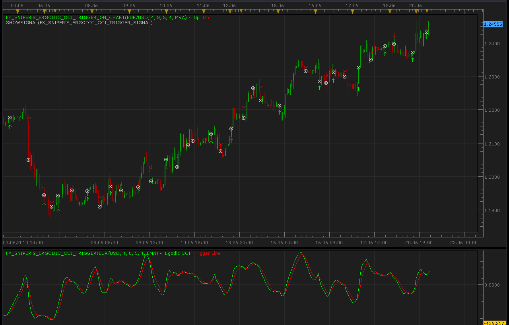

# Fx Sniper's Ergodic CCI Trigger indicator and signal

> Source: https://fxcodebase.com/code/viewtopic.php?f=17&t=1389  
> Forum: 17 · Topic 1389 · 14 post(s)

---

## Fx Sniper's Ergodic CCI Trigger indicator and signal

**Alexander.Gettinger** · Mon Jun 21, 2010 2:05 am

[viewtopic.php?f=27&t=1248&p=2370#p2370](https://fxcodebase.com/code/viewtopic.php?f=27&t=1248&p=2370#p2370)

 



 [Fx_Snipers_Ergodic_CCI_Trigger_On_Chart.lua](files/2681/Fx_Snipers_Ergodic_CCI_Trigger_On_Chart.lua)

 [Fx_Snipers_Ergodic_CCI_Trigger.lua](files/2681/Fx_Snipers_Ergodic_CCI_Trigger.lua)

MT4/Mq4 version.
[viewtopic.php?f=38&t=64450](https://fxcodebase.com/code/viewtopic.php?f=38&t=64450)

---

## Re: Fx Sniper's Ergodic CCI Trigger indicator and signal

**Alexander.Gettinger** · Mon Jun 21, 2010 2:06 am

Signal:

```lua
function Init()
    strategy:name("Fx Sniper's Ergodic CCI Trigger signal");
    strategy:description("");

    strategy.parameters:addGroup("Parameters");

    strategy.parameters:addInteger("pq", "pq", "pq", 4);
    strategy.parameters:addInteger("pr", "pr", "pr", 8);
    strategy.parameters:addInteger("ps", "ps", "ps", 5);
    strategy.parameters:addInteger("trigger", "trigger", "trigger", 4);
    strategy.parameters:addString("MA_Method", "Method of MA", "", "MVA");
    strategy.parameters:addStringAlternative("MA_Method", "EMA", "", "EMA");
    strategy.parameters:addStringAlternative("MA_Method", "KAMA", "", "KAMA");
    strategy.parameters:addStringAlternative("MA_Method", "LWMA", "", "LWMA");
    strategy.parameters:addStringAlternative("MA_Method", "MVA", "", "MVA");
    strategy.parameters:addStringAlternative("MA_Method", "TMA", "", "TMA");

    strategy.parameters:addString("Period", "Timeframe", "", "m5");
    strategy.parameters:setFlag("Period", core.FLAG_PERIODS);

    strategy.parameters:addGroup("Signals");
    strategy.parameters:addBoolean("ShowAlert", "Show Alert", "", true);
    strategy.parameters:addBoolean("PlaySound", "Play Sound", "", false);
    strategy.parameters:addFile("SoundFile", "Sound File", "", "");
end

local SoundFile;
local gSourceBid = nil;
local gSourceAsk = nil;
local first;

local BidFinished = false;
local AskFinished = false;
local LastBidCandle = nil;

local Ind;

function Prepare()
    ShowAlert = instance.parameters.ShowAlert;
    if instance.parameters.PlaySound then
        SoundFile = instance.parameters.SoundFile;
    else
        SoundFile = nil;
    end
   
    assert(not(PlaySound) or (PlaySound and SoundFile ~= ""), "Sound file must be specified");
    assert(instance.parameters.Period ~= "t1", "Signal cannot be applied on ticks");

    ExtSetupSignal("Fx Sniper's Ergodic CCI Trigger signal:", ShowAlert);

    gSourceBid = core.host:execute("getHistory", 1, instance.bid:instrument(), instance.parameters.Period, 0, 0, true);
    gSourceAsk = core.host:execute("getHistory", 2, instance.bid:instrument(), instance.parameters.Period, 0, 0, false);

    Ind = core.indicators:create("FX_SNIPER'S_ERGODIC_CCI_TRIGGER", gSourceBid, instance.parameters.pq,instance.parameters.pr,instance.parameters.ps,instance.parameters.trigger,instance.parameters.MA_Method);

    first = Ind.DATA:first() + 2;

    local name = profile:id() .. "(" .. instance.bid:instrument() .. "(" .. instance.parameters.Period  .. ")" .. instance.parameters.pq .. ")" .. instance.parameters.pr .. ")" .. instance.parameters.ps .. ")" .. instance.parameters.trigger .. ")" .. instance.parameters.MA_Method .. ")";
    instance:name(name);
end

local LastDirection=nil;

-- when tick source is updated
function Update()
    if not(BidFinished) or not(AskFinished) then
        return ;
    end

    local period;

    -- update moving average
    Ind:update(core.UpdateLast);

    -- calculate enter logic
    if LastBidCandle == nil or LastBidCandle ~= gSourceBid:serial(gSourceBid:size() - 1) then
        LastBidCandle = gSourceBid:serial(gSourceBid:size() - 1);

        period = gSourceBid:size() - 1;
        if period > first then
         if Ind.buff1[period]>Ind.buff2[period] and Ind.buff1[period-1]<=Ind.buff2[period-1] and LastDirection~=1 then
                ExtSignal(gSourceAsk, period, "Buy", SoundFile);
                LastDirection=1;
         elseif Ind.buff1[period]<Ind.buff2[period] and Ind.buff1[period-1]>=Ind.buff2[period-1] and LastDirection~=-1 then
                ExtSignal(gSourceBid, period, "Sell", SoundFile);
                LastDirection=-1;
         end
       
        end
    end
end

function AsyncOperationFinished(cookie)
    if cookie == 1 then
        BidFinished = true;
    elseif cookie == 2 then
        AskFinished = true;
    end
end

local gSignalBase = "";     -- the base part of the signal message
local gShowAlert = false;   -- the flag indicating whether the text alert must be shown

-- ---------------------------------------------------------
-- Sets the base message for the signal
-- @param base      The base message of the signals
-- ---------------------------------------------------------
function ExtSetupSignal(base, showAlert)
    gSignalBase = base;
    gShowAlert = showAlert;
    return ;
end

-- ---------------------------------------------------------
-- Signals the message
-- @param message   The rest of the message to be added to the signal
-- @param period    The number of the period
-- @param sound     The sound or nil to silent signal
-- ---------------------------------------------------------
function ExtSignal(source, period, message, soundFile)
    if source:isBar() then
        source = source.close;
    end
    if gShowAlert then
        terminal:alertMessage(source:instrument(), source[period], gSignalBase .. message, source:date(period));
    end
    if soundFile ~= nil then
        terminal:alertSound(soundFile, false);
    end
end
```

---

## Re: Fx Sniper's Ergodic CCI Trigger indicator and signal

**oritzbaba** · Fri May 20, 2011 10:12 am

Hi Alexander Gettinger and all the other geniuses out there like Apprentice, Sunshine, Nikolay and others. You are doing a good job helping newbies and novice programmers like me to hopefully succeed.

I have had most of my best trades with Fx Sniper's Ergodic CCI Trigger combined with other indicators. Please to make the FX Sniper strategy work more efficiently, can you add all the other very helpful features like set stop/limit, allowed trading, allowed side etc as contained in the MACROSS_CONF_DIST_STRATEGY.

Please help out, God bless you all.

Thanks.

---

## Re: Fx Sniper's Ergodic CCI Trigger indicator and signal

**Apprentice** · Fri May 20, 2011 4:45 pm

Your request has been added to developmental cue.

---

## Re: Fx Sniper's Ergodic CCI Trigger indicator and signal

**oritzbaba** · Sat May 21, 2011 6:50 pm

Thanks Apprentice,

I tried to backtest this strategy and I have some observations; 1. It does not trade all crosses either buy/sell as shown by the signal alert arrows on the chart. 2, It enters a trade order sometimes before the signal alert arrow on the chart and at other times after. 3, In my demo trade, it is yet to take any trade even where there had been different crossing opportunities for the strategy to trade.

Please note both the signal alert on the chart and the strategy settings are the same. please help out, what am I doing wrong? One more thing, does the the strategy remain active on FXCM server when my computer laptop is shot down? I know trailing stop does but is strategy on it?

---

## Re: Fx Sniper's Ergodic CCI Trigger indicator and signal

**adolfainsley8** · Fri Apr 22, 2016 3:31 am

One more thing, does the the strategy remain active on FXCM server when my computer laptop is shot down? I know trailing stop does but is strategy on it????

---

## Re: Fx Sniper's Ergodic CCI Trigger indicator and signal

**Apprentice** · Fri Apr 22, 2016 5:54 am

> does the the strategy remain active on FXCM server when my computer laptop is shot down?

Unfortunately not .
You will need to setup a VPS for this task.

---

## Re: Fx Sniper's Ergodic CCI Trigger indicator and signal

**Apprentice** · Fri Apr 22, 2016 7:05 am

Strategy is available here.
[viewtopic.php?f=31&t=63401](https://fxcodebase.com/code/viewtopic.php?f=31&t=63401)

---

## Re: Fx Sniper's Ergodic CCI Trigger indicator and signal

**jaricarr** · Fri Jun 24, 2016 1:58 am

Hi Apprentice,

the indicator is causing an error.

Thanks,
JariCarr

---

## Re: Fx Sniper's Ergodic CCI Trigger indicator and signal

**Apprentice** · Fri Jun 24, 2016 3:11 am

Try it now.

---

## Re: Fx Sniper's Ergodic CCI Trigger indicator and signal

**jaricarr** · Fri Jun 24, 2016 8:35 pm

Hi Apprentice,

I re-downloaded and re-installed the indicator and strategy luas.

Im still getting an error.

thanks,
JariCarr

---

## Re: Fx Sniper's Ergodic CCI Trigger indicator and signal

**jaricarr** · Fri Jun 24, 2016 9:29 pm

Hi

Looks like the problem is related to the letter "s" in the indicator name.
The backtesting of the strategy needs _Sniper_ and the indicator on the chart needs _Snipers_

I did a temporary work around to this problem until you update the file.
I installed 4 indicators and renamed them as shown on the screenshot.

thanks
JariCarr

---

## Re: Fx Sniper's Ergodic CCI Trigger indicator and signal

**Apprentice** · Sat Jun 25, 2016 3:29 am

Deinstall all instances, instal new versions.
I have changed the names of all the indicator.

---

## Re: Fx Sniper's Ergodic CCI Trigger indicator and signal

**Apprentice** · Sun Oct 21, 2018 5:32 am

The indicator was revised and updated.
