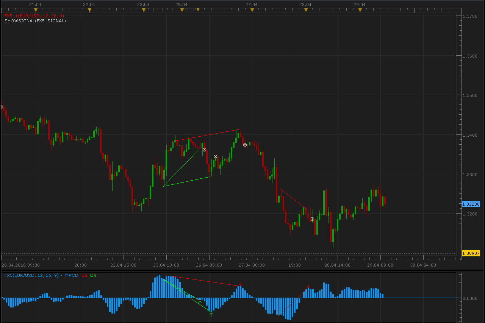

# FX5 Divergence and signal

> Source: https://fxcodebase.com/code/viewtopic.php?f=17&t=876  
> Forum: 17 · Topic 876 · 12 post(s)

---

## FX5 Divergence and signal

**Alexander.Gettinger** · Thu Apr 29, 2010 10:28 am

This indicator corresponds to MT4 indicator: [viewtopic.php?f=27&t=596](https://fxcodebase.com/code/viewtopic.php?f=27&t=596)

 

1. FX5 Divergence oscillator.

 [FX5.lua](files/1598/FX5.lua)

2. FX5 Divergence Indicator. Shows trend lines on the prices. The FX5.lua must be also installed.

 [FX5_1.lua](files/1598/FX5_1.lua)

The indicator was revised and updated

---

## Re: FX5 Divergence and signal

**Alexander.Gettinger** · Thu Apr 29, 2010 10:29 am

3) FX5 Divergence Signal. Signals when the divergence is detected (pay attention that signal happens two candles past the detected trend). The FX5.lua must be also installed.

 [FX5_Signal.lua](files/1599/FX5_Signal.lua)

---

## Re: FX5 Divergence and signal

**artemis7** · Mon May 03, 2010 7:12 am

Hi Alexander,

I'm sorry but I have an error during the loading of the FX5_Signal. Comments abour error are "[string "FX5_Signal.lua"] 2:attempt to index global 'strategy' (a nil value).

Thanks for helping.

Have a nice day,

Marie

---

## Re: FX5 Divergence and signal

**Nikolay.Gekht** · Mon May 03, 2010 7:40 am

Please, load the signal via Signals->Manage Custom Signals.
Here is step-by-step the instruction how to install signals:
[viewtopic.php?f=29&t=602](https://fxcodebase.com/code/viewtopic.php?f=29&t=602)

---

## Re: FX5 Divergence and signal

**artemis7** · Mon May 03, 2010 8:39 am

Thanks! Got it. Sorry

---

## Re: FX5 Divergence and signal

**claudix17** · Thu May 20, 2010 4:29 am

HI,

 Please , can you help , whith more explanation when the signal say "sell" for example. I can`t see exacly a real sell signal .

regards
claudio

---

## Re: FX5 Divergence and signal

**Nikolay.Gekht** · Thu May 20, 2010 9:50 am

Here is some discussion on how to use the FX Div. indicator:
[http://www.forexfactory.com/showthread.php?p=1434649](http://www.forexfactory.com/showthread.php?p=1434649)
If you find more information - please publish it as well.

---

## Re: FX5 Divergence and signal

**nick818** · Sun Jun 06, 2010 7:02 pm

is their a way to get the signal to sync with the actuall 'arrow' signal in the FX5 indicator and not 2 candles past????

---

## Re: FX5 Divergence and signal

**Nikolay.Gekht** · Mon Jun 07, 2010 9:56 am

There is no "actual" arrows. If you read the indicator carefully, you find that the arrow is put in the fractal-like method, i.e. it requires two bars before and two bars AFTER the tested bar. So, the "actual" arrow is the arrow "two bars ago".

The put arrow on the actual bar is equal to predict that the NEXT (future) two bars will be higher/lower that the current bar, i.e. predict that the current point is an extremum. That is equal to say: "predict the market". I would love to be able to predict market. But...

---

## Re: FX5 Divergence and signal

**joel.pena** · Tue Jul 08, 2014 2:59 am

Hello Nikolay,

 Is there a way to change the program form 2 candles to 1 candle before and after? Thanks in advance.

---

## Re: FX5 Divergence and signal

**Apprentice** · Thu Jul 10, 2014 5:04 am

Sure. Unfortunately will generate more false signals.

---

## Re: FX5 Divergence and signal

**Apprentice** · Sat Jul 01, 2017 4:56 am

The indicator was revised and updated.
