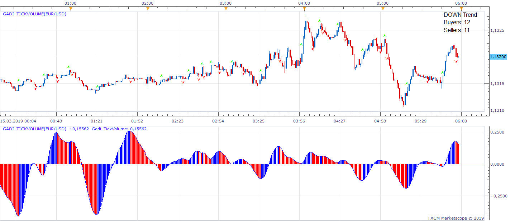
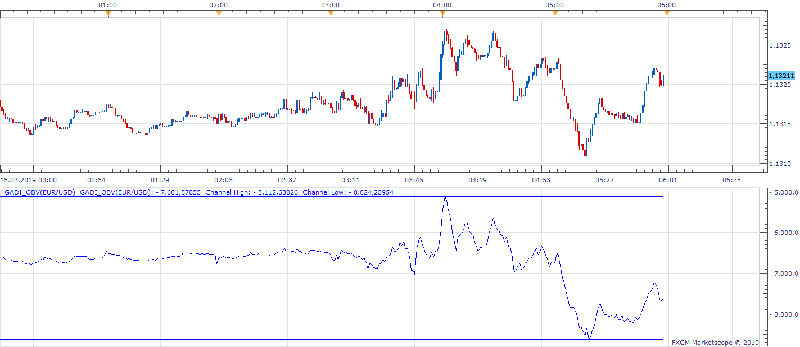

# Gadi_TickVolume

> Source: https://fxcodebase.com/code/viewtopic.php?f=17&t=67452  
> Forum: 17 · Topic 67452 · 7 post(s)

---

## Gadi_TickVolume

**Apprentice** · Fri Mar 15, 2019 6:54 am

 [Gadi_TickVolume.lua](files/124450/Gadi_TickVolume.lua)

 

 [gadi_obv.lua](files/124450/gadi_obv.lua)

---

## Re: Gadi_TickVolume

**TazmasterT** · Fri Mar 15, 2019 2:26 pm

Yes! This is amazing, thank you very much.

---

## Re: Gadi_TickVolume

**TazmasterT** · Sat Mar 16, 2019 4:42 pm

You only need to look at the two next to each other like that. The OBV keeps you out of those terrible ranging/consolidation trades at the start of the chart.
TMT

---

## Re: Gadi_TickVolume

**TazmasterT** · Thu Jul 04, 2019 8:22 am

Hi,

Thank you so much for these, along with the MacD Mirror you have just completed I have started making some good progress.

Is it possible to have two dotted lines coming out of the 'zone' that is created in the Gadi_Obv that extends until the next zone is drawn and then have an alert that sounds/emails etc if there is a breakout of this zone extension? I have attached a snagit to show what I mean.

Cheers
TMT

---

## Re: Gadi_TickVolume

**Apprentice** · Fri Jul 05, 2019 7:14 am

Your request is added to the development list under Id Number 4762

---

## Re: Gadi_TickVolume

**Apprentice** · Mon Jul 08, 2019 6:51 am

Try this version.

 [gadi_obv v2.lua](files/127274/gadi_obv%20v2.lua)

---

## Re: Gadi_TickVolume

**TazmasterT** · Tue Jul 09, 2019 6:05 am

That's great, thank you.

TMT
